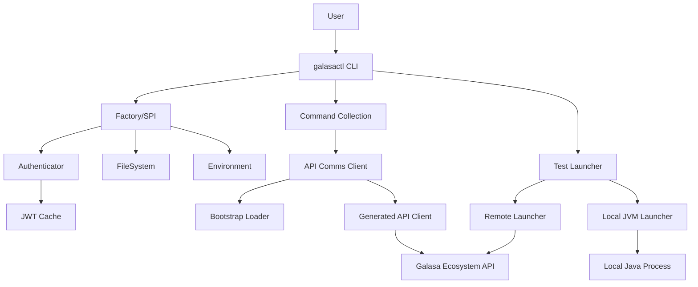
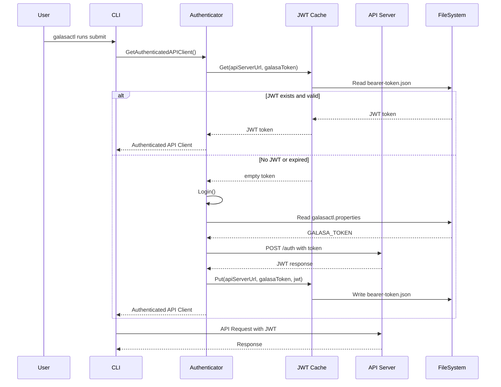
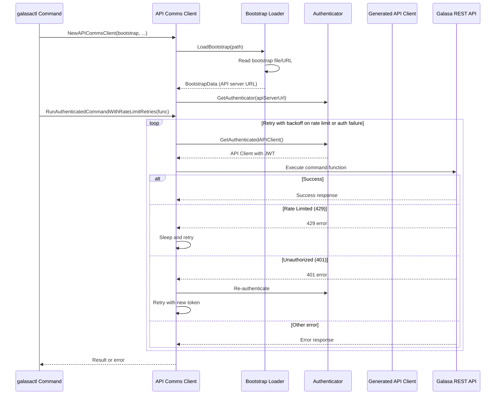
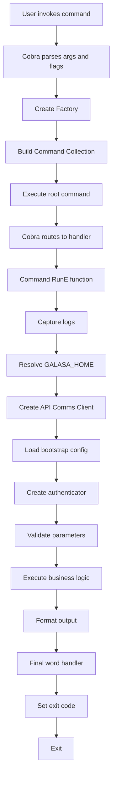

# CLI Architecture and Structure

The Galasa Command Line Interface (galasactl) is a comprehensive command-line tool written in Go that provides a user-friendly interface to interact with Galasa ecosystems and manage local test development. It enables users to run tests, manage ecosystem resources, query results, work with artifacts, and configure Galasa components.

## Purpose and Capabilities

The CLI serves as the primary interface for:

1. **Running tests** - Submit test runs to remote ecosystems or execute tests locally in a JVM
2. **Managing the Galasa ecosystem** - Configure properties, secrets, streams, roles, users, and monitors
3. **Querying test results** - Retrieve and download test artifacts and execution history
4. **Working with test artifacts** - Manage test runs, portfolios, and associated resources
5. **Local development** - Initialize local Galasa environments and run tests in development mode
6. **Authentication** - Log in to ecosystems and manage personal access tokens

## Environment Variables

The CLI behavior is controlled by three key environment variables:

### GALASA_HOME

Specifies the folder where Galasa reads and writes files and configuration settings. Defaults to `${HOME}/.galasa` if not specified. This directory contains:

- `bootstrap.properties` - Connection details for the Galasa ecosystem
- `galasactl.properties` - CLI configuration including the personal access token
- `bearer-token.json` - Cached JWT for authenticated API requests
- Test result artifacts for locally executed tests

The `--galasahome` command-line flag can override the `GALASA_HOME` environment variable on a per-command basis.

### GALASA_BOOTSTRAP

Provides the location of the bootstrap file or URL, which contains essential configuration such as the API server URL. Can be:

- An HTTP/HTTPS URL (e.g., `http://example.com/bootstrap`)
- A file path (e.g., `file:///user/.galasa/bootstrap.properties`)
- Defaults to `${GALASA_HOME}/bootstrap.properties` if not specified

The `--bootstrap` command-line flag takes precedence over this environment variable.

### GALASA_TOKEN

Contains the personal access token for authenticating with a Galasa ecosystem. Can be set as an environment variable or stored in the `galasactl.properties` file within `GALASA_HOME`. Personal access tokens are created through the Galasa web user interface.

## Implementation Technology

The CLI is implemented in Go using established libraries:

- **Cobra** - Command-line interface framework providing hierarchical command structure and flag parsing
- **Go HTTP Client** - For REST API communication with Galasa ecosystems
- **YAML/JSON Libraries** - For configuration handling and data serialization

## Architecture Overview

The CLI follows a layered architecture with clear separation of concerns.

## Command Structure

The CLI uses a hierarchical command structure built on Cobra, with a root command and multiple subcommand groups:

```mermaid
flowchart TD
    Root[galasactl] --> Auth[auth]
    Root --> Local[local]
    Root --> Project[project]
    Root --> Runs[runs]
    Root --> Properties[properties]
    Root --> Resources[resources]
    Root --> Secrets[secrets]
    Root --> Monitors[monitors]
    Root --> Streams[streams]
    Root --> Users[users]
    Root --> Roles[roles]
    Root --> Tags[tags]
    
    Auth --> AuthLogin[login]
    Auth --> AuthLogout[logout]
    Auth --> AuthTokens[tokens]
    AuthTokens --> TokensGet[get]
    AuthTokens --> TokensDelete[delete]
    
    Local --> LocalInit[init]
    
    Project --> ProjectCreate[create]
    
    Runs --> RunsSubmit[submit]
    Runs --> RunsGet[get]
    Runs --> RunsPrepare[prepare]
    Runs --> RunsDownload[download]
    Runs --> RunsCancel[cancel]
    Runs --> RunsReset[reset]
    Runs --> RunsUpdate[update]
    Runs --> RunsDelete[delete]
    Runs --> RunsCleanup[cleanup]
    RunsSubmit --> RunsSubmitLocal[local]
    RunsPrepare --> RunsPrepareLocal[local]
    RunsCleanup --> RunsCleanupLocal[local]
    
    Properties --> PropGet[get]
    Properties --> PropSet[set]
    Properties --> PropDelete[delete]
    Properties --> PropNamespaces[namespaces]
    PropNamespaces --> NamespacesGet[get]
```

Each command group provides operations for managing specific aspects of the Galasa ecosystem.

## Package Structure

The CLI codebase is organized into focused packages under `pkg/`:

### Core Packages

- **cmd/** - Command definitions and Cobra command setup
  - Implements all CLI commands using the Cobra framework
  - Each command has a dedicated file (e.g., `runsSubmit.go`, `authLogin.go`)
  - `commandCollection.go` assembles all commands into a hierarchy
  - `root.go` defines the root `galasactl` command
  - `execute.go` provides the main entry point

- **api/** - API client initialization and bootstrap loading
  - `apiCommsClient.go` - Smart client with retry and rate-limiting logic
  - `bootstrap.go` - Loads bootstrap configuration from files or URLs
  - Handles the `framework.api.server.url` property from bootstrap

- **auth/** - Authentication and token management
  - `authenticator.go` - Authenticates with API servers using personal access tokens
  - `jwtCache.go` - Caches JWT bearer tokens to `bearer-token.json`
  - `authProperties.go` - Reads `GALASA_TOKEN` from properties or environment

- **galasaapi/** - Generated OpenAPI client code
  - Auto-generated Go client for the Galasa REST API
  - Provides typed models and API methods for all ecosystem operations

- **spi/** - Service Provider Interfaces (abstractions)
  - `factory.go` - Factory pattern for creating real or mock dependencies
  - `authenticator.go` - Authentication interface
  - `fileSystem.go` - File system abstraction
  - `environment.go` - Environment variable access
  - `galasaCommand.go` - Command interface wrapping Cobra commands

### Domain Packages

- **runs/** - Test run submission, monitoring, and management
  - `submitter.go` - Orchestrates test submission with throttling and progress reporting
  - `runsGet.go` - Queries and filters test runs
  - `runsDownload.go` - Downloads test artifacts
  - `portfolio.go` - Parses test portfolios
  - `testSelection.go` - Test selection by stream, class, package, or bundle

- **launcher/** - Test execution launchers
  - `remoteLauncher.go` - Submits and monitors tests on remote ecosystems
  - `jvmLauncher.go` - Launches tests in a local Java process
  - `process.go` - Process management for local JVM execution

- **properties/** - Configuration property store operations
  - CRUD operations for Galasa configuration properties
  - Namespace management

- **secrets/** - Secrets management
  - Operations for creating, retrieving, and deleting secrets

- **resources/** - Resource management (YAML-based)
  - Apply, create, update, and delete operations for ecosystem resources

- **users/**, **roles/**, **streams/**, **monitors/**, **tags/** - Ecosystem entity management
  - Each provides operations for their respective entity types

### Utility Packages

- **utils/** - Common utilities
  - `galasaHome.go` - Resolves `GALASA_HOME` with precedence rules
  - `bearerTokenFile.go` - Manages the bearer token cache file
  - `console.go` - Console output abstraction
  - `timeService.go` - Time service for testing
  - `logRedirector.go` - Log output redirection

- **files/** - File system operations
  - Abstracts file I/O for testability

- **errors/** - Error definitions and handling
  - Structured error types with codes

- **embedded/** - Embedded resources
  - Version information and embedded assets

- **XXXformatter/** packages - Output formatting
  - Format entities for human-readable, JSON, or YAML output

## Authentication Flow

The CLI implements a sophisticated authentication system with automatic re-authentication:

Authentication is managed through several components working together.

## Configuration Precedence

Configuration values follow a clear precedence order (highest to lowest):

1. **Command-line flags** - Explicit flags like `--bootstrap`, `--galasahome`
2. **Environment variables** - `GALASA_BOOTSTRAP`, `GALASA_HOME`, `GALASA_TOKEN`
3. **Configuration files** - Properties in `${GALASA_HOME}/galasactl.properties`
4. **Default values** - Built-in defaults like `${HOME}/.galasa`

## API Communication

The CLI communicates with Galasa ecosystems through REST APIs:

The API Comms Client provides intelligent retry logic with rate limiting and automatic re-authentication.

## Command Execution Flow

Commands follow a standardized execution pattern:

Each command follows this consistent pattern, ensuring predictable behavior.

## Factory Pattern

The CLI uses a factory pattern to create dependencies, enabling testability:

- **RealFactory** - Creates real implementations for production use
  - File system operations delegate to `os` package
  - Environment access delegates to `os.Getenv`
  - Time service uses real time
  
- **Mock factories** (in tests) - Create mock implementations
  - In-memory file systems
  - Stubbed environment variables
  - Controllable time for testing timeouts

This abstraction allows comprehensive unit testing without external dependencies.

## Local vs Remote Execution

The CLI supports two execution modes:

### Remote Execution

- Commands communicate with a Galasa ecosystem via REST API
- Tests run on ecosystem infrastructure with full resource management
- Requires authentication with personal access token
- Examples: `runs submit`, `runs get`, `properties set`

### Local Execution

- Tests run in a local JVM process spawned by the CLI
- Used for test development and debugging
- No authentication required
- Limited ecosystem features (no resource arbitration)
- Examples: `runs submit local`, `runs prepare local`, `runs cleanup local`

The launcher abstraction (`launcher.go`) defines the interface, with `remoteLauncher.go` and `jvmLauncher.go` providing concrete implementations.

## Error Handling

The CLI implements structured error handling:

1. **Typed errors** - All errors use types from the `errors/` package with error codes
2. **HTTP status codes** - API errors preserve HTTP status codes for proper diagnostics
3. **Retry logic** - Transient errors (rate limiting, network issues) trigger automatic retries with exponential backoff
4. **User-friendly messages** - Errors include actionable guidance
5. **Exit codes** - Non-zero exit codes signal failure for automation integration

## Testing Strategy

The CLI employs multiple testing approaches:

- **Unit tests** - Comprehensive tests for individual packages using mock factories
- **Integration tests** - Scripts like `test-galasactl-ecosystem.sh` and `test-galasactl-local.sh`
- **Mock implementations** - Most SPI interfaces have mock variants for testing
- **Testable abstractions** - File system, environment, time service, and HTTP client are all mockable

## Project Creation

The `project create` command generates complete project structures:

- **Test projects** - OSGi bundles containing Galasa tests
- **Manager projects** - Reusable infrastructure components with lifecycle hooks
- **Build systems** - Maven and/or Gradle build files
- **OBR projects** - OSGi Bundle Repository for artifact distribution

Generated projects follow Galasa best practices and are ready to build and run.

## Key Design Principles

1. **Separation of concerns** - Clear boundaries between commands, API client, authentication, and business logic
2. **Testability** - Factory pattern and SPI abstractions enable comprehensive testing
3. **Retry resilience** - Automatic retry with backoff for rate limiting and transient failures
4. **Configuration flexibility** - Multiple ways to configure with clear precedence
5. **Consistent UX** - All commands follow similar patterns for flags, output, and error handling
6. **Extensibility** - New commands can be added by following established patterns
