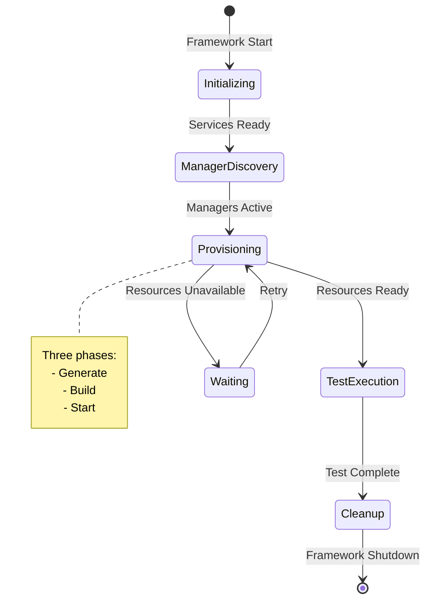
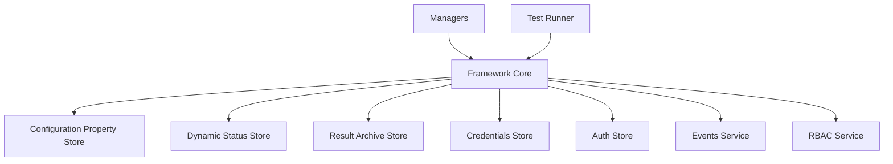
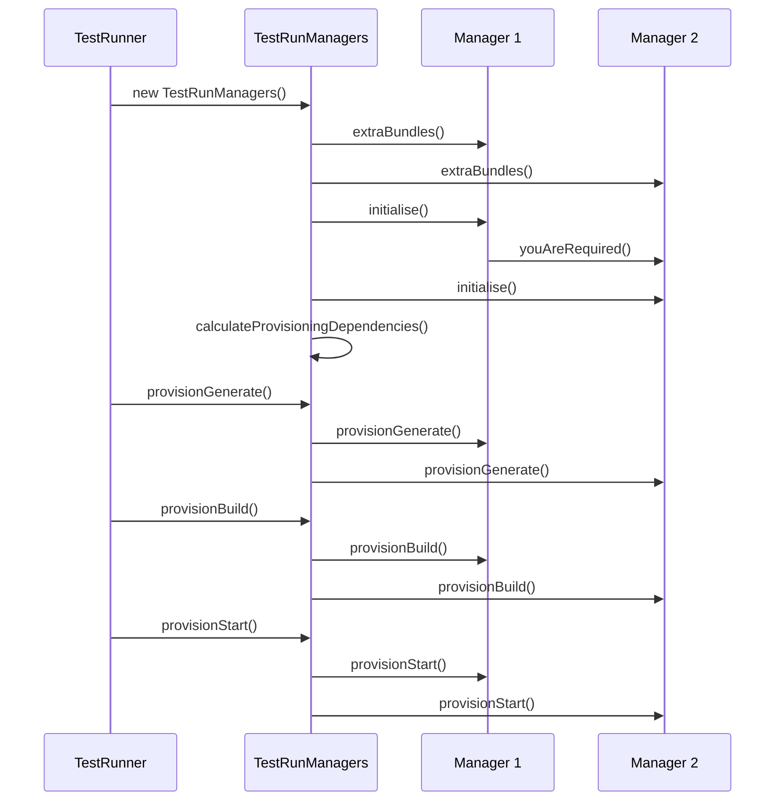

# Framework Core Architecture

The Framework Core is the central component of Galasa that orchestrates all test execution activities. It manages the test lifecycle, coordinates Manager initialization and provisioning, and provides access to essential services like the Configuration Property Store (CPS), Dynamic Status Store (DSS), and Result Archive Store (RAS).

## Overview

The Framework Core acts as the integration point between:
- Test Runners that execute test classes
- Managers that provision and manage resources
- Storage services that maintain configuration, state, and results
- The OSGi framework that loads and manages bundles

It provides the `IFramework` interface as the primary API for accessing framework services and ensures proper initialization, coordination, and cleanup throughout the test execution lifecycle.

## Key Responsibilities

### Test Lifecycle Management

The Framework Core manages the complete test execution lifecycle from initialization through cleanup:

1. **Framework Initialization**: Configures and initializes all required services (CPS, DSS, RAS, credentials, authentication)
2. **Manager Discovery**: Locates all available Manager implementations via OSGi service registration
3. **Manager Initialization**: Activates Managers needed for the test and resolves their dependencies
4. **Resource Provisioning**: Coordinates Manager provisioning phases (generate, build, start)
5. **Test Execution**: Invokes test methods while maintaining heartbeat and timeout monitoring
6. **Cleanup**: Tears down resources and archives results in reverse dependency order



The Framework maintains test state in the DSS and updates lifecycle status markers that external systems can monitor.

### Resource Allocation and Pooling

The Framework Core provides resource allocation services through `IResourcePoolingService`:

- **Resource Pool Management**: Generates available resource lists from regex patterns defined in CPS
- **Conflict Avoidance**: Tracks resource usage in DSS to prevent concurrent allocation
- **Retry Logic**: Places test runs in waiting state when resources are temporarily unavailable
- **Resource Release**: Coordinates proper cleanup when resources are no longer needed

### Service Integration

The Framework Core integrates multiple storage and service components:



Each service is registered as an OSGi service and accessed through the Framework's service accessor methods.

## IFramework Interface

The `IFramework` interface is the primary API that Managers and other components use to access framework services. It provides namespaced access to prevent components from interfering with each other's properties and state.

### Core Service Access Methods

**Configuration Property Store**:
```java
IConfigurationPropertyStoreService getConfigurationPropertyService(String namespace)
```
Provides namespaced access to configuration properties. The namespace (e.g., "zos", "zosbatch") isolates each Manager's configuration.

**Dynamic Status Store**:
```java
IDynamicStatusStoreService getDynamicStatusStoreService(String namespace)
```
Provides namespaced access to runtime state storage for resource locking, test status, and coordination between test runs.

**Result Archive Store**:
```java
IResultArchiveStore getResultArchiveStore()
```
Provides access to store test results, logs, and artifacts.

**Credentials Service**:
```java
ICredentialsService getCredentialsService()
```
Retrieves credentials from the configured credentials store.

**Resource Pooling Service**:
```java
IResourcePoolingService getResourcePoolingService()
```
Allocates resources from pools defined in configuration.

**Additional Services**:
- `IAuthStore getAuthStore()` - Authentication and authorization
- `RBACService getRBACService()` - Role-based access control
- `IStreamsService getStreamsService()` - Test stream management
- `IEventsService getEventsService()` - Event publishing
- `IConfidentialTextService getConfidentialTextService()` - Sensitive data protection

### Metadata Access

- `String getTestRunName()` - Returns the unique test run identifier
- `IRun getTestRun()` - Returns full test run metadata
- `Random getRandom()` - Provides shared random number generator
- `IFrameworkRuns getFrameworkRuns()` - Access to run management APIs

## Framework Implementation Classes

### Framework Class

`dev.galasa.framework.Framework` is the singleton implementation of `IFramework`, registered as an OSGi service. It:

- Maintains references to all registered service implementations
- Validates namespace naming (alphanumeric characters only)
- Wraps service stores with namespaced service interfaces
- Tracks the test run name and metadata
- Provides lifecycle control through `IShuttableFramework`

### FrameworkInitialisation Class

`dev.galasa.framework.FrameworkInitialisation` handles framework bootstrap:

1. **Galasa Home Resolution**: Determines working directory from `GALASA_HOME` environment/property
2. **Service Store URIs**: Resolves CPS, DSS, RAS, and credentials URIs from bootstrap properties
3. **OSGi Service Registration**: Locates and registers service implementations via OSGi
4. **Service Initialization**: Initializes stores in correct dependency order
5. **Override Properties**: Applies property overrides from command line or configuration

The initialization process supports multiple strategies (test run, resource management, API server) selected via `IFrameworkInitialisationStrategy`.

### TestRunManagers Class

`dev.galasa.framework.TestRunManagers` manages the collection of active Managers for a test run:

- **Manager Discovery**: Locates all `IManager` implementations via OSGi service references
- **Dependency Resolution**: Sorts Managers into provisioning order based on dependencies
- **Lifecycle Coordination**: Invokes Manager lifecycle methods in correct sequence
- **Bundle Loading**: Requests and loads additional OSGi bundles required by Managers



The provisioning order ensures Managers that depend on others are provisioned after their dependencies.

## Relationship Between Framework Core and Managers

Managers are pluggable components that provide specific functionality for different technologies and platforms. The Framework Core and Managers interact through a well-defined contract:

### Manager Lifecycle

The Framework drives Managers through these lifecycle phases:

1. **Discovery**: Framework locates Managers via OSGi `IManager` service registration
2. **Extra Bundles**: Managers request additional OSGi bundles be loaded (e.g., platform-specific implementations)
3. **Initialization**: Managers examine test class annotations and add themselves to active list if needed
4. **Dependency Declaration**: Managers declare dependencies via `areYouProvisionalDependentOn()`
5. **Provision Generate**: Managers allocate resource names and slots (must not build anything yet)
6. **Provision Build**: Managers build and configure resources in dependency order
7. **Provision Start**: Managers start provisioned resources
8. **Test Execution**: Managers fill annotated fields and respond to test method lifecycle events
9. **Provision Stop**: Managers stop resources in reverse dependency order
10. **Provision Discard**: Managers clean up and release resources

### Service Access from Managers

Managers access framework services through the `IFramework` instance passed during initialization:

```java
public class ZosManagerImpl extends AbstractManager {
    private IFramework framework;
    
    @Override
    public void initialise(IFramework framework, List<IManager> allManagers,
                          List<IManager> activeManagers, GalasaTest galasaTest) {
        this.framework = framework;
        
        // Get namespaced CPS access
        IConfigurationPropertyStoreService cps = 
            framework.getConfigurationPropertyService("zos");
        
        // Get namespaced DSS access
        IDynamicStatusStoreService dss = 
            framework.getDynamicStatusStoreService("zos");
        
        // Check if test needs this manager
        if (testNeedsZos(galasaTest)) {
            activeManagers.add(this);
        }
    }
}
```

The Framework ensures Managers have isolated namespaces to prevent configuration conflicts.

### Manager Dependencies

Managers declare provisioning dependencies to ensure proper ordering:

```java
@Override
public boolean areYouProvisionalDependentOn(IManager otherManager) {
    // zOS Batch depends on zOS Manager
    return otherManager instanceof IZosManagerSpi;
}
```

The Framework sorts active Managers into a dependency-respecting order before provisioning begins.

## Module Structure

The Framework Core is organized under `modules/framework/galasa-parent/` with these key subprojects:

### Core Framework Modules

- **`dev.galasa.framework`**: Main framework implementation including `Framework`, `FrameworkInitialisation`, `TestRunner`, `TestRunManagers`, and lifecycle management
- **`dev.galasa`**: Core annotations and interfaces used by test classes and Managers
- **`galasa-boot`**: Bootstrap launcher that starts OSGi and loads framework bundles
- **`galasa-testharness`**: Test execution harness for local and automated runs

### Service Implementation Modules

- **`dev.galasa.framework.auth.spi`**: Authentication and authorization service interfaces
- **`dev.galasa.framework.maven.repository`**: Maven repository access for bundle loading
- **`dev.galasa.framework.resource.management`**: Resource management service that monitors and cleans up allocated resources
- **`dev.galasa.framework.metrics`**: Metrics collection and reporting

### API Server Modules

- **`dev.galasa.framework.api`**: Core API server framework
- **`dev.galasa.framework.api.authentication`**: Authentication endpoints
- **`dev.galasa.framework.api.cps`**: Configuration property store REST API
- **`dev.galasa.framework.api.ras`**: Result archive store REST API
- **`dev.galasa.framework.api.runs`**: Test run management API
- **`dev.galasa.framework.api.resources`**: Resource management API
- **`dev.galasa.framework.api.health`**: Health check endpoints

### Controller Modules

- **`dev.galasa.framework.k8s.controller`**: Kubernetes-based test run controller
- **`dev.galasa.framework.docker.controller`**: Docker-based test run controller (if present)

## Extension Points

The Framework Core provides several extension mechanisms:

### Service Registration

Components can register service implementations via OSGi:

- `IConfigurationPropertyStoreRegistration` - Custom CPS backends
- `IDynamicStatusStoreRegistration` - Custom DSS backends
- `IResultArchiveStoreRegistration` - Custom RAS backends
- `ICredentialsStoreRegistration` - Custom credentials backends
- `IManager` - Custom Manager implementations

### Initialization Strategies

Different initialization strategies support various framework use cases:

- **Test Run Strategy**: Full Manager initialization, resource provisioning, test execution
- **Default Strategy**: Basic service initialization for API servers and controllers
- **Resource Management Strategy**: Service initialization for resource cleanup daemon

Strategies are selected via `IFrameworkInitialisationStrategy` implementations.

## Configuration

Framework behavior is controlled through properties and environment variables:

### Environment Variables

- `GALASA_HOME` - Base directory for framework files (overrides `user.home/.galasa`)
- `USERPROFILE` - Windows fallback for user home directory

### Bootstrap Properties

Bootstrap properties configure initial framework behavior:

- `framework.config.store` - URI for Configuration Property Store
- `framework.dynamicstatus.store` - URI for Dynamic Status Store
- `framework.resultarchive.store` - URI(s) for Result Archive Store(s)
- `framework.credentials.store` - URI for Credentials Store
- `framework.auth.store` - URI for Auth Store
- `framework.galasa.home` - Override for Galasa home directory

URIs support multiple schemes: `file://`, `etcd://`, `couchdb://`, `inmemory://`

### Override Properties

Override properties passed to tests take precedence over stored configuration and can inject test-specific settings.

## Operational Aspects

### Framework Startup

The framework is typically started via `galasa-boot`:

```bash
java -jar galasa-boot.jar \
  --obr mvn:dev.galasa/dev.galasa.uber.obr/0.36.0/obr \
  --test dev.galasa.example.banking/dev.galasa.example.banking.account.TestAccount
```

Galasa Boot:
1. Starts Felix OSGi framework
2. Loads framework bundles from OBR
3. Registers bootstrap and override properties
4. Framework activates and initializes services
5. Test Runner loads test bundle and executes test

### Health and Monitoring

The Framework provides health monitoring through:

- **Heartbeat**: `TestRunHeartbeat` periodically updates DSS to indicate the test is alive
- **Timeout Monitor**: `TestRunTimeoutMonitor` enforces maximum test duration
- **Lifecycle Status**: Test run status tracked in DSS (`run.{runName}.status`)
- **Metrics**: Optional metrics server exposes framework and test metrics

### Resource Management

A separate resource management process monitors DSS for abandoned resources:

- Runs continuously in ecosystem
- Invokes Manager resource cleanup for finished/failed runs
- Prevents resource leaks from abnormally terminated tests
- Configured via `--resourcemanagement` flag to `galasa-boot`

## Related Components

- **[Storage Services](/openwiki/architecture/storage-services.md)**: CPS, DSS, RAS, and credentials store implementations
- **[Managers](/openwiki/architecture/managers.md)**: Pluggable components that provision and manage resources
- **[Test Execution Lifecycle](/openwiki/concepts/test-execution-lifecycle.md)**: Detailed test execution flow
- **[Galasa Boot](/openwiki/operations/galasa-boot.md)**: Bootstrap launcher and command-line options
