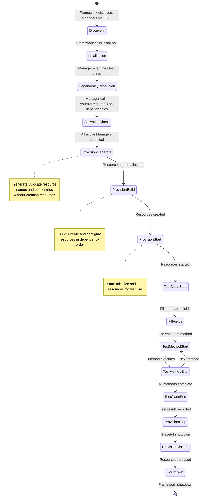
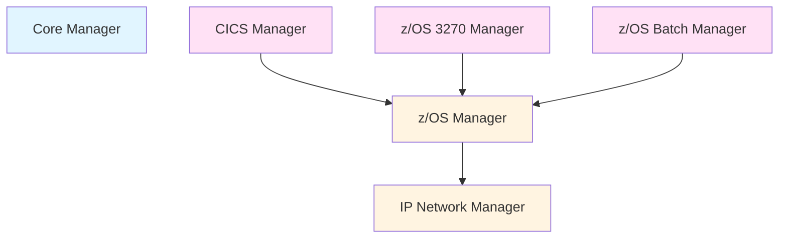

# Manager Architecture and Plugin System

Managers are the extensibility backbone of Galasa, providing pluggable components that encapsulate technology-specific functionality and resource management. They follow a well-defined lifecycle, support dependency injection, and coordinate resource provisioning across multiple test runs.

## What are Managers?

Managers are pluggable components that provide specific functionality for different technologies and platforms. Each Manager is responsible for:

1. **Provisioning and Managing Resources**: Allocating, configuring, and tracking resources like z/OS images, CICS regions, Docker containers, or HTTP clients
2. **Providing Test Interfaces**: Exposing Test Programming Interfaces (TPIs) that test classes use to interact with provisioned resources
3. **Handling Cleanup and Resource Release**: Ensuring resources are properly released and cleaned up after test execution
4. **Implementing Annotations**: Defining annotations that allow test classes to declaratively request resources

Managers are discovered and loaded dynamically at runtime via OSGi service registration, making the framework highly extensible without requiring core changes.

## Manager Categories

Galasa organizes Managers into logical categories based on their purpose:

### Core Managers

Essential functionality required by all or most tests:

- **Core Manager**: Provides logging, test properties, resource strings, and stored artifact root access
- **Artifact Manager**: Manages test artifact retrieval and storage
- **Text Scan Manager**: Provides pattern matching and text analysis capabilities

### Platform Managers

Support for specific operating system platforms:

- **z/OS Manager**: Provisions z/OS images and provides foundational z/OS services
- **Linux Manager**: Manages Linux systems for test execution
- **Windows Manager**: Provides Windows system support

### Technology Managers

Support for specific middleware and application technologies:

- **CICS Manager**: Manages CICS regions and provides CECI, CEDA, CEMT interfaces
- **DB2 Manager**: Database connectivity and operations
- **z/OS 3270 Manager**: Terminal emulation for 3270 interactions
- **z/OS Batch Manager**: Job submission and output retrieval
- **z/OS File Manager**: Dataset and UNIX file management
- **z/OS Console Manager**: Console command execution
- **Liberty Manager**: WebSphere Liberty profile support
- **MQ Manager**: IBM MQ queue manager integration

### Cloud Managers

Support for cloud platforms and containerization:

- **Docker Manager**: Container lifecycle management
- **Kubernetes Manager**: Kubernetes cluster and pod management
- **OpenStack Manager**: OpenStack infrastructure provisioning

### Communication Managers

Network protocols and communication interfaces:

- **HTTP Manager**: HTTP/HTTPS client capabilities
- **IP Network Manager**: Network connectivity and port management

### Test Tool Managers

Integration with external testing tools:

- **JMeter Manager**: Performance testing with Apache JMeter
- **Selenium Manager**: Browser automation and web testing

### Workflow Managers

Integration with workflow and issue tracking systems:

- **GitHub Issue Manager**: GitHub issue creation and tracking

### Utility Managers

Specialized utility functions:

- **Galasa Ecosystem Manager**: Manages Galasa ecosystem instances for testing
- **Elastic Log Manager**: Elastic log aggregation

## Manager Interface and Base Classes

### IManager Interface

All Managers implement the `IManager` interface, which defines the complete Manager lifecycle. Key methods include:

**Discovery and Initialization**:
```java
List<String> extraBundles(IFramework framework)
void initialise(IFramework framework, List<IManager> allManagers, 
                List<IManager> activeManagers, GalasaTest galasaTest)
void youAreRequired(List<IManager> allManagers, List<IManager> activeManagers, 
                    GalasaTest galasaTest)
```

**Dependency Declaration**:
```java
boolean areYouProvisionalDependentOn(IManager otherManager)
```

**Provisioning Lifecycle**:
```java
void provisionGenerate()
void provisionBuild()
void provisionStart()
void provisionStop()
void provisionDiscard()
```

**Test Execution Support**:
```java
void startOfTestClass()
void fillAnnotatedFields(Object instantiatedTestClass)
void startOfTestMethod(GalasaMethod galasaMethod)
Result endOfTestMethod(GalasaMethod galasaMethod, Result currentResult, Throwable currentException)
Result endOfTestClass(Result currentResult, Throwable currentException)
```

**Shutdown**:
```java
void endOfTestRun()
void shutdown()
```

### AbstractManager Base Class

The `AbstractManager` class provides boilerplate implementations and utility methods that concrete Managers extend:

**Field Management**:
- `registerAnnotatedField(Field field, Object value)`: Register a value to inject into a test field
- `getAnnotatedField(Field field)`: Retrieve the generated object for a field
- `findAnnotatedFields(Class<? extends Annotation> managerAnnotation)`: Locate fields annotated with Manager annotations
- `generateAnnotatedFields(Class<? extends Annotation> managerAnnotation)`: Automatically invoke methods marked with `@GenerateAnnotatedField` to populate test fields

**Framework Access**:
- `getFramework()`: Access the Framework instance
- `getTestClass()`: Access the test class

**Dependency Helpers**:
- `addDependentManager(List<IManager> allManagers, List<IManager> activeManagers, GalasaTest galasaTest, Class<T> dependentInterface)`: Locate and activate a required Manager by interface

**Annotation Processing**:
Managers use the `@GenerateAnnotatedField` annotation to mark methods that should be invoked to generate values for test fields:

```java
@GenerateAnnotatedField(annotation = ZosImage.class)
public IZosImage generateZosImage(Field field, List<Annotation> annotations) {
    // Generate and return IZosImage instance
}
```

## Manager Lifecycle

Managers follow a well-defined lifecycle that ensures proper initialization, resource allocation, test execution, and cleanup:



*Manager lifecycle phases from discovery through cleanup*

### Lifecycle Phase Details

#### 1. Discovery and Registration

Managers register themselves as OSGi services using the `@Component` annotation:

```java
@Component(service = { IManager.class })
public class ZosManagerImpl extends AbstractManager implements IZosManagerSpi {
    // ...
}
```

The Framework discovers all registered Managers via the OSGi service registry.

#### 2. Initialization

The Framework calls `initialise()` on each Manager. The Manager examines the test class to determine if it should participate:

```java
@Override
public void initialise(@NotNull IFramework framework, @NotNull List<IManager> allManagers,
        @NotNull List<IManager> activeManagers, @NotNull GalasaTest galasaTest) throws ManagerException {
    super.initialise(framework, allManagers, activeManagers, galasaTest);
    
    // Check if test class uses this Manager's annotations
    List<AnnotatedField> ourFields = findAnnotatedFields(ZosManagerField.class);
    if (!ourFields.isEmpty()) {
        youAreRequired(allManagers, activeManagers, galasaTest);
    }
}
```

#### 3. Dependency Resolution

Managers declare dependencies on other Managers through the `youAreRequired()` method:

```java
@Override
public void youAreRequired(@NotNull List<IManager> allManagers, @NotNull List<IManager> activeManagers,
        @NotNull GalasaTest galasaTest) throws ManagerException {
    if (activeManagers.contains(this)) {
        return;
    }
    
    activeManagers.add(this);
    
    // Request the IP Network Manager
    ipManager = addDependentManager(allManagers, activeManagers, galasaTest, IIpNetworkManagerSpi.class);
    if (ipManager == null) {
        throw new ZosManagerException("The IP Network Manager is not available");
    }
}
```

The Framework sorts Managers into provisioning order based on the `areYouProvisionalDependentOn()` method, which returns true if one Manager depends on another during provisioning phases.

#### 4. Extra Bundle Loading

Before provisioning, Managers can request additional OSGi bundles to be loaded via `extraBundles()`. This allows Managers to load fragment implementations based on configuration properties:

```java
@Override
public List<String> extraBundles(@NotNull IFramework framework) throws ZosManagerException {
    ArrayList<String> bundles = new ArrayList<>();
    bundles.add(BatchExtraBundle.get());  // Load from CPS property
    bundles.add(FileExtraBundle.get());
    return bundles;
}
```

#### 5. Resource Provisioning (Generate, Build, Start)

The Framework invokes three provisioning phases in dependency order:

**Generate Phase**: Managers allocate resource names, pool entries, and determine what resources are needed without actually creating them. If resources are unavailable, they throw `ResourceUnavailableException` to put the test in waiting state.

**Build Phase**: Managers create and configure the resources they need. This phase builds resources in dependency order so that dependent Managers can use resources from their dependencies.

**Start Phase**: Managers start or initialize resources for active use by tests.

```java
@Override
public void provisionGenerate() throws ManagerException, ResourceUnavailableException {
    // Generate annotated fields by calling @GenerateAnnotatedField methods
    generateAnnotatedFields(ZosManagerField.class);
}
```

#### 6. Test Execution

The Framework coordinates test method execution:

1. **startOfTestClass()**: Called once before any test methods
2. **fillAnnotatedFields()**: Injects Manager-generated values into test fields before each method
3. **startOfTestMethod()**: Called before each test method
4. **endOfTestMethod()**: Called after each test method, allows Managers to override result
5. **endOfTestClass()**: Called after all test methods, allows Managers to override overall result

#### 7. Cleanup and Shutdown

Cleanup phases execute in reverse dependency order:

1. **provisionStop()**: Gracefully stop resources
2. **provisionDiscard()**: Delete and release resources
3. **shutdown()**: Final cleanup of Manager-internal state (HTTP clients, connections, etc.)

## Manager Dependency Model

Managers declare dependencies to ensure proper initialization and provisioning order. The Framework uses these dependencies to calculate a topological sort that respects all dependency relationships.



*Example Manager dependency hierarchy*

### Dependency Declaration

Managers declare provisioning dependencies through `areYouProvisionalDependentOn()`:

```java
@Override
public boolean areYouProvisionalDependentOn(@NotNull IManager otherManager) {
    return otherManager instanceof IZosManagerSpi;
}
```

This ensures the CICS Manager provisions after the z/OS Manager, allowing CICS regions to be allocated on provisioned z/OS images.

### Transitive Dependencies

When a Manager activates via `youAreRequired()`, it can activate its own dependencies:

```java
@Override
public void youAreRequired(...) throws ManagerException {
    if (!activeManagers.contains(this)) {
        activeManagers.add(this);
        // Activate z/OS Manager as dependency
        zosManager = addDependentManager(allManagers, activeManagers, galasaTest, IZosManagerSpi.class);
    }
}
```

The Framework automatically handles transitive dependencies, ensuring all required Managers are activated.

## Service Provider Interface (SPI) Pattern

Managers follow the Service Provider Interface pattern to decouple interfaces from implementations:

1. **Manager API (TPI)**: Public interfaces in the manager package (e.g., `dev.galasa.zos.IZosImage`)
2. **Manager SPI**: Internal provider interfaces in the spi subpackage (e.g., `dev.galasa.zos.spi.IZosManagerSpi`)
3. **Manager Implementation**: Implementation classes in internal package (e.g., `dev.galasa.zos.internal.ZosManagerImpl`)
4. **Fragment Implementations**: Alternative implementations loaded as OSGi fragments (e.g., z/OS Batch via z/OSMF or RSE API)

Tests interact only with TPI interfaces, while the Manager implementation is hidden. This allows:

- Multiple implementations for the same TPI
- Runtime selection of implementations based on configuration
- Fragment bundles that provide alternative implementations without changing the Manager

### Fragment Bundle Pattern

Managers can define multiple implementation bundles loaded based on CPS properties:

```java
// z/OS Manager loads different implementations for file operations
bundles.add(FileExtraBundle.get());  // Reads "zos.bundle.extra.file.manager" property
```

This allows the same `IZosFileHandler` interface to be implemented by either:
- `dev.galasa.zosfile.zosmf.manager` (z/OSMF implementation)
- `dev.galasa.zosfile.rseapi.manager` (RSE API implementation)

## Resource Management

Managers handle resources through allocation, sharing, isolation, and cleanup:

### Resource Allocation

Managers allocate resources during the Generate phase using the Framework's Resource Pooling Service:

- Define resource pools in CPS as regex patterns (e.g., `zos.dse.tag.PRIMARY.imageid=MVSA|MVSB|MVSC`)
- Allocate from pool using `IResourcePoolingService`
- Track allocation in DSS to prevent conflicts
- Throw `ResourceUnavailableException` if resources are unavailable

### Resource Sharing

Managers support resource sharing between tests:

- **DSS Locking**: Use Dynamic Status Store to coordinate exclusive and shared locks
- **Reference Counting**: Track how many tests use a shared resource
- **Shared Environments**: Managers can opt into shared environment support via `doYouSupportSharedEnvironments()`

### Resource Isolation

Managers ensure resource isolation:

- **Unique Run Identifiers**: Use test run name for uniqueness
- **Dataset HLQ Prefixes**: Generate unique high-level qualifiers for z/OS datasets
- **Port Allocation**: Allocate unique ports from pools to avoid conflicts
- **UNIX Path Prefixes**: Use unique prefixes for UNIX filesystem resources

### Resource Cleanup

Cleanup executes in reverse dependency order:

1. **Stop Phase**: Graceful shutdown (e.g., stop CICS region, disconnect terminals)
2. **Discard Phase**: Resource deletion (e.g., delete datasets, release ports, remove containers)
3. **Shutdown Phase**: Manager-internal cleanup (e.g., close HTTP clients)

Cleanup happens even if tests fail, ensuring resources are always released.

## Manager Testing and Readiness

Each Manager undergoes testing at various levels, with readiness indicators showing maturity:

### Testing Levels

- **IVT (Installation Verification Test)**: Manager has IVT tests run locally during development
- **Local**: Manager tested in a local Galasa Ecosystem
- **Isolated**: Manager tested in an Isolated Ecosystem configuration
- **MVP**: Manager tested as part of the Galasa MVP (Minimum Viable Product) configuration
- **Other Managers**: Manager used for provisioning other Manager tests

### Readiness Indicators

- **Alpha**: Manager is actively developed and subject to change. TPI may not be stable.
- **Beta**: Manager is almost ready. TPI is stable but minor changes may occur.
- **Release**: Manager is feature complete, passed all tests, and deemed production grade.

The README in the managers repository tracks the current testing level and readiness for all Managers.

## Annotation-Based Resource Injection

Managers use Java annotations to enable declarative resource provisioning in test classes:

### Test Class Annotations

Tests declare required resources using Manager annotations:

```java
@Test
public class MyCICSTest {
    @ZosImage(imageTag = "PRIMARY")
    public IZosImage zosImage;
    
    @Cics(cicsTag = "CICS1", imageTag = "PRIMARY")
    public ICicsRegion cicsRegion;
    
    @ZosBatchJobname
    public IZosBatchJobname jobname;
    
    @Logger
    public Log logger;
    
    @Test
    public void testCICSTransaction() {
        // Use injected resources
        logger.info("Testing CICS region: " + cicsRegion.getApplid());
    }
}
```

### Annotation Processing

Managers process annotations through these steps:

1. **findAnnotatedFields()**: Locate all fields with Manager annotations
2. **@GenerateAnnotatedField Methods**: Define methods that generate resource instances
3. **generateAnnotatedFields()**: Automatically invoke generator methods for each field
4. **registerAnnotatedField()**: Register the generated value for injection
5. **fillAnnotatedFields()**: Inject values into test fields before each test method

Example generator method:

```java
@GenerateAnnotatedField(annotation = ZosImage.class)
public IZosImage generateZosImage(Field field, List<Annotation> annotations) 
        throws ManagerException, ResourceUnavailableException {
    ZosImage annotation = field.getAnnotation(ZosImage.class);
    String imageTag = annotation.imageTag();
    return allocateZosImage(imageTag);
}
```

### Dependency Annotations

Some annotations trigger dependencies on other Managers. For example, `@Cics(imageTag="A")` requires both the CICS Manager and the z/OS Manager. The z/OS Manager uses `findProvisionDependentAnnotatedFieldTags()` to discover that image "A" is needed even without an explicit `@ZosImage` annotation.

## Extension Points

The Manager architecture provides multiple extension points:

### Creating New Managers

To create a new Manager:

1. Extend `AbstractManager`
2. Implement Manager-specific SPI interfaces
3. Register as OSGi service with `@Component(service = { IManager.class })`
4. Define annotations for test field injection
5. Implement `@GenerateAnnotatedField` methods
6. Implement lifecycle methods as needed (provisionGenerate, provisionBuild, etc.)
7. Declare dependencies in `youAreRequired()` and `areYouProvisionalDependentOn()`

### Implementing Manager Fragments

To provide an alternative implementation:

1. Create a new bundle as an OSGi fragment
2. Implement the Manager's SPI interfaces
3. Configure the Manager to load the fragment via CPS property
4. The Manager's `extraBundles()` method loads the fragment at runtime

### Manager Configuration

Managers use the Configuration Property Store (CPS) for all configuration:

- Namespace isolation prevents property conflicts
- Properties support infixes for multi-dimensional configuration
- Default values with override capabilities
- Dynamic property resolution at runtime

Example:
```
zos.dse.tag.PRIMARY.imageid=MVSA
zos.image.MVSA.ipv4.hostname=192.168.1.100
zosbatch.batchjob.timeout=300
```

## Implementation Details

### OSGi Service Registration

Managers register as OSGi Declarative Services components:

```java
@Component(service = { IManager.class })
public class CoreManagerImpl extends AbstractGherkinManager implements ICoreManager, ILoggingManager {
    // Implementation
}
```

The Framework discovers Managers by querying the OSGi service registry for all `IManager.class` services.

### Manager Sorting Algorithm

The Framework sorts Managers into provisioning order using a bubble-sort-based algorithm:

1. For each Manager position, check if it should be after any later Manager
2. If a dependency violation is found, swap the Managers
3. Repeat until no swaps occur or a limit is reached
4. Verify the final order has no circular dependencies
5. Store both forward and reversed Manager lists for provisioning and cleanup

### Shared Environment Support

Managers can declare support for shared environments:

```java
@Override
public boolean doYouSupportSharedEnvironments() {
    return true;  // This Manager supports sharing between tests
}
```

The Framework checks this during Shared Environment Build to determine which Managers can participate in shared environment provisioning.

### Result Override Capability

Managers can override test results during lifecycle methods:

```java
@Override
public Result endOfTestMethod(@NotNull GalasaMethod galasaMethod, @NotNull Result currentResult,
        Throwable currentException) throws ManagerException {
    if (detectSpecificFailureCondition()) {
        return Result.envfail("Environment failure detected by Manager");
    }
    return null;  // Accept current result
}
```

This allows Managers to classify failures as environmental issues rather than test failures.
