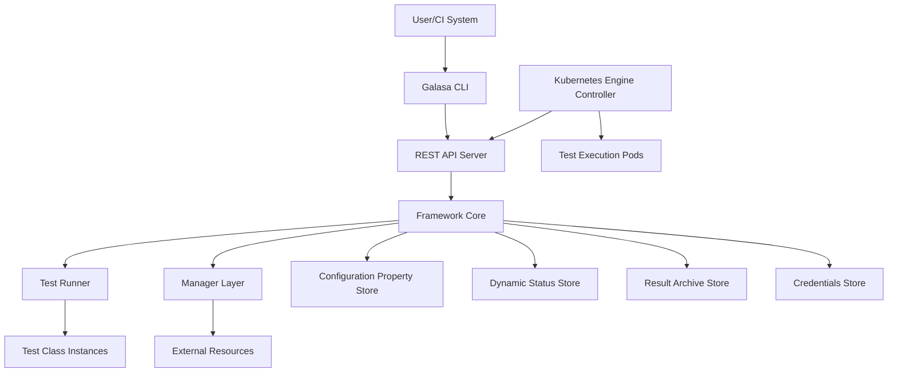
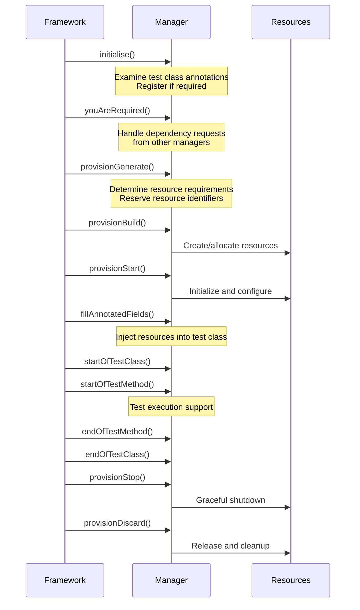
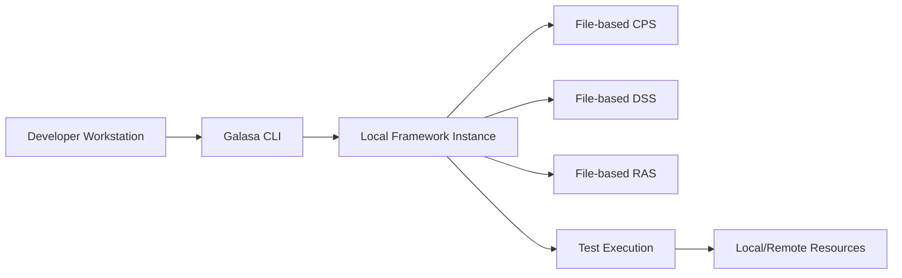
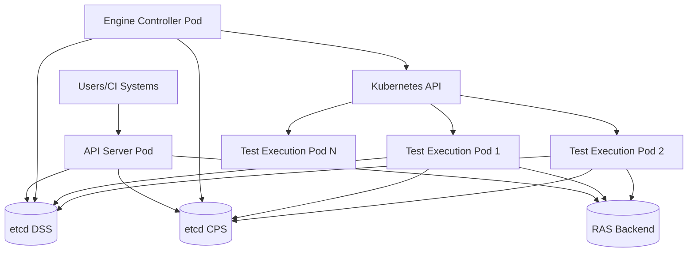
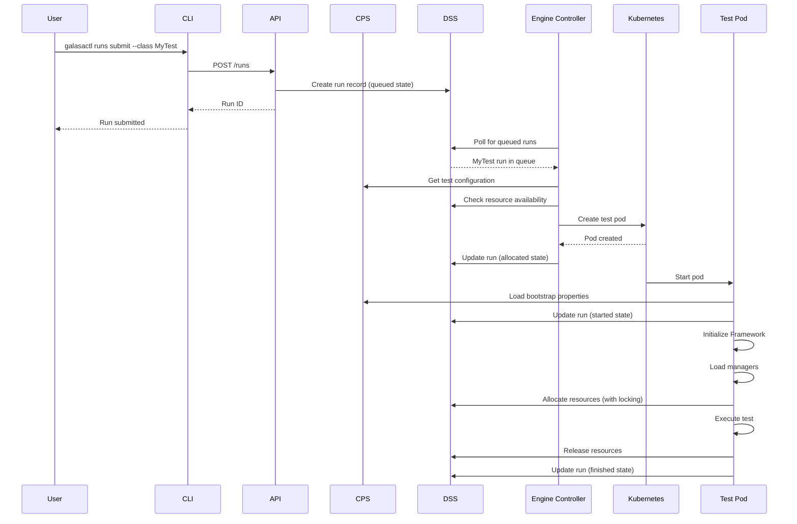

# Galasa Architecture Overview

Galasa is an open-source test automation framework designed for enterprise-scale testing across multiple platforms and technologies, including mainframe systems, cloud environments, and distributed systems. This document provides a high-level overview of Galasa's architecture, explaining its key components and how they interact to deliver automated, scalable testing capabilities.

## Architectural Principles

Galasa's architecture is built on several foundational principles that guide its design and implementation:

**Modularity**: Components are designed as independent, replaceable modules with well-defined interfaces. The framework core, managers, storage services, and test runners can be developed, tested, and deployed independently.

**Extensibility**: The framework provides multiple extension points through its Service Provider Interface (SPI) pattern, allowing new managers, storage backends, and authentication mechanisms to be added without modifying core framework code.

**Separation of Concerns**: Clear boundaries exist between different aspects of the system - test execution orchestration (Framework Core), resource provisioning (Managers), data persistence (Storage Services), and test scheduling (Controllers).

**Pluggability**: Components can be loaded dynamically at runtime through OSGi bundles. Managers, storage implementations, and other services are discovered and instantiated based on configuration and test requirements.

## Core Architecture Components

*High-level component relationships in the Galasa architecture*

### Framework Core

The Framework Core is the central orchestrator of the Galasa ecosystem. Implemented through the `IFramework` interface, it provides access to all framework services and manages the overall test execution lifecycle.

**Key Responsibilities**:
- Lifecycle management for test runs from initialization through completion
- Service registration and discovery through OSGi service component mechanisms
- Resource allocation and management coordination across managers
- Integration point for all storage services (CPS, DSS, RAS, Credentials)
- Authentication and authorization service provisioning

The Framework Core maintains singleton instances of core services and ensures they are properly initialized before any test execution begins. It provides namespace-isolated access to configuration and dynamic status storage, preventing managers from interfering with each other's state.

### Managers

Managers are pluggable components that provide specific technology or platform capabilities. They follow the `IManager` interface contract and are loaded dynamically based on test class annotations and configuration.

**Manager Categories**:
- **Core Managers**: Provide essential functionality required by all tests (ArtifactManager, HttpClientManager)
- **Platform Managers**: Support specific operating systems and platforms (zOS Manager, Linux Manager, Windows Manager)
- **Technology Managers**: Enable interaction with specific technologies (CICS Manager, DB2 Manager, JMeter Manager)
- **Cloud Managers**: Facilitate cloud platform integration (Kubernetes Manager, Docker Manager, OpenStack Manager)

**Manager Lifecycle Phases**:

*Manager lifecycle from initialization through resource cleanup*

Managers declare dependencies on other managers through the `areYouProvisionalDependentOn()` method, allowing the framework to determine the correct provisioning order. For example, the CICS Manager depends on the zOS Manager because it needs a zOS image before it can provision a CICS region.

### Test Runner

The Test Runner (`TestRunner` class) executes test classes and coordinates their lifecycle with managers. It handles test class loading, manager initialization, test method execution, and result collection.

**Execution Flow**:
1. **Initialization**: Load test class from specified OSGi bundle
2. **Manager Setup**: Discover and initialize required managers based on test annotations
3. **Resource Provisioning**: Coordinate multi-phase resource provisioning (generate, build, start)
4. **Field Injection**: Populate annotated fields in test class with provisioned resources
5. **Test Execution**: Execute test methods with full manager support
6. **Result Capture**: Collect test results, logs, and artifacts
7. **Resource Cleanup**: Coordinate resource teardown (stop, discard)

The Test Runner distinguishes between different run types (normal tests, shared environment builds, shared environment discards) and adjusts its behavior accordingly.

### Storage Services

Galasa employs multiple specialized storage services, each addressing specific data lifecycle needs:

**Configuration Property Store (CPS)**: 
Provides hierarchical, namespace-isolated configuration properties. Managers and tests query the CPS for runtime configuration such as endpoint URLs, resource pool definitions, and feature flags. The CPS supports property inheritance and overrides through namespace hierarchies.

**Dynamic Status Store (DSS)**:
Maintains transient runtime state for resource allocation, locking, and coordination between concurrent test runs. The DSS provides atomic compare-and-swap operations for distributed locking, enabling safe resource allocation in multi-engine deployments. Status information is cleared when runs complete.

**Result Archive Store (RAS)**:
Captures test execution results, logs, artifacts, and test structure metadata. The RAS supports multiple backend implementations (file-based, database-backed) and can write to multiple stores simultaneously through composite implementation patterns. Each test run receives a unique run ID for result correlation.

**Credentials Store**:
Securely manages authentication credentials required by tests and managers. Credentials are retrieved by ID and can be provided by different backend implementations (file-based, external secret managers, cloud key vaults).

### CLI

The Galasa CLI (`galasactl`) provides command-line access to the Galasa ecosystem. Written in Go, it communicates with the Galasa REST API to submit tests, query results, manage resources, and configure ecosystem settings.

**Key Capabilities**:
- Test submission and execution monitoring
- Result retrieval and artifact download
- Ecosystem bootstrap and configuration
- Authentication and authorization management
- Integration with CI/CD pipelines through exit codes and structured output formats

### REST API Server

The REST API Server exposes HTTP endpoints for programmatic interaction with the Galasa ecosystem. It provides services for:
- Test run submission, query, and cancellation
- Result archive access and artifact retrieval
- Configuration property management
- User authentication and authorization
- Resource management and status query

The API server runs as a separate service (launched via `galasa-boot` with the `--api` flag) and integrates with the framework core to access storage services and trigger test execution.

## Deployment Patterns

Galasa supports two primary deployment patterns optimized for different use cases:

### Local Development Deployment

*Local development deployment with file-based storage services*

In local development mode:
- Framework runs directly on developer workstation via `galasa-boot` JAR
- Storage services use file-based implementations under `~/.galasa` or `$GALASA_HOME`
- Tests execute in the same JVM as the framework
- Configuration properties are managed through local files
- Suitable for test development, debugging, and isolated testing

### Kubernetes Ecosystem Deployment

*Kubernetes ecosystem deployment with distributed storage and isolated test execution*

In Kubernetes ecosystem mode:
- **API Server**: Runs as a Kubernetes Deployment, handles REST API requests, authenticates users
- **Engine Controller**: Kubernetes-based controller that monitors queued runs in DSS and creates test execution pods
- **Test Execution Pods**: Individual pods created per test run, each running `galasa-boot` with the test class
- **Distributed Storage**: Shared etcd-based CPS and DSS enable coordination across all pods
- **Scalability**: Multiple test pods execute concurrently with isolated resource allocation via DSS locking
- **Resource Management**: Optional resource management service monitors DSS and releases hung resources

The Engine Controller (`K8sController` class) continuously polls the DSS for queued test runs, evaluates resource availability, and schedules test pods when resources are available. Each test pod operates independently with its own Framework Core instance but shares configuration and state through distributed storage services.

## Component Interactions

### Test Submission and Execution Flow

*End-to-end flow from test submission to completion in Kubernetes ecosystem*

### Manager Dependency Resolution

Managers frequently depend on other managers to provide foundational capabilities. The framework resolves these dependencies during initialization:

1. All managers receive `initialise()` call with the test class
2. Managers examine test class annotations to determine if they are needed
3. Required managers call `youAreRequired()` on their dependencies
4. Framework builds dependency graph using `areYouProvisionalDependentOn()`
5. Provisioning methods are called in dependency order (dependencies first)

For example, a test using CICS and DB2 on zOS creates this dependency chain:
- Test annotations require CICS Manager and DB2 Manager
- CICS Manager calls `youAreRequired()` on zOS Manager
- DB2 Manager calls `youAreRequired()` on zOS Manager  
- Framework provisions in order: zOS Manager → CICS Manager → DB2 Manager

## Extension Points

Galasa provides well-defined extension points for customization:

**Custom Managers**: Implement `IManager` interface and register as OSGi service component. Managers can provide new annotations, resource types, and integration with external systems.

**Storage Backends**: Implement `IConfigurationPropertyStore`, `IDynamicStatusStore`, or `IResultArchiveStore` interfaces to integrate with different storage technologies (databases, cloud services, secret managers).

**Authentication Mechanisms**: Implement `IAuthStore` and related interfaces to integrate with enterprise authentication systems (LDAP, OIDC, SAML).

**Test Languages**: While Java is the primary test language, the framework's language abstraction (`GalasaTest`, `GalasaMethod` interfaces) allows for alternative test language support.

## Operational Characteristics

**Concurrency**: Multiple test pods can execute concurrently in Kubernetes deployments. The DSS provides distributed locking to coordinate resource allocation and prevent conflicts.

**Fault Tolerance**: Test pods are isolated - failure in one test does not affect others. The Engine Controller monitors pod health and can mark runs as failed if pods terminate unexpectedly.

**Resource Sharing**: Managers can designate resources as shared, allowing multiple tests to reuse pre-provisioned environments. Shared environment lifecycle is managed separately through dedicated build and discard runs.

**Observability**: The framework exposes metrics endpoints (Prometheus format), health endpoints, and comprehensive logging. The RAS captures complete test execution traces for post-mortem analysis.

**Security**: Authentication is enforced at the API layer. Role-based access control (RBAC) determines user permissions for test submission, configuration management, and result access. Credentials are never exposed in logs or test results.

## Related Documentation

- [Framework Core Architecture](/openwiki/architecture/framework-core.md) - Detailed framework internals
- [Manager Architecture](/openwiki/architecture/managers.md) - Manager lifecycle and development
- [Storage Services](/openwiki/architecture/storage-services.md) - CPS, DSS, RAS, and Credentials Store
- [CLI Architecture](/openwiki/architecture/cli.md) - Command-line interface design
- [Test Execution Lifecycle](/openwiki/concepts/test-execution-lifecycle.md) - Complete test run state machine
