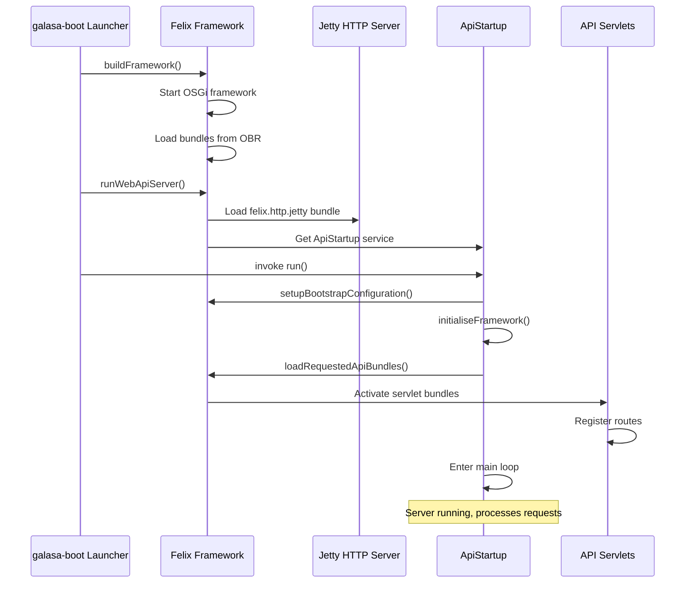
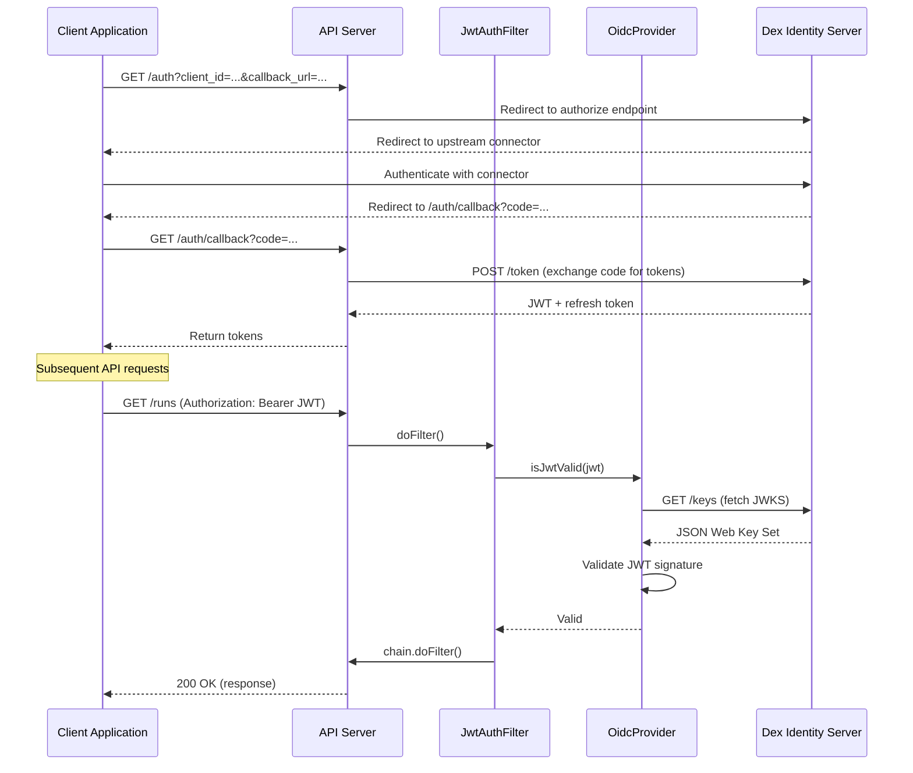

# REST API Architecture

The Galasa REST API server provides HTTP endpoints for interacting with a Galasa ecosystem, enabling external clients such as the Web UI and CLI to submit test runs, query results, manage resources, and perform administrative operations.

## API Server Structure

The REST API is implemented as a collection of OSGi bundles under `dev.galasa.framework.api.*`, each handling a distinct functional area. The server runs on an embedded Jetty HTTP server within the Felix OSGi framework and is launched via `galasa-boot` with the `--api` flag.

### Core API Bundles

The API server is organized into specialized servlet bundles that handle different endpoint groups:

- **dev.galasa.framework.api** - Core API startup and initialization orchestration
- **dev.galasa.framework.api.common** - Shared components including `BaseServlet`, routing infrastructure, validation, and response building
- **dev.galasa.framework.api.beans** - Data transfer objects and generated OpenAPI model classes
- **dev.galasa.framework.api.authentication** - Authentication endpoints (`/auth/*`) for OpenID Connect flows
- **dev.galasa.framework.api.ras** - Result Archive Store endpoints (`/ras/*`) for test run queries and artifacts
- **dev.galasa.framework.api.runs** - Run submission and portfolio endpoints (`/runs/*`)
- **dev.galasa.framework.api.resources** - Generic resource management (`/resources/*`)
- **dev.galasa.framework.api.cps** - Configuration Property Store endpoints (`/cps/*`)
- **dev.galasa.framework.api.secrets** - Secrets management (`/secrets/*`)
- **dev.galasa.framework.api.streams** - Test stream configuration (`/streams/*`)
- **dev.galasa.framework.api.users** - User management (`/users/*`)
- **dev.galasa.framework.api.rbac** - Role-Based Access Control information (`/rbac/*`)
- **dev.galasa.framework.api.monitors** - Kubernetes resource monitors (`/monitors/*`)
- **dev.galasa.framework.api.bootstrap** - Bootstrap configuration (`/bootstrap/*`)
- **dev.galasa.framework.api.openapi.servlet** - OpenAPI specification endpoint (`/openapi`)

Each servlet bundle registers itself via OSGi Declarative Services with a specific URL pattern (e.g., `osgi.http.whiteboard.servlet.pattern=/ras/*`) and extends `BaseServlet` to inherit common request handling, routing, and error management.

## Launching the API Server

The API server is started using the `galasa-boot` launcher with the `--api` flag:

```bash
java -jar galasa-boot.jar \
  --api \
  --localmaven file://${HOME}/.m2/repository/ \
  --remotemaven https://development.galasa.dev/ \
  --obr mvn:dev.galasa/dev.galasa.uber.obr/${VERSION}/obr
```

### Startup Flow



*Sequence showing the API server startup from galasa-boot through framework initialization to servlet activation*

The `FelixFramework.runWebApiServer()` method loads Jetty, retrieves the `ApiStartup` OSGi service, and invokes its `run()` method with bootstrap and override properties. `ApiStartup` initializes the framework, loads all bundles that provide `javax.servlet.Servlet` services (or specified extra bundles), and then enters a monitoring loop, keeping the server alive until a shutdown signal is received.

## Request Routing Architecture

Each servlet extends `BaseServlet`, which provides a pattern-based routing mechanism. Routes are registered during servlet initialization:

```java
public class RasServlet extends BaseServlet {
    @Override
    public void init() throws ServletException {
        addRoute(new RunDetailsRoute(getResponseBuilder(), framework, env));
        addRoute(new RunQueryRoute(getResponseBuilder(), framework, env));
        addRoute(new RunArtifactsListRoute(getResponseBuilder(), fileSystem, framework));
        // ... additional routes
    }
}
```

When a request arrives, `BaseServlet` matches the path against registered route patterns and delegates to the appropriate route's `handleGetRequest()`, `handlePostRequest()`, `handlePutRequest()`, or `handleDeleteRequest()` method. Each route inherits from `BaseRoute` and implements specific HTTP methods relevant to its functionality.

## Authentication and Authorization

### Authentication Flow

The API server uses OpenID Connect (OIDC) for authentication, integrated with Dex as the identity provider. The `JwtAuthFilter` applies JWT validation to all protected endpoints.



*Authentication flow showing initial OIDC code exchange and subsequent JWT validation for API requests*

The `JwtAuthFilter` is registered as an OSGi service with the property `osgi.http.whiteboard.filter.pattern=/*`, applying to all requests. It checks if the requested route requires authentication (via `UnauthenticatedRoute.getRoutesAsMap()`) and validates the Bearer token from the `Authorization` header using `OidcProvider.isJwtValid()`. Invalid or missing JWTs result in a `401 Unauthorized` response.

Environment variables configure Dex integration:
- `GALASA_DEX_ISSUER` - Dex issuer URL (e.g., `http://127.0.0.1:5556/dex`)
- `GALASA_DEX_GRPC_HOSTNAME` - Dex gRPC endpoint for client management
- `GALASA_EXTERNAL_API_URL` - Public API server URL
- `GALASA_USERNAME_CLAIMS` - JWT claims to extract username

### Authorization (RBAC)

Role-Based Access Control is enforced via the `RBACValidator` and the framework's `RBACService`. Routes annotated with `@ProtectedRoute` require permission checks before execution.

```java
public class RunsPortfoliosRoute extends BaseRoute {
    public HttpServletResponse handlePostRequest(...) {
        String loginId = requestContext.getUser().getLoginId();
        rbacValidator.validateActionPermitted(BuiltInAction.TEST_RUN, loginId);
        // ... process request
    }
}
```

The `RBACService` checks whether a user's assigned roles grant permission for a specific action ID (e.g., `galasa.run.submit`). If the action is not permitted, a `403 Forbidden` response is returned. RBAC configuration is stored in the authentication store (typically CouchDB).

## Key API Endpoint Groups

### Runs API (`/runs/*`)

Endpoints for submitting test runs and managing portfolios. The `RunsServlet` handles:
- `POST /runs/portfolios` - Submit a portfolio of test runs
- `GET /runs/{groupId}` - Query run status by group ID
- `PUT /runs/{groupId}` - Update run status or cancel runs

Run submissions validate test catalog availability, retrieve credentials for maven repositories, and create run entries in the Dynamic Status Store.

### Result Archive Store API (`/ras/*`)

Provides access to completed test run artifacts and logs:
- `GET /ras/runs` - Query runs with filtering and pagination
- `GET /ras/runs/{runId}` - Retrieve run details
- `GET /ras/runs/{runId}/artifacts` - List run artifacts
- `GET /ras/runs/{runId}/artifacts/{artifactPath}` - Download artifact content
- `GET /ras/runs/{runId}/runlog` - Retrieve run log

The RAS servlet interacts with the configured Result Archive Store (CouchDB or filesystem) via `IResultArchiveStoreDirectoryService`.

### Configuration Property Store API (`/cps/*`)

Manages ecosystem configuration:
- `GET /cps/namespaces` - List all namespaces
- `GET /cps/namespaces/{namespace}/properties` - Get properties in a namespace
- `PUT /cps/namespaces/{namespace}/properties/{propertyName}` - Set or update a property
- `DELETE /cps/namespaces/{namespace}/properties/{propertyName}` - Delete a property

### Secrets API (`/secrets/*`)

Secure credential storage:
- `GET /secrets` - List all secrets (metadata only, no values)
- `POST /secrets` - Create a new secret
- `GET /secrets/{secretId}` - Retrieve secret metadata
- `PUT /secrets/{secretId}` - Update a secret
- `DELETE /secrets/{secretId}` - Delete a secret

Secret values are never returned in responses; clients must recreate secrets to change values.

### Streams API (`/streams/*`)

Test stream configuration for organizing test catalogs:
- `GET /streams` - List all streams
- `POST /streams` - Create a new stream
- `GET /streams/{streamName}` - Get stream details
- `PUT /streams/{streamName}` - Update stream
- `DELETE /streams/{streamName}` - Delete stream
- `GET /streams/{streamName}/testcatalog` - Retrieve test catalog for stream

### Users API (`/users/*`)

User management for RBAC:
- `GET /users` - List all users
- `GET /users/{loginId}` - Get user details and role assignments
- `PUT /users/{loginId}` - Update user roles

### RBAC API (`/rbac/*`)

Information about roles and actions:
- `GET /rbac/roles` - List available roles
- `GET /rbac/roles/{roleId}` - Get role details
- `GET /rbac/actions` - List all actions
- `GET /rbac/actions/{actionId}` - Get action details

### Authentication API (`/auth/*`)

OpenID Connect authentication flows:
- `GET /auth` - Initiate authentication (redirects to Dex)
- `GET /auth/callback` - Handle OIDC callback
- `POST /auth/tokens` - Exchange authorization code or refresh token for JWT
- `GET /auth/tokens` - List tokens for current user
- `DELETE /auth/tokens/{tokenId}` - Revoke a token

## OpenAPI Specification

The API is fully described in an OpenAPI 3.0 specification located at:
- Source: `dev.galasa.framework.api.openapi/src/main/resources/openapi.yaml`
- Endpoint: `GET /openapi` (served by `OpenApiServlet`)

The specification defines all endpoints, request/response schemas, authentication requirements, and error codes. Generated client code for the CLI is produced from this specification using OpenAPI generators.

## Integration with Framework Services

The API server depends on several framework services accessed via the `IFramework` interface:

- **Configuration Property Store (CPS)** - Via `IConfigurationPropertyStoreService`, manages namespace-based properties
- **Dynamic Status Store (DSS)** - Via `IDynamicStatusStoreService`, stores run state and ephemeral data
- **Result Archive Store (RAS)** - Via `IResultArchiveStoreDirectoryService`, persists test artifacts and logs
- **Authentication Store** - Via `IAuthStoreService`, stores tokens, users, and RBAC configuration
- **Credentials Service** - Via `ICredentialsService`, provides secure credential retrieval
- **Streams Service** - Via `IStreamsService`, manages test stream definitions
- **RBAC Service** - Via `RBACService`, enforces role-based permissions

These services are initialized during framework startup and injected into servlets via OSGi references.

## Environment Configuration

The API server requires several environment variables for proper operation:

| Variable | Purpose | Example |
|----------|---------|---------|
| `GALASA_DEX_ISSUER` | Dex OIDC issuer URL | `http://127.0.0.1:5556/dex` |
| `GALASA_DEX_GRPC_HOSTNAME` | Dex gRPC endpoint | `127.0.0.1:5557` |
| `GALASA_EXTERNAL_API_URL` | Public API server URL | `http://localhost:8080` |
| `GALASA_USERNAME_CLAIMS` | JWT claims for username extraction | `preferred_username,name,sub` |
| `GALASA_ALLOWED_ORIGINS` | CORS allowed origins | `*` or specific domain |

Bootstrap properties configure backing stores:
```properties
framework.config.store=etcd:http://127.0.0.1:2379
framework.resultarchive.store=couchdb:http://127.0.0.1:5984
framework.auth.store=couchdb:http://127.0.0.1:5984
framework.extra.bundles=dev.galasa.cps.etcd,dev.galasa.ras.couchdb
api.extra.bundles=dev.galasa.auth.couchdb
```

## Error Handling

All servlets use a consistent error response format defined in `ServletError` and returned via `ResponseBuilder`:

```json
{
  "error_code": 5000,
  "error_message": "GAL5000E: Error occurred when trying to execute request. Report the problem to your Galasa Ecosystem owner."
}
```

Error codes follow a pattern:
- `5000-5099` - General API errors
- `5100-5199` - Authentication and authorization errors
- `5200-5299` - Resource-specific errors
- `5300-5399` - Validation errors
- `5400-5499` - HTTP status-related errors (400, 401, 403, 404, 405)
- `5500+` - Service-specific errors

Exceptions are caught at the servlet level by `BaseServlet.processRequest()`, which converts `InternalServletException` (curated errors) and unexpected exceptions into appropriate HTTP responses and error JSON.

## Testing the API Locally

For local development, external dependencies (CouchDB, etcd, Dex) can be run via Docker:

```bash
# Start CouchDB
docker run -d -p 5984:5984 \
  -e COUCHDB_USER=admin -e COUCHDB_PASSWORD=password \
  --name couchdb couchdb:3.3.3

# Start etcd
docker run -d -p 2379:2379 -p 2380:2380 \
  -e ALLOW_NONE_AUTHENTICATION=yes \
  --name etcd bitnami/etcd:3.3.27-debian-11-r100

# Start Dex
docker run -d -p 5556:5556 -p 5557:5557 \
  -v ~/.dex/config-dev.yaml:/etc/dex/config.docker.yaml \
  --name dex ghcr.io/dexidp/dex:v2.38.0

# Start API server
java -jar galasa-boot.jar --api \
  --localmaven file://${HOME}/.m2/repository/ \
  --remotemaven https://development.galasa.dev/ \
  --obr mvn:dev.galasa/dev.galasa.uber.obr/${VERSION}/obr
```

The server listens on `http://localhost:8080` by default, with all endpoints available under their respective servlet paths.
