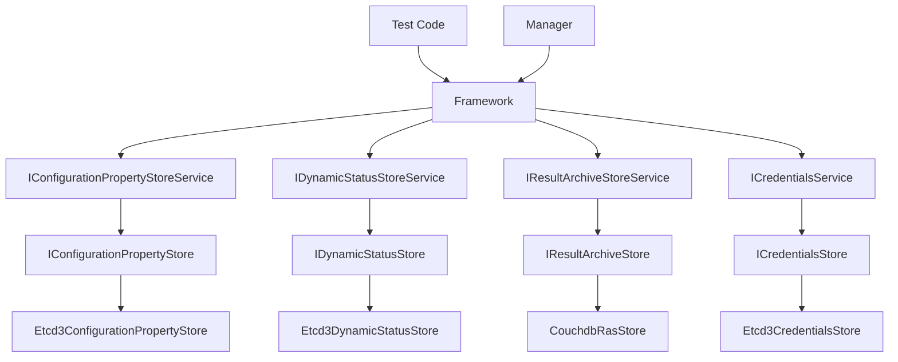
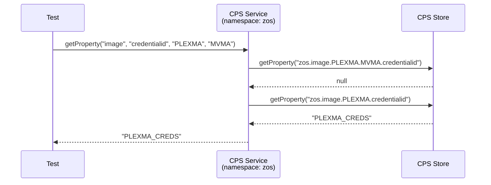
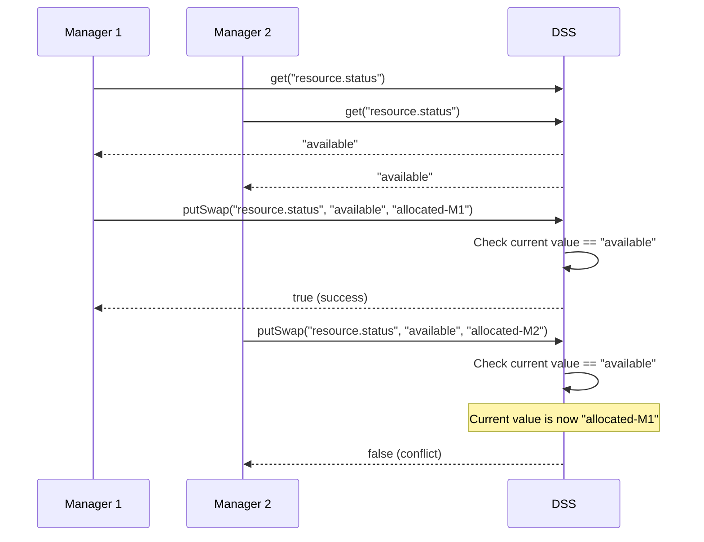
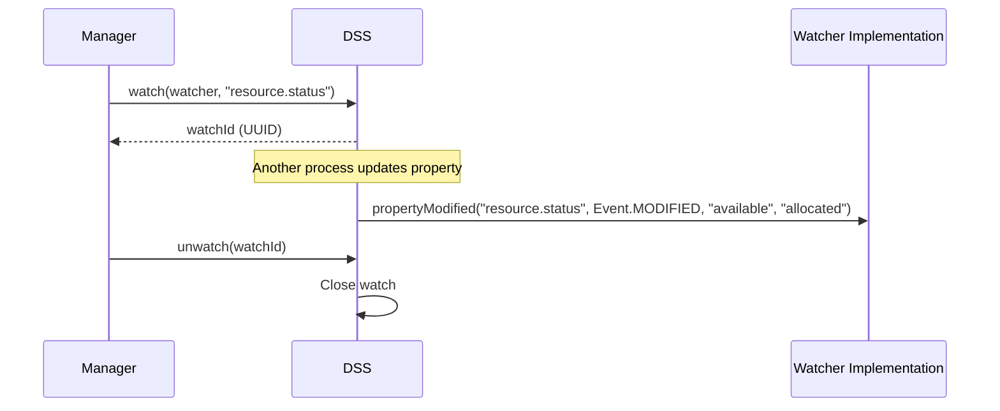
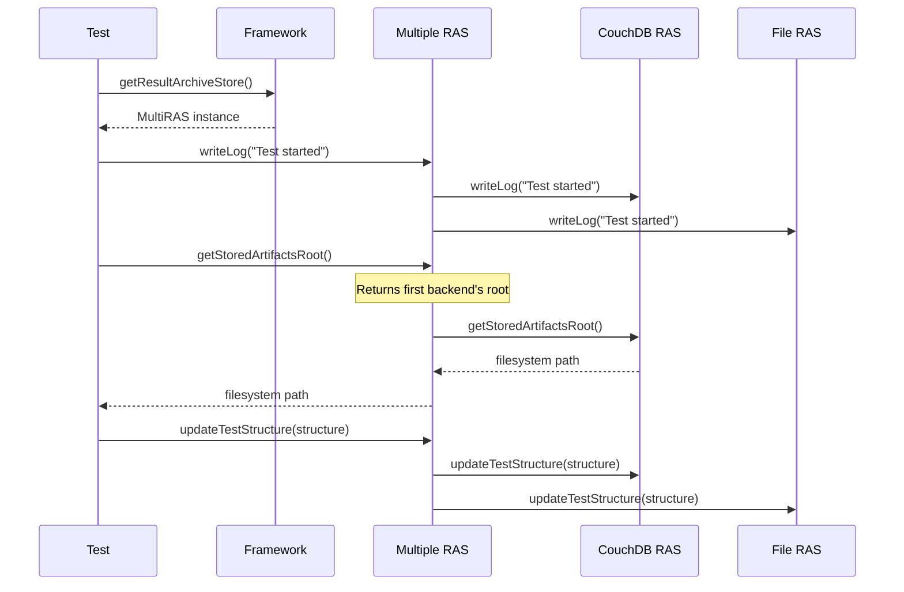
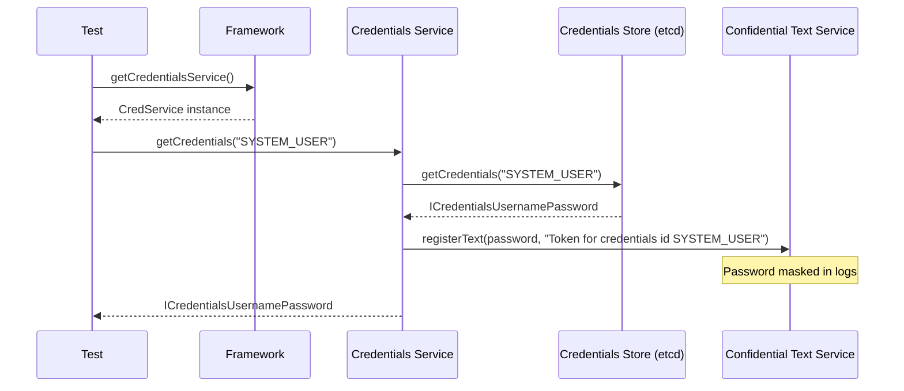
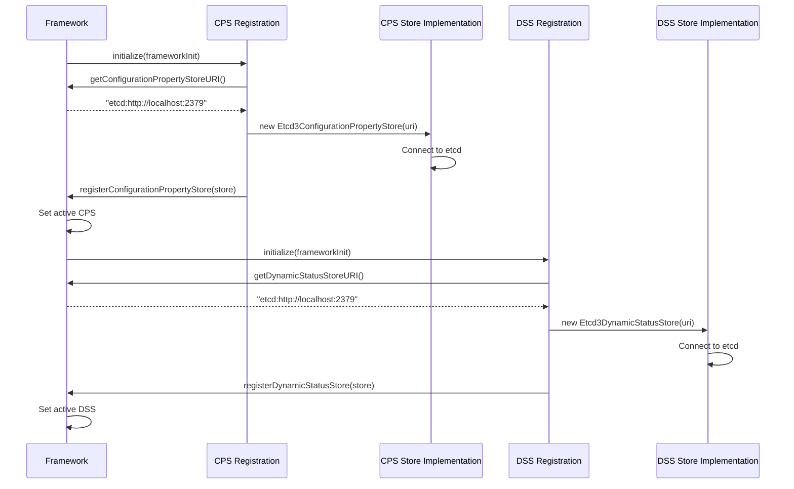

# Storage Services Architecture

Galasa's storage services provide pluggable backend implementations for managing different types of data during test execution. The framework defines four core storage services, each with well-defined interfaces that allow backend implementations to be swapped without changing client code.

## Overview

The storage services architecture separates interface from implementation through a two-layer design:

1. **Service Layer**: High-level interfaces that managers and tests interact with
2. **Store Layer**: Low-level backend interfaces that implement persistence



*The layered storage services architecture with service and store interfaces.*

## Configuration Property Store (CPS)

The Configuration Property Store provides hierarchical key-value storage for configuration properties with namespace-based organization and property inheritance.

### Responsibilities

- Store and retrieve configuration properties
- Support namespace-based property organization
- Implement property inheritance through infixes
- Enable property overrides for test runs
- Support bulk operations (get/set/delete prefixed properties)

### Interface Design

The CPS has two primary interfaces:

**IConfigurationPropertyStore** (backend interface):
- `getProperty(String key)`: Retrieve a single property
- `setProperty(String key, String value)`: Store a property
- `deleteProperty(String key)`: Remove a property
- `getPrefixedProperties(String prefix)`: Retrieve all properties with a prefix
- `getPropertiesFromNamespace(String namespace)`: Get all properties in a namespace
- `getNamespaces()`: List all available namespaces

**IConfigurationPropertyStoreService** (client interface):
- `getProperty(String prefix, String suffix, String... infixes)`: Get property with inheritance
- `setProperty(String name, String value)`: Set property in namespace
- `deleteProperty(String name)`: Delete property in namespace
- `getPrefixedProperties(String prefix)`: Get properties by prefix
- `getAllProperties()`: Get all properties in the service's namespace

### Property Inheritance

The CPS implements hierarchical property lookup through infixes. When requesting a property, the framework searches from most specific to least specific:



*Property inheritance search order from most specific to least specific.*

The search order for `getProperty("image", "credentialid", "PLEXMA", "MVMA")` in namespace "zos" would be:
1. `zos.image.PLEXMA.MVMA.credentialid`
2. `zos.image.PLEXMA.credentialid`
3. `zos.image.credentialid`

### Backend Implementations

**Etcd3 Backend** (`dev.galasa.cps.etcd`):
- Uses jetcd client to connect to etcd clusters
- Implements key-value storage with UTF-8 encoding
- Supports atomic operations through etcd transactions
- Location: `/modules/extensions/galasa-extensions-parent/dev.galasa.cps.etcd`

## Dynamic Status Store (DSS)

The Dynamic Status Store maintains dynamic state information during test execution, supporting transactional updates, atomic operations, and watch capabilities.

### Responsibilities

- Store transient runtime state for test runs and resources
- Support atomic compare-and-swap operations
- Enable transactional multi-key updates
- Provide watch capabilities for state change notifications
- Support time-to-live (TTL) for ephemeral properties
- Manage resource allocation state

### Interface Design

The DSS has a three-tier interface hierarchy:

**IDynamicStatusStore** (backend interface):
- Extends `IDynamicStatusStoreKeyAccess`
- `shutdown()`: Clean up resources

**IDynamicStatusStoreKeyAccess** (key operations interface):
- `put(String key, String value)`: Store a key-value pair
- `put(Map<String, String> keyValues)`: Store multiple pairs
- `put(String key, String value, long timeToLiveSecs)`: Store with TTL
- `putSwap(String key, String oldValue, String newValue)`: Atomic compare-and-swap
- `get(String key)`: Retrieve a value
- `getPrefix(String keyPrefix)`: Get all keys with prefix
- `delete(String key)`: Delete a key
- `deletePrefix(String keyPrefix)`: Delete all keys with prefix
- `performActions(IDssAction... actions)`: Execute atomic multi-key transaction
- `watch(IDynamicStatusStoreWatcher watcher, String key)`: Watch a key for changes
- `watchPrefix(IDynamicStatusStoreWatcher watcher, String keyPrefix)`: Watch prefix

**IDynamicStatusStoreService** (client interface):
- Extends `IDynamicStatusStoreKeyAccess`
- `getDynamicResource(String resourceKey)`: Get interface for resource management
- `getDynamicRun()`: Get interface for run status updates

### Transactional Updates

The DSS supports atomic multi-key transactions through the `performActions` method, which accepts multiple `IDssAction` implementations:

- `DssAdd`: Add a new key (fails if exists)
- `DssUpdate`: Update an existing key
- `DssSwap`: Swap a key if it matches old value
- `DssDelete`: Delete a key
- `DssDeletePrefix`: Delete all keys with prefix

<!-- openwiki: mermaid parse failed and this diagram was converted to a text fence so it does not break rendering. Fix the diagram source and restore the mermaid fence. Parser error: Heuristic: an unescaped angle bracket inside a label breaks rendering; rephrase the label. -->
```text
sequenceDiagram
    participant Manager
    participant DSSService as DSS Service
    participant DSSStore as DSS Store (etcd)
    
    Manager->>DSSService: performActions(actions)
    Note over Manager,DSSService: actions = [<br/>DssSwap("lock", null, "allocated"),<br/>DssAdd("resource.port", "8080"),<br/>DssAdd("resource.status", "in-use")<br/>]
    
    DSSService->>DSSStore: txn.If(lock == null)
    DSSStore-->>DSSService: condition checked
    
    DSSService->>DSSStore: txn.Then(<br/>put("lock", "allocated"),<br/>put("resource.port", "8080"),<br/>put("resource.status", "in-use")<br/>)
    DSSStore->>DSSStore: Execute transaction atomically
    DSSStore-->>DSSService: success
    
    DSSService-->>Manager: Transaction succeeded
```

*Atomic multi-key transaction ensuring all operations succeed or fail together.*

### Compare-and-Swap Operations

The `putSwap` operation enables lock-free resource allocation:



*Compare-and-swap prevents concurrent allocation conflicts.*

### Watch Capabilities

The DSS provides watch functionality to notify clients of property changes:



*Watch mechanism for monitoring property changes in real-time.*

### Backend Implementations

**Etcd3 Backend** (`dev.galasa.cps.etcd`):
- Uses jetcd client transactions for atomic operations
- Implements compare-and-swap using etcd's conditional transactions
- Supports watch through etcd watch API
- Implements TTL using etcd lease mechanism
- Handles pagination for large prefix queries (10,000 keys per page)
- Location: `/modules/extensions/galasa-extensions-parent/dev.galasa.cps.etcd`

## Result Archive Store (RAS)

The Result Archive Store captures and persists test results, logs, and artifacts. The framework supports multiple RAS backends simultaneously through a composite pattern.

### Responsibilities

- Write test logs during execution
- Store test structure and metadata
- Persist test artifacts
- Provide directory services for querying test results
- Support multiple concurrent backends
- Calculate unique run identifiers

### Interface Design

**IResultArchiveStore** (backend interface):
- `writeLog(String message)`: Write a log message
- `writeLog(List<String> messages)`: Write multiple log messages
- `updateTestStructure(TestStructure testStructure)`: Update test metadata
- `createTestStructure(String runId, TestStructure testStructure)`: Create new test record
- `getStoredArtifactsRoot()`: Get filesystem path for artifacts
- `retrieveRunLogLineCount()`: Get current log line count
- `flush()`: Flush pending writes
- `shutdown()`: Clean up resources

**IResultArchiveStoreService**:
- Extends `IResultArchiveStore`
- Marker interface for services

**FrameworkMultipleResultArchiveStore**:
- Implements composite pattern to write to multiple RAS backends
- Delegates all operations to registered backends
- Currently read-only from first backend for artifacts

### Usage Pattern



*Multiple RAS backends receive all writes but only first provides artifact filesystem.*

### Backend Implementations

**CouchDB Backend** (`dev.galasa.ras.couchdb`):
- Uses Apache CouchDB for storing test data
- Three databases: `galasa_run`, `galasa_log`, `galasa_artifacts`
- Implements custom filesystem provider for artifact storage
- Supports views for querying test results
- Batches log writes (100 lines) for efficiency
- Location: `/modules/extensions/galasa-extensions-parent/dev.galasa.ras.couchdb`

**File Backend**:
- Stores results in local filesystem
- Used primarily for local test runs

## Credentials Store

The Credentials Store securely manages and provides access to credentials required by tests.

### Responsibilities

- Store credentials securely
- Retrieve credentials by identifier
- Support multiple credential types (username/password, tokens)
- Integrate with confidential text service to prevent logging
- Enable credential lifecycle management

### Interface Design

**ICredentialsStore** (backend interface):
- `getCredentials(String credsId)`: Retrieve credentials
- `getAllCredentials()`: Get all credentials
- `setCredentials(String credsId, ICredentials credentials)`: Store credentials
- `deleteCredentials(String credsId)`: Remove credentials
- `shutdown()`: Clean up resources

**ICredentialsService** (client interface):
- Same methods as `ICredentialsStore`
- Automatically registers credentials with confidential text service

### Credential Types

The framework supports multiple credential implementations:
- `ICredentialsUsernamePassword`: Username and password pairs
- `ICredentialsToken`: Token-based authentication
- Custom implementations through `ICredentials` interface

### Usage Pattern



*Credentials retrieval with automatic registration in confidential text service.*

### Backend Implementations

**Etcd3 Backend** (`dev.galasa.cps.etcd`):
- Stores encrypted credentials in etcd
- Uses JSON serialization for credential objects
- Location: `/modules/extensions/galasa-extensions-parent/dev.galasa.cps.etcd`

## Namespace Organization

All storage services use namespaces to isolate data between different managers and tests. Namespaces are specified when obtaining a service instance from the framework:

```java
// Each manager gets its own namespace
IConfigurationPropertyStoreService cps = framework.getConfigurationPropertyService("zos");
IDynamicStatusStoreService dss = framework.getDynamicStatusStoreService("zosbatch");
```

Namespace rules:
- Must be alphanumeric (no dots)
- Cannot be null or empty
- Typically matches the manager name
- Properties are prefixed with namespace: `zos.image.credentialid`

## Service Initialization

Storage services are initialized during framework startup through a registration pattern:



*Storage service registration during framework initialization.*

Only one CPS and one DSS can be active during a test run or server instance. Multiple RAS backends can be active simultaneously.

## Integration with Test Execution

Storage services integrate throughout the test lifecycle:

1. **Before Test**: 
   - CPS loads configuration properties
   - DSS allocates resources through compare-and-swap
   - Credentials Store provides authentication

2. **During Test**: 
   - RAS records logs and artifacts
   - DSS updates resource state
   - CPS properties are read as needed

3. **After Test**: 
   - RAS stores final test structure
   - DSS releases resources
   - All services flush pending writes

## Configuration

Storage services are configured through bootstrap properties:

- `framework.config.store`: URI for CPS backend (e.g., `etcd:http://localhost:2379`)
- `framework.dynamicstatus.store`: URI for DSS backend
- `framework.resultarchive.store`: URI(s) for RAS backend(s), comma-separated for multiple

## Extension Development

To implement a new storage backend:

1. Create an OSGi bundle in `/modules/extensions/galasa-extensions-parent/`
2. Implement the appropriate store interface (`IConfigurationPropertyStore`, `IDynamicStatusStore`, etc.)
3. Implement the registration interface to register the store with the framework
4. Package dependencies as a "fat jar" if external libraries are required
5. Use the `bnd.bnd` file to control bundle packaging

The etcd and CouchDB extensions serve as reference implementations.
