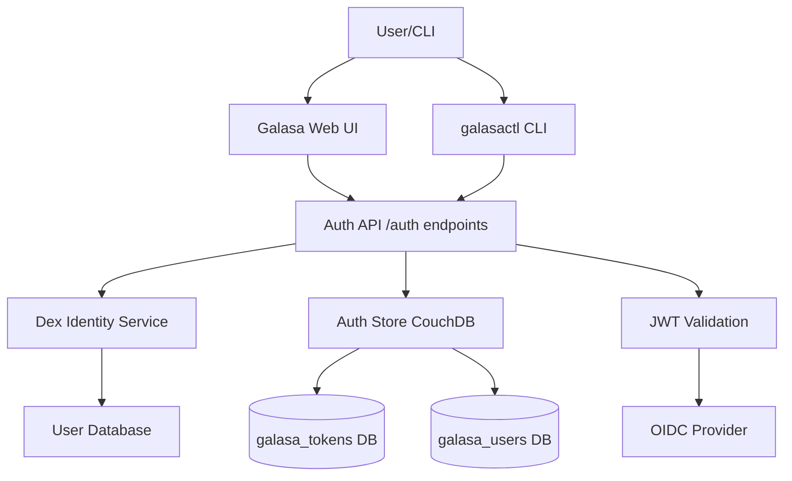
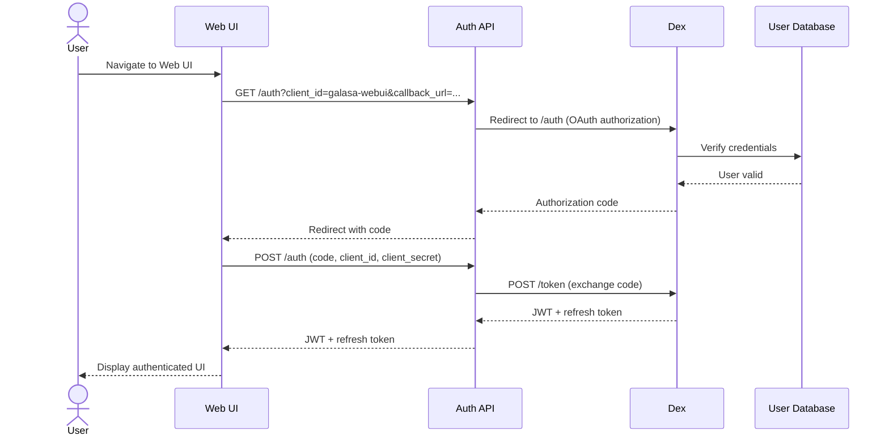
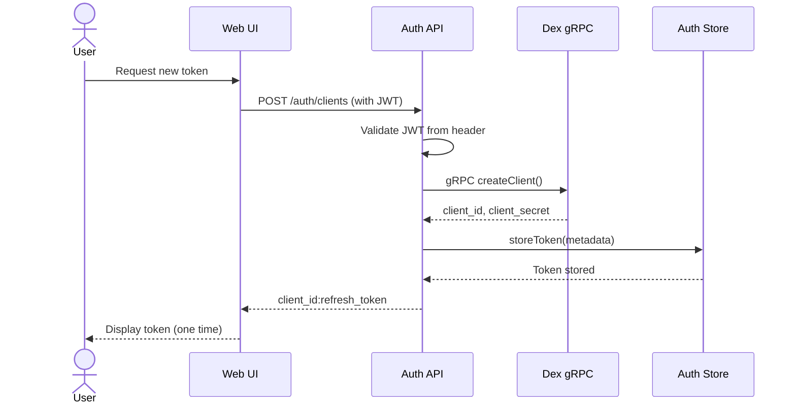
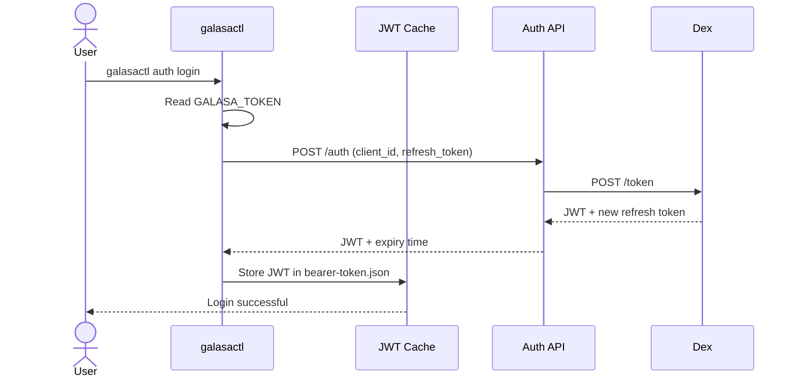
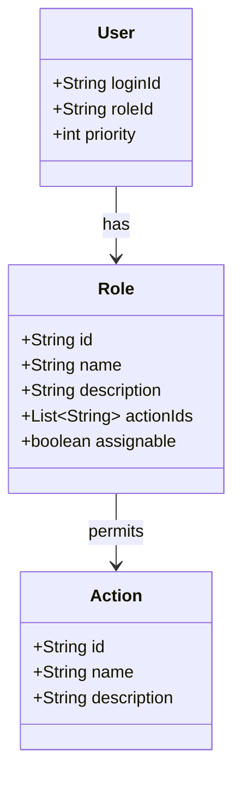

# Authentication and Authorization

Galasa implements a comprehensive authentication and authorization system to secure ecosystem access. Authentication verifies user identity through OAuth 2.0 flows via Dex, while authorization uses role-based access control (RBAC) to determine what authenticated users can do.

## Authentication Architecture

Galasa's authentication system integrates OpenID Connect (OIDC) through Dex, an identity service that federates authentication to external providers. The system supports two primary authentication flows: interactive login for the Web UI and token-based authentication for the CLI and automation tools.

### Authentication Flow Components



*The authentication architecture showing the flow from clients through the Auth API, Dex, and storage backends*

The authentication system consists of several integrated components:

- **Auth API** - REST endpoints (`/auth/*`) that orchestrate OAuth flows and token operations
- **Dex** - OpenID Connect provider handling identity federation and token issuance
- **Auth Store** - CouchDB-backed storage for token metadata and user records
- **JWT Validation** - Filter that validates JSON Web Tokens on protected endpoints
- **OIDC Provider** - Component that fetches and validates Dex's public keys

## Web UI Authentication Flow

When a user logs into the Galasa Web UI, the system performs an OAuth 2.0 authorization code flow:



*OAuth 2.0 authorization code flow for Web UI authentication*

The Web UI initiates authentication by calling `GET /auth` with a static client ID configured in Dex. The Auth API redirects to Dex's authorization endpoint, where the user authenticates against a configured identity provider (such as LDAP, SAML, or static password database). After successful authentication, Dex returns an authorization code that the Web UI exchanges for a JWT and refresh token via `POST /auth`.

## Personal Access Tokens

Personal access tokens enable non-interactive authentication for the CLI and automation workflows. Tokens are created through the Web UI and consist of a client ID and refresh token that can be exchanged for short-lived JWTs.

### Token Creation Flow



*Personal access token creation flow showing Dex client registration and metadata storage*

When requesting a personal access token, the Web UI calls `POST /auth/clients` with a valid JWT. The Auth API creates a new Dex client via gRPC and stores token metadata in the auth store. The token metadata includes the user owner, description, creation time, and expiry time, but not the actual client secret. The token is returned to the user in the format `client_id:refresh_token` and must be saved immediately as it cannot be retrieved later.

### Token Storage and Structure

Personal access tokens are stored in two locations:

1. **Dex** - Stores the actual client credentials (client ID and client secret/refresh token)
2. **Auth Store (CouchDB)** - Stores token metadata in the `galasa_tokens` database

The auth store maintains token records with the following structure:

- **tokenId** - Unique identifier for the token record
- **dexClientId** - Reference to the Dex client
- **description** - User-provided description
- **creationTime** - When the token was created
- **expiryTime** - When the token expires (default 90 days)
- **owner** - Reference to the user who owns the token

Token expiry is enforced during authentication. The default token lifespan is 90 days, configurable when creating the token (1-365 days). Legacy tokens without expiry times are automatically migrated to have the default 90-day lifespan during auth store initialization.

## CLI Authentication

The Galasa CLI (`galasactl`) uses personal access tokens to authenticate with ecosystems. The authentication flow involves exchanging the refresh token for a short-lived JWT that is cached locally.

### CLI Login Flow



*CLI authentication flow exchanging a personal access token for a cached JWT*

The CLI reads the personal access token from either the `GALASA_TOKEN` environment variable or the `galasactl.properties` file in `GALASA_HOME`. The token format is `client_id:refresh_token`, which the CLI parses and sends to `POST /auth` to obtain a JWT. The JWT is cached in a file named after the API server URL (e.g., `localhost-8080.json`) within `GALASA_HOME`.

### JWT Caching and Expiry

The JWT cache implements intelligent token management:

- **File-based storage** - JWTs are stored in `${GALASA_HOME}/<url-hash>.json`
- **Automatic expiry checking** - Tokens within 10 minutes of expiry are not returned from cache
- **Automatic re-authentication** - When a cached JWT is invalid or expired, the CLI automatically logs in again
- **Multiple ecosystem support** - Different JWTs are cached per API server URL
- **Encrypted storage** - JWT files are encrypted using the personal access token as the key

The CLI warns users when their personal access token is approaching expiry (default threshold is 14 days). The warning is displayed during login to prompt token renewal before access is lost.

## JWT Validation Filter

All protected API endpoints require a valid JWT in the `Authorization: Bearer <token>` header. The `JwtAuthFilter` validates JWTs before requests reach servlet handlers.

### JWT Validation Process

The validation filter operates on every incoming request:

1. **Route classification** - Determines if the route requires authentication
2. **Token extraction** - Extracts the bearer token from the `Authorization` header
3. **Signature verification** - Validates the JWT signature using Dex's public keys
4. **Claims validation** - Verifies the token's issuer, expiry, and other claims
5. **Request processing** - Allows valid requests through or returns 401 Unauthorized

Unauthenticated routes include:

- `GET /health` - Health check endpoint
- `GET /bootstrap` - Bootstrap configuration
- `POST /auth` - Token exchange endpoint
- `GET /auth/callback` - OAuth callback endpoint

All other routes require a valid JWT. The OIDC provider fetches Dex's JSON Web Key Set (JWKS) from the configured issuer URL to verify JWT signatures.

## Role-Based Access Control (RBAC)

Galasa implements RBAC to control what authenticated users can do. Users are assigned roles, and roles define permitted actions on system resources.

### RBAC Structure



*RBAC data model showing relationships between users, roles, and actions*

The RBAC system consists of three core entities:

- **Users** - System users with assigned roles
- **Roles** - Named permission sets that can be assigned to users
- **Actions** - Specific operations that can be performed on resources

### Built-in Roles

Galasa provides five built-in roles with predefined permission sets:

| Role ID | Role Name    | Description                     | Assignable | Actions                                |
|---------|--------------|----------------------------------|------------|----------------------------------------|
| 0       | deactivated  | User has no access              | Yes        | None                                   |
| 1       | tester       | Test developer and runner       | Yes        | TEST_RUN_LAUNCH, GENERAL_API_ACCESS   |
| 2       | admin        | Administrator access            | Yes        | All actions                           |
| 3       | owner        | Galasa service owner            | No         | All actions                           |
| 4       | viewer       | View test results               | Yes        | GENERAL_API_ACCESS                    |

The **owner** role is special and cannot be assigned through the API. Users are designated as owners through the `GALASA_OWNER_LOGIN_IDS` environment variable, which is configured via Helm charts. This provides a failsafe mechanism for system administration access.

### Built-in Actions

Galasa defines specific actions that roles can permit:

- **GENERAL_API_ACCESS** - Able to access the REST API
- **TEST_RUN_LAUNCH** - Launch test runs
- **TEST_RUN_SET_USER** - Associate a different user with submitted test runs
- **RUNS_DELETE_OTHER_USERS** - Delete runs submitted by other users
- **USER_EDIT_OTHER** - Edit or delete other users, including roles and tokens
- **MONITORS_SET** - Create or edit monitors
- **SECRETS_GET_UNREDACTED_VALUES** - Get unredacted secret values
- **SECRETS_SET** - Set secrets
- **SECRETS_DELETE** - Delete secrets
- **CPS_PROPERTIES_SET** - Set CPS properties
- **CPS_PROPERTIES_DELETE** - Delete CPS properties

The `RBACService` determines whether a user can perform an action by checking their role's action permissions. Owner users automatically have all permissions regardless of their stored role ID.

### Default User Role

When new users are created, they are assigned a default role specified by the `GALASA_DEFAULT_USER_ROLE` environment variable. This allows administrators to control the initial permission set for new users. If not specified, users without a role ID default to role ID "2" (admin) for backward compatibility with pre-RBAC installations.

### User Priority

Users have a numeric priority value that determines the order in which they are processed by certain operations. Higher priority values indicate higher precedence. The priority is stored in the user record and can be modified through the API.

## Auth Store Backend

The auth store is implemented using CouchDB and provides persistence for authentication-related data. The `CouchdbAuthStore` implements the `IAuthStore` interface and manages two databases:

### Database Structure

1. **galasa_tokens** - Stores personal access token metadata
   - View: `loginId-view` - Indexes tokens by owner's login ID
   - Contains: token ID, Dex client ID, description, timestamps, owner reference

2. **galasa_users** - Stores user records
   - View: `loginId-view` - Indexes users by login ID (lowercase)
   - Contains: user number, login ID, role ID, priority, frontend clients

### Auth Store Operations

The auth store provides operations for managing tokens and users:

**Token Operations:**
- `getTokens()` - Retrieve all token records
- `getTokensByLoginId(String)` - Get tokens for a specific user
- `storeToken(...)` - Create a new token record
- `deleteToken(String)` - Remove a token record
- `getTokenByDexClientId(String)` - Find token by Dex client ID

**User Operations:**
- `getAllUsers()` - Retrieve all user records
- `getUserByLoginId(String)` - Get user by login ID (case-insensitive)
- `createUser(String, String, String)` - Create a new user record
- `updateUser(IUser)` - Update an existing user record

The auth store uses basic authentication to access CouchDB, with credentials provided via the `GALASA_AUTHSTORE_TOKEN` environment variable as a base64-encoded `username:password` string.

## Configuration

Authentication requires several environment variables to be configured:

### Required Environment Variables

- **GALASA_DEX_ISSUER** - Dex issuer URL (e.g., `http://127.0.0.1:5556/dex`)
- **GALASA_DEX_GRPC_HOSTNAME** - Dex gRPC address (e.g., `127.0.0.1:5557`)
- **GALASA_AUTHSTORE_TOKEN** - Base64-encoded CouchDB credentials
- **GALASA_EXTERNAL_API_URL** - External URL of the Galasa API server

### Optional Environment Variables

- **GALASA_USERNAME_CLAIMS** - JWT claims to use for username (default: `preferred_username,name,sub`)
- **GALASA_ALLOWED_ORIGINS** - CORS allowed origins (default: `*`)
- **GALASA_DEFAULT_USER_ROLE** - Default role for new users
- **GALASA_OWNER_LOGIN_IDS** - Comma-separated list of owner user login IDs

### Dex Configuration

Dex requires configuration to define static clients and user databases. A typical development configuration includes:

```yaml
issuer: http://127.0.0.1:5556/dex
storage:
  type: sqlite3
  config:
    file: var/dex/dex.db
web:
  http: 0.0.0.0:5556
grpc:
  addr: 0.0.0.0:5557
  reflection: true
expiry:
  idTokens: "24h"
  refreshTokens:
    disableRotation: true
    validIfNotUsedFor: "2160h"  # 90 days
staticClients:
  - id: galasa-webui
    redirectURIs:
      - 'http://localhost:8080/auth/callback'
    name: 'Galasa Web UI'
    secret: example-webui-client-secret
enablePasswordDB: true
staticPasswords:
  - email: "admin@example.com"
    hash: "<bcrypt-hash>"
    username: "admin"
    userID: "<uuid>"
```

The Dex configuration defines static clients for the Web UI, refresh token expiry settings, and authentication backends (password DB, LDAP, etc.).

## Security Considerations

The authentication system implements several security best practices:

### Token Security

- **One-time display** - Personal access tokens are shown only once during creation
- **No token storage** - Actual tokens (client secrets) are never stored in the auth store
- **Expiry enforcement** - Tokens have configurable expiry times (1-365 days)
- **Encrypted cache** - CLI caches JWTs encrypted with the personal access token
- **Automatic revocation** - Tokens can be revoked, immediately invalidating associated JWTs

### JWT Security

- **Short lifespan** - JWTs expire within 24 hours (configurable in Dex)
- **Signature verification** - All JWTs are cryptographically verified using Dex's public keys
- **Claims validation** - Issuer, expiry, and audience claims are validated
- **HTTPS recommended** - Production deployments should use HTTPS for all API communication

### Access Control

- **Principle of least privilege** - Default roles should grant minimal necessary permissions
- **Owner failsafe** - Owner designation through Helm configuration prevents admin lockout
- **Case-insensitive login IDs** - Prevents confusion and duplicate accounts with different cases
- **Audit trail** - Token metadata tracks creation time and owner for accountability

## Testing Authentication Locally

For local development and testing, the authentication system can be run with Docker containers for CouchDB and Dex. The development instructions in `modules/framework/dev-instructions.md` provide detailed setup steps including:

1. Running CouchDB container with admin credentials
2. Configuring Dex with static clients and users
3. Setting environment variables for the API server
4. Creating personal access tokens through the Web UI
5. Testing authentication with the CLI

The local setup enables full end-to-end testing of OAuth flows, token management, and JWT validation without requiring a full Kubernetes deployment.
