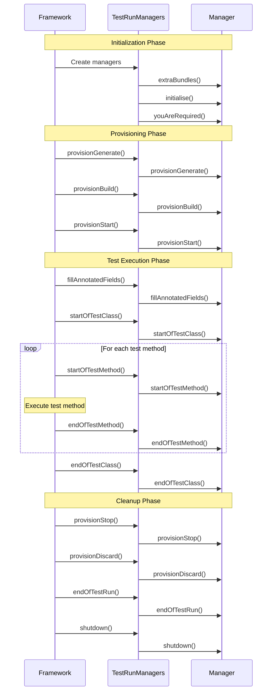

# Manager Lifecycle Methods

Galasa managers participate in test execution through a series of lifecycle methods called by the framework in a specific order. These methods allow managers to provision resources, inject dependencies into test classes, and clean up after test execution.

## Lifecycle Overview

The manager lifecycle consists of four main phases:

1. **Initialization and Discovery** - The framework discovers managers and determines which are needed
2. **Provisioning** - Managers provision and start resources required for the test
3. **Test Execution** - Managers support test method execution and result handling
4. **Cleanup** - Managers gracefully stop and discard provisioned resources

## Sequence of Lifecycle Methods



*Sequence of manager lifecycle method calls during test execution*

## Initialization Phase Methods

### extraBundles()

```java
List<String> extraBundles(IFramework framework) throws ManagerException
```

Called once during manager discovery to allow a manager to request additional OSGi bundles to be loaded. This enables managers to load implementation bundles (fragments) based on Configuration Property Store (CPS) properties.

**When called**: Before `initialise()`, during manager discovery

**Purpose**: Request additional OSGi bundles for manager implementations

**Example use case**: The zOS Manager can request different batch implementation bundles (zOSMF vs traditional) based on CPS configuration

**What to do**:
- Examine CPS properties to determine required bundles
- Return list of bundle symbolic names to load
- Return `null` if no extra bundles needed
- Do not depend on the test class at this point

### initialise()

```java
void initialise(IFramework framework, List<IManager> allManagers,
                List<IManager> activeManagers, GalasaTest galasaTest) 
                throws ManagerException
```

Called to initialize the manager and determine if it should participate in the test run. The manager examines the test class for relevant annotations and activates itself if needed.

**When called**: After all managers are discovered and extra bundles loaded

**Purpose**: 
- Examine the test class for relevant annotations
- Activate the manager by adding itself to `activeManagers` if needed
- Request other dependent managers via their `youAreRequired()` method
- Preserve the framework and test class references for later use

**What to do**:
- Call `super.initialise()` to preserve framework and test class references
- Use `findAnnotatedFields()` to search for manager-specific annotations
- Add `this` to `activeManagers` list if annotations found
- Call `youAreRequired()` on dependent managers

**Example**:
```java
@Override
public void initialise(@NotNull IFramework framework, @NotNull List<IManager> allManagers,
        @NotNull List<IManager> activeManagers, @NotNull GalasaTest galasaTest) throws ManagerException {
    super.initialise(framework, allManagers, activeManagers, galasaTest);
    
    if(galasaTest.isJava()) {
        List<AnnotatedField> ourFields = findAnnotatedFields(HttpManagerField.class);
        if (!ourFields.isEmpty()) {
            youAreRequired(allManagers, activeManagers, galasaTest);
        }
    }
}
```

### youAreRequired()

```java
void youAreRequired(List<IManager> allManagers, List<IManager> activeManagers, 
                    GalasaTest galasaTest) throws ManagerException
```

Called by another manager that depends on this manager's functionality. This manager should activate itself if not already active.

**When called**: During initialization when another manager requests this manager as a dependency

**Purpose**: Activate the manager because it is required by another manager

**What to do**:
- Check if already in `activeManagers` to avoid duplicate activation
- Add `this` to `activeManagers` if not already present
- Request any managers this manager depends on
- Perform any initialization that was skipped if no annotations were found

**Example**:
```java
@Override
public void youAreRequired(@NotNull List<IManager> allManagers, 
        @NotNull List<IManager> activeManagers, @NotNull GalasaTest galasaTest)
        throws ManagerException {
    if (activeManagers.contains(this)) {
        return;
    }
    activeManagers.add(this);
    
    // Request dependent managers
    ipManager = addDependentManager(allManagers, activeManagers, galasaTest, 
                                   IIpNetworkManagerSpi.class);
}
```

## Provisioning Phase Methods

The provisioning phase follows a three-step process: Generate, Build, Start. Managers are called in dependency order for these methods (dependencies provisioned before dependents).

### provisionGenerate()

```java
void provisionGenerate() throws ManagerException, ResourceUnavailableException
```

Determines what resources are needed and reserves them from resource pools. No actual resource creation or modification should occur.

**When called**: After all managers are initialized, before any resources are built

**Purpose**: 
- Determine required resources
- Reserve resources from pools (DSS slots, image tags, etc.)
- Generate objects for annotated fields
- Validate resource availability

**What to do**:
- Use `generateAnnotatedFields()` to create objects for injection
- Reserve resource slots from Dynamic Status Store (DSS)
- Determine configuration and resource names
- Throw `ResourceUnavailableException` if resources unavailable (triggers test wait/retry)
- Do not create, modify, or start any actual resources

**Example**:
```java
@Override
public void provisionGenerate() throws ManagerException, ResourceUnavailableException {
    // Generate objects for annotated fields
    generateAnnotatedFields(HttpManagerField.class);
    
    // Reserve resources from pools
    for(String tag : imageTags) {
        reserveImageSlot(tag); // May throw ResourceUnavailableException
    }
}
```

### provisionBuild()

```java
void provisionBuild() throws ManagerException, ResourceUnavailableException
```

Creates or allocates resources that were planned during Generate phase. Resources are built but not yet started.

**When called**: After all managers complete Generate, before Start phase

**Purpose**: Create and configure resources

**What to do**:
- Create VMs, containers, datasets, or other resources
- Allocate credentials and certificates
- Configure resource properties
- Do not start services or make resources active yet
- Can still throw `ResourceUnavailableException` for temporary conditions

**Example**:
```java
@Override
public void provisionBuild() throws ManagerException {
    // Create container but don't start it
    containerId = dockerClient.createContainer(containerConfig);
    
    // Allocate datasets on z/OS
    zosFileHandler.createDataset(datasetName, attributes);
}
```

### provisionStart()

```java
void provisionStart() throws ManagerException, ResourceUnavailableException
```

Starts and initializes resources that were built during the Build phase. Resources become active and ready for test execution.

**When called**: After all managers complete Build phase

**Purpose**: Start resources and verify they are ready

**What to do**:
- Start VMs, containers, or services
- Wait for resources to become ready
- Perform health checks
- Establish connections
- Can still throw `ResourceUnavailableException` for temporary conditions

**Example**:
```java
@Override
public void provisionStart() throws ManagerException {
    // Start container
    dockerClient.startContainer(containerId);
    
    // Wait for service to be ready
    waitForServiceReady(serviceUrl, timeout);
    
    // Establish connections
    connection = openConnection(hostname, port);
}
```

## Test Execution Phase Methods

### fillAnnotatedFields()

```java
void fillAnnotatedFields(Object instantiatedTestClass) throws ManagerException
```

Injects generated objects into the test class's annotated fields. Called before each test method to reset fields that may have been modified.

**When called**: After test class instantiation, before `startOfTestClass()`, and before each test method

**Purpose**: Inject manager-provided objects into test class fields

**What to do**:
- Set field values on the instantiated test class object
- Use objects generated during `provisionGenerate()`
- The `AbstractManager` base class handles this automatically for registered fields

**Note**: The default implementation in `AbstractManager` automatically fills all fields registered via `registerAnnotatedField()` during the Generate phase.

### startOfTestClass()

```java
void startOfTestClass() throws ManagerException
```

Called when the test class is instantiated and ready to run. Managers can perform setup that applies to all test methods.

**When called**: After `fillAnnotatedFields()`, before any test methods execute

**Purpose**: Perform class-level setup and initialization

**What to do**:
- Perform setup that applies to all test methods
- Initialize class-level state
- Open connections that will be used across multiple methods
- Do not assume test methods will run (the class may be ignored)

### startOfTestMethod()

```java
void startOfTestMethod(GalasaMethod galasaMethod) throws ManagerException
```

Called before each test method executes. Managers can perform method-specific setup.

**When called**: Before each test method, after `fillAnnotatedFields()`

**Purpose**: Perform method-level setup

**What to do**:
- Perform setup specific to the test method
- Reset method-level state
- Start method-specific logging or tracing
- Access method name and annotations via `galasaMethod`

### endOfTestMethod()

```java
Result endOfTestMethod(GalasaMethod galasaMethod, Result currentResult, 
                       Throwable currentException) throws ManagerException
```

Called after each test method completes. Managers can override the test result if needed.

**When called**: After each test method completes, whether it passed or failed

**Purpose**: 
- Perform method-level cleanup
- Optionally override the test result
- Capture method-specific diagnostics

**What to do**:
- Perform method cleanup (close method-specific resources)
- Examine result and exception
- Return a different `Result` to override the outcome, or `null` to accept current result
- Capture logs, screenshots, or other diagnostics

**Return value**: New `Result` to override, or `null` to keep current result

### endOfTestClass()

```java
Result endOfTestClass(Result currentResult, Throwable currentException) 
                      throws ManagerException
```

Called after all test methods complete. Managers can override the overall test class result.

**When called**: After all test methods complete

**Purpose**:
- Perform class-level cleanup
- Optionally override the test class result
- Capture final diagnostics

**What to do**:
- Perform class-level cleanup
- Examine overall result and any exception
- Return a different `Result` to override the outcome, or `null` to accept current result
- Store artifacts to Result Archive Store (RAS)

**Return value**: New `Result` to override, or `null` to keep current result

## Cleanup Phase Methods

Cleanup methods are called in reverse dependency order (dependents cleaned up before dependencies).

### provisionStop()

```java
void provisionStop()
```

Gracefully stops provisioned resources. Should not throw exceptions as it's called after test result is recorded.

**When called**: After `endOfTestClass()` and test result recording

**Purpose**: Gracefully stop running resources

**What to do**:
- Stop services and processes gracefully
- Close connections
- Perform orderly shutdown
- Do not throw exceptions (logs warnings instead)
- Do not delete or discard resources yet

**Example**:
```java
@Override
public void provisionStop() {
    try {
        if (container != null) {
            dockerClient.stopContainer(containerId);
        }
    } catch (Exception e) {
        logger.warn("Failed to stop container", e);
    }
}
```

### provisionDiscard()

```java
void provisionDiscard()
```

Discards and deletes provisioned resources. Should be quick to avoid slowing test throughput.

**When called**: After `provisionStop()`

**Purpose**: Delete resources and free resource pool slots

**What to do**:
- Delete VMs, containers, datasets
- Free resource pool slots in DSS
- Remove temporary files
- Should be reasonably quick (avoid slow cleanup)
- Do not throw exceptions (logs warnings instead)

**Example**:
```java
@Override
public void provisionDiscard() {
    // Free resource slots
    for(ZosBaseImageImpl image : images.values()) {
        if (image instanceof ZosProvisionedImageImpl) {
            ((ZosProvisionedImageImpl)image).freeImage();
        }
    }
    
    // Delete container
    try {
        if (containerId != null) {
            dockerClient.removeContainer(containerId);
        }
    } catch (Exception e) {
        logger.warn("Failed to remove container", e);
    }
}
```

### endOfTestRun()

```java
void endOfTestRun()
```

Called after provisioning cleanup, before manager shutdown. Managers can perform final test run activities.

**When called**: After `provisionDiscard()`, before `shutdown()`

**Purpose**: Perform final test run activities

**What to do**:
- Store final artifacts to RAS
- Emit test results to external systems
- Perform failure analysis
- Update run metadata
- Do not throw exceptions

### shutdown()

```java
void shutdown()
```

Final cleanup of manager-owned resources. Managers must not call other managers as they may have shut down already.

**When called**: Last method called, after all other lifecycle methods complete

**Purpose**: Close manager-owned resources

**What to do**:
- Close HTTP clients, database connections, file handles
- Release framework service references
- Clean up manager-internal resources
- Do not call other managers (they may be shut down)
- Calls to framework, CPS, DSS, RAS are safe
- Do not throw exceptions

**Example**:
```java
@Override
public void shutdown() {
    for (IHttpClient client : instantiatedClients) {
        client.close();
    }
}
```

## Important Notes

### Method Ordering

The framework calls lifecycle methods in strict order:
1. Provisioning methods (`provisionGenerate`, `provisionBuild`, `provisionStart`) are called in dependency order
2. Cleanup methods (`provisionStop`, `provisionDiscard`) are called in reverse dependency order
3. Test execution methods maintain dependency order

### Exception Handling

- **Provisioning phase**: Exceptions in `provisionGenerate`, `provisionBuild`, or `provisionStart` cause environmental failure
  - `ResourceUnavailableException` triggers test wait/retry in automation
  - Other exceptions mark the test as environmental failure
- **Cleanup phase**: Exceptions in `provisionStop`, `provisionDiscard`, `endOfTestRun`, or `shutdown` are logged but do not affect test result
- **Test execution phase**: Exceptions affect test result according to manager logic

### Shared Environments

For shared environment builds, the provisioning lifecycle differs:
- Provisioning methods (`provisionGenerate`, `provisionBuild`, `provisionStart`) execute normally
- Test methods do not execute
- Cleanup methods (`provisionStop`, `provisionDiscard`) are skipped
- Resources remain provisioned for reuse by other tests

Managers can implement `doYouSupportSharedEnvironments()` to return `true` if they do not provision resources that would conflict in shared environments.

## See Also

- [Manager Architecture](../architecture/managers.md) - Overall manager design and architecture
- [Test Execution Lifecycle](./test-execution-lifecycle.md) - Complete test execution flow
- [Creating a Manager](../workflows/creating-a-manager.md) - How to implement a new manager
