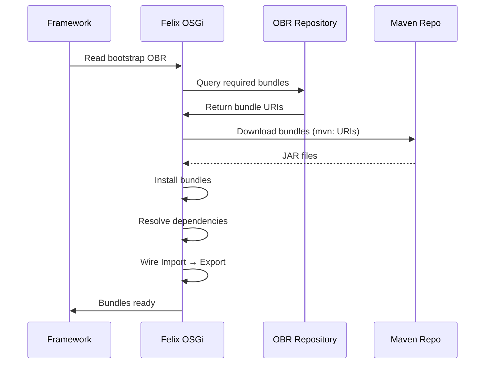

# OSGi Bundle Architecture and OBRs

Galasa uses OSGi (Open Services Gateway initiative) as its fundamental module system for loading, managing, and isolating components at runtime. This document explains what OSGi bundles are, why Galasa uses them, how bundle metadata is defined, and how OSGi Bundle Repositories (OBRs) package bundles for distribution.

## What are OSGi Bundles?

An OSGi bundle is a JAR file with enhanced metadata in its `MANIFEST.MF` that declares:

- **Bundle identity**: Symbolic name and version
- **Exported packages**: Java packages made available to other bundles
- **Imported packages**: Java packages the bundle needs from other bundles
- **Bundle capabilities**: Services and features the bundle provides

Unlike standard JARs, OSGi bundles declare explicit package-level dependencies rather than relying on classpath order. The OSGi framework (Apache Felix in Galasa's case) uses this metadata to:

1. Resolve dependencies between bundles
2. Wire package imports to exports at runtime
3. Isolate bundles from each other (preventing classpath pollution)
4. Load and unload bundles dynamically

<!-- openwiki: mermaid parse failed and this diagram was converted to a text fence so it does not break rendering. Fix the diagram source and restore the mermaid fence. Parser error: Heuristic: an unescaped angle bracket inside a label breaks rendering; rephrase the label. -->
```text
flowchart LR
    Bundle1[Bundle A<br/>Exports: dev.galasa.http] 
    Bundle2[Bundle B<br/>Imports: dev.galasa.http<br/>Exports: dev.galasa.test]
    Bundle3[Bundle C<br/>Imports: dev.galasa.test]
    
    Bundle1 -->|Provides packages| Bundle2
    Bundle2 -->|Provides packages| Bundle3
    
    style Bundle1 fill:#e1f5ff
    style Bundle2 fill:#ffe1f5
    style Bundle3 fill:#f5ffe1
```

## Why Galasa Uses OSGi

Galasa adopted OSGi to achieve several key architectural goals:

### Modular Extension Architecture

Managers, storage implementations, and test bundles are discovered and loaded dynamically via OSGi service registration. The framework discovers all components implementing `IManager` at runtime without requiring static configuration:

- **Service Discovery**: Components register as OSGi services using `@Component` annotations
- **Dynamic Loading**: The framework can request additional bundles at runtime
- **Isolation**: Each Manager bundle has its own classloader, preventing dependency conflicts

### Dependency Management

OSGi's explicit dependency model prevents classpath conflicts that commonly occur in flat classpath systems:

- **Version Resolution**: Multiple versions of the same library can coexist
- **Optional Dependencies**: Bundles can declare optional imports (e.g., `resolution:=optional`)
- **Transitive Control**: Dependencies are explicitly declared, not implicitly inherited

### Fragment Bundles

Managers use OSGi fragments to provide platform-specific implementations without changing the core Manager. For example, z/OS Batch Manager loads either the z/OSMF or RSE API fragment based on configuration:

```
dev.galasa.zosbatch.manager (host bundle)
├── dev.galasa.zosbatch.zosmf.manager (fragment)
└── dev.galasa.zosbatch.rseapi.manager (fragment)
```

Fragments extend their host bundle's classpath and can provide alternative implementations of the same interface.

### On-Demand Loading

The framework can request additional bundles during test execution via the `extraBundles()` method. Managers specify which platform-specific fragments to load based on CPS properties, and the OSGi framework resolves and installs them dynamically.

## Bundle Metadata with bnd.bnd Files

Galasa projects use the BND tool to generate OSGi manifest metadata from simplified `bnd.bnd` files. This approach is cleaner than manually editing `MANIFEST.MF` files.

### Basic bnd.bnd Structure

A typical Galasa bundle's `bnd.bnd` file looks like this:

```properties
-snapshot: ${tstamp}
Bundle-Name: Galasa Core Manager
Export-Package: dev.galasa.core.manager
Import-Package: !javax.validation.constraints, \
                *
```

**Key directives:**

- **`-snapshot`**: Adds timestamp to snapshot versions
- **`Bundle-Name`**: Human-readable bundle name
- **`Export-Package`**: Packages this bundle makes available to others
- **`Import-Package`**: Packages this bundle needs from other bundles

### Export-Package Patterns

`Export-Package` controls which packages are visible to other bundles:

```properties
# Export specific packages
Export-Package: dev.galasa.cicsts,\
    dev.galasa.cicsts.spi

# Export all packages except internal ones
Export-Package: !dev.galasa.framework.internal*,\
                dev.galasa.framework*

# Export everything
Export-Package: dev.galasa*
```

The `!` prefix excludes packages from export. Convention dictates that `*.internal.*` packages should never be exported.

### Import-Package Patterns

`Import-Package` declares dependencies on packages from other bundles:

```properties
# Import everything (most common)
Import-Package: *

# Exclude optional dependencies
Import-Package: !javax.validation*, \
                !org.osgi.service.component.annotations, \
                *

# Optional imports for runtime flexibility
Import-Package: org.apache.felix.*;resolution:=optional, \
                org.apache.logging.log4j;resolution:=optional, \
                *
```

**Key patterns:**

- **`*`**: Import all packages referenced in the compiled code
- **`!pattern`**: Exclude packages from import (useful for embedded dependencies)
- **`resolution:=optional`**: Package is not required for the bundle to resolve
- Wildcard patterns like `org.apache.commons.*` match all subpackages

### Real-World Examples

**Framework bundle** (`dev.galasa.framework/bnd.bnd`):
```properties
Export-Package: !dev.galasa.framework.internal*;!dev.galasa.framework.maven;dev.galasa.framework;dev.galasa.framework.*;
Import-Package: !javax.validation*,\
               org.apache.commons.io;version="${@}",\
               org.apache.felix.*;resolution:=optional,\
               org.apache.logging.log4j;resolution:=optional,\
               *
```

**Test bundle** (generated project template):
```properties
Bundle-Name: {{.BundleName}}
Export-Package: {{.PackageName}},\
    {{.PackageName}}.spi
Import-Package: !javax.validation.constraints,\
                !org.osgi.service.component.annotations,\
                *
```

The test bundle exports its own packages so other bundles can reference test utilities, and imports everything else with wildcards.

## Wrapping Non-OSGi Dependencies

Many third-party libraries (like Apache HttpClient, Kafka clients, or Selenium) are not packaged as OSGi bundles. Galasa's `/modules/wrapping/` directory contains projects that wrap these dependencies into OSGi bundles.

### Maven Bundle Plugin Approach

Wrapper projects use the Apache Felix `maven-bundle-plugin` with `<Embed-Dependency>` to bundle third-party JARs inside an OSGi wrapper:

```xml
<plugin>
    <groupId>org.apache.felix</groupId>
    <artifactId>maven-bundle-plugin</artifactId>
    <extensions>true</extensions>
    <configuration>
        <instructions>
            <Bundle-SymbolicName>dev.galasa.wrapping.httpclient5</Bundle-SymbolicName>
            <Embed-Dependency>*;scope=compile|runtime</Embed-Dependency>
            <Embed-Transitive>true</Embed-Transitive>
            <Import-Package>
                javax.crypto,
                javax.net.ssl,
                org.slf4j
            </Import-Package>
            <Export-Package>org.apache.hc.*</Export-Package>
        </instructions>
    </configuration>
</plugin>
```

**Key instructions:**

- **`<Embed-Dependency>`**: Includes all compile/runtime dependencies inside the bundle JAR
- **`<Embed-Transitive>`**: Includes transitive dependencies
- **`<Import-Package>`**: Declares external packages needed (typically JDK packages)
- **`<Export-Package>`**: Re-exports the wrapped library's packages

This creates a "fat bundle" containing the original library and all its dependencies, exposing them as OSGi packages.

### Example: Kafka Client Wrapper

```xml
<artifactId>dev.galasa.wrapping.kafka.clients</artifactId>
<packaging>bundle</packaging>

<dependencies>
    <dependency>
        <groupId>org.apache.kafka</groupId>
        <artifactId>kafka-clients</artifactId>
    </dependency>
</dependencies>

<instructions>
    <Bundle-SymbolicName>dev.galasa.wrapping.kafka.clients</Bundle-SymbolicName>
    <Embed-Dependency>*;scope=compile|runtime</Embed-Dependency>
    <Embed-Transitive>true</Embed-Transitive>
    <Import-Package>
        javax.management,
        javax.net.ssl
    </Import-Package>
    <Export-Package>
        org.apache.kafka.clients.*,
        org.apache.kafka.common.*
    </Export-Package>
</instructions>
```

This embeds Kafka client libraries and their dependencies into a single OSGi bundle that exports Kafka's API packages.

## OSGi Bundle Repositories (OBRs)

An OSGi Bundle Repository (OBR) is an XML index file that catalogs available bundles and their metadata. Galasa uses OBRs to package and distribute collections of bundles (framework components, managers, tests) as a unit.

### Purpose of OBRs

OBRs serve several purposes in Galasa:

1. **Dependency Resolution**: The OSGi framework uses OBR metadata to find bundles that satisfy `Import-Package` requirements
2. **Distribution**: OBRs package related bundles together (e.g., all managers, all tests for a project)
3. **Version Management**: OBRs track bundle versions and allow multiple versions to coexist
4. **Maven Integration**: OBRs can reference bundles via Maven coordinates (`mvn:` URLs)

### OBR File Format

An OBR file (`repository.obr` or `galasa.obr`) is an XML document listing bundles and their capabilities:

```xml
<repository name="dev.galasa:dev.galasa.uber.obr:1.1.1" lastmodified="20240115-143022">
    <resource id="dev.galasa.framework/1.1.1" 
              symbolicname="dev.galasa.framework" 
              version="1.1.1"
              uri="mvn:dev.galasa/dev.galasa.framework/1.1.1/jar">
        <capability name="package">
            <p n="package" v="dev.galasa.framework"/>
            <p n="version" t="version" v="1.1.1"/>
        </capability>
        <require name="package">
            <p n="package" v="org.apache.commons.io"/>
        </require>
    </resource>
    ...
</repository>
```

Each `<resource>` represents a bundle with:
- **Capabilities**: Packages and services the bundle provides
- **Requirements**: Packages and services the bundle needs
- **URI**: Location to download the bundle (Maven coordinates or file path)

### Building OBRs with Maven

The Galasa Maven plugin builds OBRs from Maven projects with `<packaging>galasa-obr</packaging>`:

```xml
<project>
    <groupId>dev.galasa</groupId>
    <artifactId>dev.galasa.uber.obr</artifactId>
    <version>1.1.1</version>
    <packaging>galasa-obr</packaging>

    <dependencies>
        <dependency>
            <groupId>dev.galasa</groupId>
            <artifactId>dev.galasa.framework</artifactId>
        </dependency>
        <dependency>
            <groupId>dev.galasa</groupId>
            <artifactId>dev.galasa.core.manager</artifactId>
        </dependency>
        <!-- More bundles... -->
    </dependencies>

    <build>
        <plugins>
            <plugin>
                <groupId>dev.galasa</groupId>
                <artifactId>galasa-maven-plugin</artifactId>
                <extensions>true</extensions>
            </plugin>
        </plugins>
    </build>
</project>
```

The plugin:
1. Resolves all bundle dependencies
2. Reads OSGi metadata from each JAR's `MANIFEST.MF`
3. Generates a `repository.obr` file with Maven coordinates
4. Removes problematic execution environment requirements (Felix bug workaround)

### Building OBRs with Gradle

The Galasa Gradle OBR plugin provides similar functionality for Gradle projects:

```groovy
plugins {
    id 'dev.galasa.obr' version '1.1.1'
    id 'maven-publish'
}

dependencies {
    bundle project(':dev.galasa.example.tests')
    bundle project(':dev.galasa.example.manager')
}

def obrFile = file('build/galasa.obr')

publishing {
    publications {
        maven(MavenPublication) {
            artifact obrFile
        }
    }
}
```

**Key elements:**

- **`bundle` configuration**: Lists bundles to include in the OBR (non-transitive)
- **`obr` configuration**: Can merge existing OBRs
- **`genobr` task**: Builds the OBR file at `build/galasa.obr`

The Gradle plugin:
1. Resolves first-level dependencies from `bundle` and `obr` configurations
2. Processes each JAR to extract OSGi metadata
3. Generates `galasa.obr` with Maven coordinate URIs
4. Makes the OBR available for publishing

### OBR Usage in Test Projects

Test projects require an OBR subproject to package all test bundles:

```
dev.galasa.example.banking/
├── dev.galasa.example.banking.payee/     (test bundle)
├── dev.galasa.example.banking.account/   (test bundle)
└── dev.galasa.example.banking.obr/       (OBR aggregator)
```

The OBR project depends on all test bundles and produces a single `galasa.obr` file. When deployed to a Maven repository, the Galasa ecosystem can resolve and load the test bundles on demand.

## OBR Resolution at Runtime

When Galasa runs a test, the framework:

1. **Reads bootstrap OBR**: Loads the main framework and manager OBR
2. **Discovers test OBR**: Resolves test stream configuration to find test bundles
3. **Resolves dependencies**: Uses OBR metadata to find all required bundles
4. **Downloads bundles**: Fetches bundles from Maven repositories via `mvn:` URIs
5. **Installs in Felix**: Loads bundles into the OSGi framework
6. **Wires packages**: Felix connects Import-Package to Export-Package declarations
7. **Activates bundles**: Starts bundle lifecycle and registers OSGi services



## Common Bundle Patterns

### Manager Bundle Pattern

Managers typically follow this structure:

```
bnd.bnd:
  Export-Package: dev.galasa.manager.api,\
                  dev.galasa.manager.spi
  Import-Package: !javax.validation.constraints,\
                  *
```

- **Export API**: Public API for test classes
- **Export SPI**: Service Provider Interface for fragments
- **Import everything**: Depends on framework and other managers

### Test Bundle Pattern

Test bundles export their own packages for visibility:

```
bnd.bnd:
  Export-Package: dev.galasa.tests.myapp
  Import-Package: *
```

Tests depend on framework APIs and manager APIs via `Import-Package: *`.

### Extension/Storage Bundle Pattern

Extensions that implement storage services typically hide internal implementations:

```
bnd.bnd:
  Export-Package: !dev.galasa.cps.etcd.internal,\
                  dev.galasa.cps.etcd*
  Import-Package: dev.galasa.framework,\
                  com.google.gson,\
                  *
```

Public API is exported; internal implementation packages are not.

## Best Practices

### Bundle Design

- **Export only public APIs**: Use `!internal*` patterns to hide implementation details
- **Minimize exports**: Fewer exported packages reduce coupling
- **Use semantic versioning**: Follow OSGi version scheme (major.minor.micro.qualifier)

### Dependency Management

- **Mark optional imports**: Use `resolution:=optional` for runtime-optional dependencies
- **Exclude unused imports**: Use `!pattern` to prevent unwanted wiring
- **Version ranges carefully**: Avoid overly broad version ranges that cause conflicts

### OBR Management

- **Separate concerns**: Create distinct OBRs for framework, managers, and tests
- **Use Maven coordinates**: `mvn:` URIs enable repository-agnostic distribution
- **Merge carefully**: When merging OBRs, ensure no version conflicts

### Testing

- **Validate manifests**: Check that Import/Export packages match actual usage
- **Test resolution**: Verify bundles resolve in clean OSGi environment
- **Check for split packages**: Ensure no two bundles export the same package

## Troubleshooting

### Common Issues

**"Unresolved requirement" errors**:
- Missing Import-Package declaration
- No bundle exports the required package
- Version mismatch between import and export

**ClassNotFoundException in OSGi**:
- Package not exported by providing bundle
- Import-Package missing in consuming bundle
- Wrong classloader accessing the class

**Bundle won't start**:
- Circular dependency between bundles
- Missing required packages
- Activator class not found

### Debugging Tools

- **Felix console**: Interactive shell for inspecting bundle state
- **`lb` command**: List all bundles and their states
- **`diag` command**: Show why a bundle failed to resolve
- **OBR analyzer**: Validate OBR XML structure and references

## Related Concepts

- **[Build Dependencies](./build-dependencies.md)**: How Galasa manages compile-time and runtime dependencies
- **[Modules](./modules.md)**: Overview of Galasa's module structure
- **[Building Test Projects](../workflows/building-test-projects.md)**: Complete workflow for building and packaging tests

## References

- [OSGi Alliance Specification](https://www.osgi.org/developer/specifications/)
- [Apache Felix Bundle Repository](https://felix.apache.org/documentation/subprojects/apache-felix-osgi-bundle-repository.html)
- [BND Tool Documentation](https://bnd.bndtools.org/)
