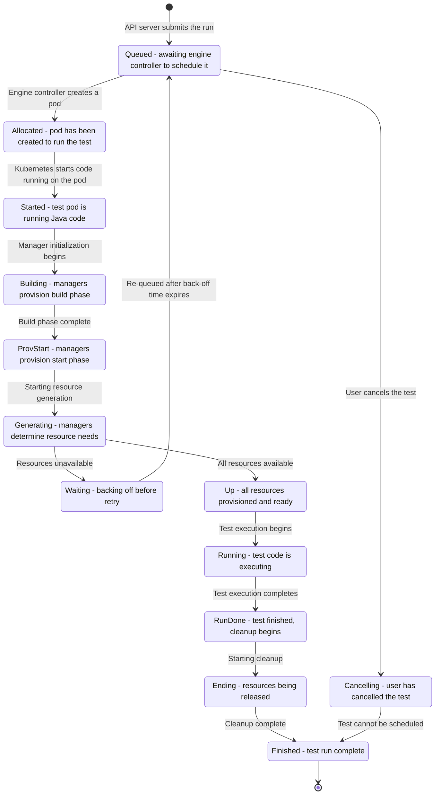
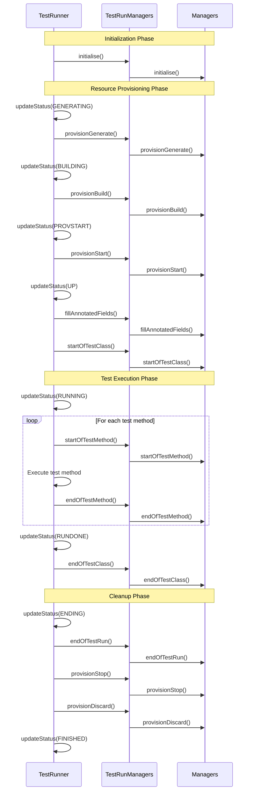

# Test Execution Lifecycle and States

This page explains the complete lifecycle of a Galasa test execution, from initial submission through resource provisioning, test execution, cleanup, and completion. Understanding this lifecycle is essential for troubleshooting test runs, developing managers, and operating a Galasa ecosystem.

## Test Run State Machine

A test run transitions through multiple states during its lifecycle. The state machine below shows all possible states and transitions:

*State machine showing test run lifecycle from queued through to finished*

## Test Run States

### Submission and Scheduling States

#### queued
The initial state when a test is submitted to the Galasa ecosystem. The test awaits scheduling by the engine controller. From this state, a test can transition to:
- **allocated**: Engine controller creates a pod to run the test
- **cancelling**: User cancels the test before it's scheduled

#### allocated
Resources have been allocated for the test run. In a Kubernetes environment, this means a pod has been created. The test waits for Kubernetes to start the code on the pod.

#### started
The test execution environment has been initialized and Java code is running on the pod. The framework begins loading managers and preparing for resource provisioning.

### Resource Provisioning States

The framework executes three distinct provisioning phases in sequence to prepare the test environment.

#### generating
The framework is in the `provisionGenerate` phase. Managers determine what resources they need (e.g., resource names, pool assignments, settings) but do not build anything yet. This phase allows all managers to validate resource availability before any building occurs.

If a manager throws `ResourceUnavailableException` during this phase, the test transitions to **waiting** state rather than failing. This enables automatic retry when resources become available.

#### building
The framework is in the `provisionBuild` phase. Managers create or allocate the resources they need. Resources are built in dependency order as determined by manager provisioning dependencies.

If this phase fails with `ResourceUnavailableException`, the test transitions to **waiting**; other exceptions cause the test to fail with environmental failure.

#### provstart
The framework is in the `provisionStart` phase. Managers initialize and configure their provisioned resources, making them ready for test execution.

Like the building phase, `ResourceUnavailableException` causes transition to **waiting**, while other exceptions fail the test.

#### up
All resources are provisioned, started, and ready. For shared environment builds, the test remains in this state. For normal tests, the framework proceeds to test execution.

### Test Execution States

#### running
The actual test code is executing. The framework has:
- Filled all annotated fields in the test class
- Called `startOfTestClass` on all managers
- Begun executing test methods

Test methods execute in sequence, with managers receiving `startOfTestMethod` and `endOfTestMethod` callbacks for each method.

#### rundone
Test execution has completed. All test methods have finished, and the framework has called `endOfTestClass` on all managers. The test now transitions to cleanup.

### Cleanup and Completion States

#### ending
Resources are being released. The framework is executing cleanup phases:
1. `endOfTestRun`: Managers perform final cleanup tasks
2. `provisionStop`: Managers gracefully stop resources (in reverse dependency order)
3. `provisionDiscard`: Managers release or delete resources (in reverse dependency order)

#### finished
The test run is complete. All resources have been cleaned up, test results have been recorded to the RAS, and run properties may be deleted from the DSS. This is a terminal state.

### Special States

#### waiting
The test could not acquire required resources and is backing off before retrying. The framework calculates a wait time (default: 600 seconds + random 0-180 seconds) and stores a `wait.until` timestamp in the DSS. After the wait time expires, the test is automatically re-queued.

Tests enter this state when a manager throws `ResourceUnavailableException` during any provisioning phase (generate, build, or start).

#### cancelling
The user has cancelled the test. The engine controller will not schedule it for execution. The test transitions directly to **finished** from this state.

## Component Interactions

The test execution lifecycle involves coordination between three primary components:

*Sequence of interactions between TestRunner, TestRunManagers, and Managers during a test run*

### TestRunner

The `TestRunner` orchestrates the entire test lifecycle. It:
- Loads the test bundle and test class
- Creates and initializes managers through `TestRunManagers`
- Updates test run state in the DSS at each phase transition
- Coordinates the provisioning phases in order
- Executes test methods through `TestClassWrapper`
- Handles exceptions and determines whether to fail, retry (transition to waiting), or succeed
- Coordinates cleanup phases in reverse dependency order

### TestRunManagers

`TestRunManagers` manages the collection of active managers for a test run. It:
- Discovers and loads all available managers
- Resolves manager dependencies and determines provisioning order
- Delegates lifecycle method calls to all active managers in the correct order
- Propagates exceptions from managers to the test runner
- Ensures cleanup phases execute in reverse order

### Managers

Individual managers implement the lifecycle methods to provision and manage specific resources. Each manager:
- Declares dependencies on other managers through `areYouProvisionalDependentOn`
- Determines resource needs in `provisionGenerate`
- Creates resources in `provisionBuild`
- Starts resources in `provisionStart`
- Provides test access through annotated fields
- Cleans up resources in `provisionStop` and `provisionDiscard`

## Resource Provisioning Phases

The framework executes provisioning in three distinct phases to ensure proper resource coordination.

### Generate Phase

**Purpose**: Determine what resources are needed without building anything.

Managers should:
- Validate configuration properties
- Select resource pools or names
- Check resource availability
- Throw `ResourceUnavailableException` if resources cannot be acquired

Managers must **not**:
- Create or build any resources
- Modify external systems
- Allocate actual resources

The generate phase allows all managers to validate they can proceed before any manager commits resources.

### Build Phase

**Purpose**: Create and allocate resources.

Managers should:
- Provision virtual machines, containers, or other infrastructure
- Allocate resources from pools
- Create configuration files
- Set up environments

Managers execute in dependency order, so dependent resources are available when needed.

### Start Phase

**Purpose**: Initialize and configure provisioned resources.

Managers should:
- Start services on provisioned infrastructure
- Apply runtime configuration
- Establish connections
- Verify resources are operational

After this phase, all resources must be ready for test execution.

## Resource Cleanup Phases

Cleanup occurs in reverse dependency order to ensure resources are released safely.

### Stop Phase

**Purpose**: Gracefully stop resources.

Managers should:
- Stop services
- Close connections
- Save state if needed
- Prepare for resource release

This phase should be quick and is called even if the test failed.

### Discard Phase

**Purpose**: Release or delete resources.

Managers should:
- Delete temporary resources
- Return resources to pools
- Clean up allocated infrastructure
- Remove temporary files

Managers should keep this phase reasonably quick to maintain test throughput.

## Resource Unavailability and Retry

When resources are unavailable during provisioning, Galasa can automatically retry the test rather than failing it.

### ResourceUnavailableException

Managers throw `ResourceUnavailableException` during any provisioning phase (generate, build, or start) when resources are temporarily unavailable but might become available later. Examples include:
- No available resources in a pool
- Maximum concurrent resource limit reached
- Dependent service temporarily unavailable

### Waiting State Mechanics

When `ResourceUnavailableException` is thrown:
1. The test transitions to **waiting** state
2. The framework calculates a wait time (configurable via `waiting.initial.delay` and `waiting.random.delay` CPS properties)
3. A `wait.until` timestamp is stored in the DSS
4. The `metrics.runs.made.to.wait` counter is incremented
5. After the wait time expires, the test is automatically re-queued

The default wait time is 600 seconds plus a random 0-180 seconds. The random component prevents thundering herd problems when multiple tests are waiting for the same resources.

### Local vs. Automation Runs

Only automation runs (non-local) enter the waiting state and get automatically re-queued. Local test runs fail immediately on `ResourceUnavailableException` because there's no scheduling infrastructure to retry them.

## Shared Environment Support

Galasa supports shared environments that can be built once and reused by multiple tests.

### Shared Environment Build

When a test runs as a shared environment build:
- Provisioning phases (generate, build, start) execute normally
- Test execution is **skipped** - the test never enters **running** state
- After `provisionStart` completes, the test enters **up** state and remains there
- Cleanup phases (stop, discard) are **skipped**
- An expiry time is stored in the DSS based on the configured duration

All active managers must support shared environments (`doYouSupportSharedEnvironments()` returns true) or the build fails.

### Shared Environment Discard

When a shared environment is discarded:
- Provisioning phases are **skipped**
- Test execution is **skipped**
- Only cleanup phases (stop, discard) execute
- The test result is set to "Discarded"
- Shared environment properties are deleted from the DSS

## State Persistence and Observability

### Dynamic Status Store (DSS)

The framework persists test run state in the DSS under the key pattern `run.<runName>.status`. This allows:
- External systems to monitor test progress
- The engine controller to track scheduled tests
- Tests to be interrupted or cancelled
- Automatic re-queuing from waiting state

Additional DSS properties track:
- `run.<runName>.heartbeat`: Updated periodically while the test runs
- `run.<runName>.result`: Final test result (pass/fail/etc.)
- `run.<runName>.wait.until`: Timestamp when a waiting test should be re-queued
- `run.<runName>.started`: Timestamp when the test started
- `run.<runName>.finished`: Timestamp when the test finished

### Test Structure

The framework maintains a `TestStructure` object that is written to the RAS at key lifecycle transitions. This object contains:
- Current state
- Start and end times
- Test result
- Test methods executed
- Manager information

### Events

The framework produces events to the Events Service at state transitions, enabling real-time monitoring and integration with external systems.

## Error Handling

### Environmental Failures

If any provisioning phase throws an exception other than `ResourceUnavailableException`, the test fails with environmental failure (envfail result). The framework:
1. Sets the test result to envfail
2. Calls `testClassResult` on managers to notify them of the failure
3. Proceeds to cleanup phases (ending, stop, discard)
4. Transitions to finished state

### Test Failures

Test method failures do not affect state transitions. The test proceeds normally through rundone → ending → finished regardless of pass/fail status.

### Cancellation

If a user cancels a queued test, it transitions to cancelling state and then directly to finished without executing any test code or cleanup. Tests that are already running cannot transition to cancelling state.

## Configuration

Several CPS properties control lifecycle behavior:

- `waiting.initial.delay`: Base wait time in seconds before re-queuing (default: 600)
- `waiting.random.delay`: Random additional wait time in seconds (default: 180)
- Test timeout properties control how long a test can remain in running state
- Heartbeat interval controls how often the framework updates the heartbeat timestamp

## Related Components

- **Framework Core**: Provides the infrastructure for test execution and state management
- **Kubernetes Controller**: Transitions tests from queued to allocated by creating pods
- **Manager Lifecycle**: Individual manager behaviors during each lifecycle phase
- **Result Archive Store**: Persists test results and artifacts
- **Dynamic Status Store**: Maintains runtime state information
