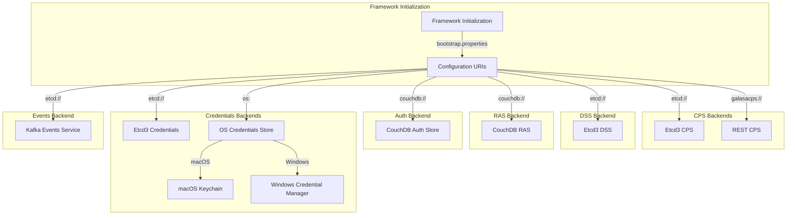
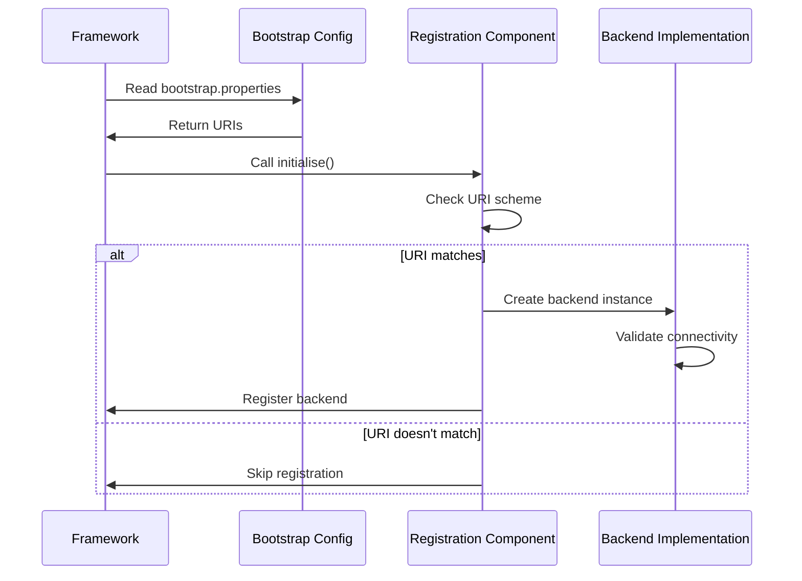

# Storage Backend Implementations

Galasa's extensions module provides concrete implementations of storage backends for various services. These implementations enable Galasa to integrate with enterprise-grade storage systems like etcd, CouchDB, and Kafka, as well as operating system credential stores.

## Architecture Overview

Each storage backend is packaged as an OSGi bundle that registers itself with the Galasa framework through a registration component. The framework determines which backend to use based on URI schemes in the bootstrap configuration.



## Configuration Property Store (CPS) Backends

### Etcd3 CPS Backend

The etcd3 CPS backend provides a distributed configuration store backed by etcd, suitable for ecosystem deployments.

**Location**: `dev.galasa.cps.etcd`

**URI Scheme**: `etcd://`

**When to Use**:
- Ecosystem deployments requiring shared configuration
- Environments needing distributed configuration management
- Production deployments with high availability requirements

**Configuration**:
```properties
# In bootstrap.properties
framework.config.store=etcd://etcd-server:2379
framework.extra.bundles=dev.galasa.cps.etcd
```

**Implementation Details**:
- Uses JETCD client library to connect to etcd
- Implements `IConfigurationPropertyStore` interface
- Supports read and write operations
- Handles property namespaces with prefix-based queries
- Registration class: `Etcd3ConfigurationPropertyRegistration`
- Main implementation: `Etcd3ConfigurationPropertyStore`

**Key Features**:
- Get property by key: `getProperty(String key)`
- Get properties by prefix: `getPrefixedProperties(String prefix)`
- Set property: `setProperty(String key, String value)`
- Delete property: `deleteProperty(String key)`
- Get properties from namespace: `getPropertiesFromNamespace(String namespace)`

### REST CPS Backend

The REST CPS backend enables local test runs to access shared configuration from a remote Galasa ecosystem via REST API calls.

**Location**: `dev.galasa.cps.rest`

**URI Scheme**: `galasacps://`

**When to Use**:
- Local test development using shared ecosystem configuration
- Hybrid environments where tests run locally but use remote configuration
- Development workflows with ecosystem integration

**Configuration**:
```properties
# In bootstrap.properties
framework.config.store=galasacps://myhost/api
framework.extra.bundles=dev.galasa.cps.rest
# Optional: Enable caching for better performance
framework.cps.rest.cache.is.enabled=true
```

**Implementation Details**:
- Read-only CPS implementation (set/delete operations not supported)
- Transforms `galasacps://` URLs to `https://` for API communication
- Requires JWT authentication via system property `GALASA_TOKEN`
- Registration class: `RestCPSRegistration`
- Main implementation: `RestCPS` with optional `CacheCPS` wrapper
- API version: Coded against REST API v0.33.0

**Key Features**:
- Automatic URL scheme translation (`galasacps://` → `https://`)
- Client-side caching with aggressive cache priming when enabled
- Property redaction for local runs (e.g., framework DSS and credentials store properties)
- Namespace redaction (e.g., `secure` namespace is always redacted)
- HTTP client connection pooling

**Redacted Properties**:
The REST CPS automatically redacts certain properties to ensure local runs use local resources:
- `framework.dynamicstatus.store` - Local runs should use local DSS
- `framework.credentials.store` - Local runs should use local credentials
- Entire `secure` namespace - Local credentials should be used instead

## Dynamic Status Store (DSS) Backend

### Etcd3 DSS Backend

The etcd3 DSS backend provides distributed dynamic state management using etcd's transactional capabilities.

**Location**: `dev.galasa.cps.etcd` (shared bundle with CPS)

**URI Scheme**: `etcd://`

**When to Use**:
- Ecosystem deployments requiring coordinated resource management
- Test orchestration with shared state
- Resource locking and allocation across multiple test runners

**Configuration**:
```properties
# In bootstrap.properties
framework.dynamicstatus.store=etcd://etcd-server:2379
framework.extra.bundles=dev.galasa.cps.etcd
```

**Implementation Details**:
- Uses JETCD client library with Watch and Lease capabilities
- Implements `IDynamicStatusStore` interface
- Supports atomic operations and transactions
- Provides watch capability for state change notifications
- Registration class: `Etcd3DynamicStatusStoreRegistration`
- Main implementation: `Etcd3DynamicStatusStore`

**Key Features**:
- Put single or multiple key-value pairs: `put(String key, String value)`, `put(Map<String, String> keyValues)`
- Time-to-live (TTL) support: `put(Map<String, String> keyValues, long timeToLiveSecs)`
- Atomic swap operation: `putSwap(String key, String oldValue, String newValue)`
- Swap multiple values atomically: `putSwap(Map<String, String> keyValueUpdates, Map<String, String> mustRemain, Map<String, String> mustNotExist)`
- Watch for changes: `watch(IDynamicStatusStoreWatcher watcher, String keyPrefix)`
- Delete operations: `delete(String key)`, `deletePrefix(String keyPrefix)`

**Transactional Operations**:
The DSS supports complex atomic operations through the `performActions()` method, which can combine multiple operations in a single transaction:
- `DssAdd` - Add new key-value pairs that must not exist
- `DssUpdate` - Update existing keys that must have specific values
- `DssSwap` - Swap values atomically
- `DssDelete` - Delete keys
- `DssDeletePrefix` - Delete all keys with a prefix

## Result Archive Store (RAS) Backend

### CouchDB RAS Backend

The CouchDB RAS backend provides persistent storage of test results and artifacts using CouchDB.

**Location**: `dev.galasa.ras.couchdb`

**URI Scheme**: `couchdb://`

**When to Use**:
- Ecosystem deployments requiring centralized test result storage
- Environments needing queryable test history
- Production deployments with result retention requirements

**Configuration**:
```properties
# In bootstrap.properties
framework.resultarchive.store=couchdb:https://couchdb-server:5984
framework.extra.bundles=dev.galasa.ras.couchdb
```

**Environment Variables**:
- `GALASA_RAS_TOKEN` - Basic authentication token for CouchDB access

**Implementation Details**:
- Uses Apache HttpClient 5 for CouchDB HTTP API communication
- Implements `IResultArchiveStoreService` interface
- Provides filesystem-like API through custom FileSystemProvider
- Registration class: `CouchdbRasRegistration`
- Main implementation: `CouchdbRasStore`
- FileSystem provider: `CouchdbRasFileSystemProvider`

**CouchDB Databases**:
- `galasa_artifacts` - Stores test artifacts and files
- `galasa_run` - Stores test run metadata and structure
- `galasa_log` - Stores test execution logs

**Key Features**:
- Write logs with batching: `writeLog(String message)` (batches at 100 lines)
- Update test structure: `updateTestStructure(TestStructure structure)`
- Directory service for artifact navigation: `CouchdbDirectoryService`
- Artifact storage with compression support
- Query builder for test result searches: `CouchdbRasQueryBuilder`

**Storage Strategy**:
- Run documents track overall test execution metadata
- Log documents batch 100 lines per document for efficiency
- Artifact documents store binary content with base64 encoding
- Multiple artifact documents per run to handle size limits
- Run IDs prefixed with `cdb-` for identification

## Authentication Store Backend

### CouchDB Auth Store Backend

The CouchDB auth store backend manages user authentication data and tokens using CouchDB.

**Location**: `dev.galasa.auth.couchdb`

**URI Scheme**: `couchdb://`

**When to Use**:
- Ecosystem deployments requiring user authentication
- Environments with access control requirements
- Production deployments with multi-user support

**Configuration**:
```properties
# In bootstrap.properties
framework.auth.store=couchdb:https://couchdb-server:5984
framework.extra.bundles=dev.galasa.auth.couchdb
```

**Environment Variables**:
- `GALASA_AUTHSTORE_TOKEN` - Basic authentication token for CouchDB access

**Implementation Details**:
- Uses Apache HttpClient 5 for CouchDB HTTP API communication
- Implements `IAuthStore` interface
- Manages user records and authentication tokens (not the tokens themselves)
- Registration class: `CouchdbAuthStoreRegistration`
- Main implementation: `CouchdbAuthStore`

**CouchDB Databases**:
- `galasa_tokens` - Stores token metadata and ownership
- `galasa_users` - Stores user profiles and authentication data

**Key Features**:
- Store authentication tokens: `storeToken(String clientId, String description, IUser owner)`
- Get tokens by login ID: `getTokensByLoginId(String loginId)`
- Delete token: `deleteToken(String tokenId)`
- User management: `createUser(String loginId, String clientName)`, `getAllUsers()`
- Front-end client management: `createClient(String clientName)`, `deleteClient(String clientId)`
- Token expiry management with 90-day default lifespan

**Token Management**:
- Tokens have creation time and expiry time metadata
- Default token lifespan: 90 days
- Legacy token migration on initialization
- Token ownership tracked via user association

## Credentials Store Backends

### Etcd3 Credentials Backend

The etcd3 credentials backend stores encrypted credentials in etcd for ecosystem use.

**Location**: `dev.galasa.cps.etcd` (shared bundle with CPS)

**URI Scheme**: `etcd://`

**When to Use**:
- Ecosystem deployments with shared credential requirements
- Server-side test execution
- Production environments requiring centralized credential management

**Configuration**:
```properties
# In bootstrap.properties
framework.credentials.store=etcd://etcd-server:2379
framework.extra.bundles=dev.galasa.cps.etcd
# Encryption key in CPS namespace 'secure'
secure.credentials.file.encryption.key=<your-encryption-key>
```

**Implementation Details**:
- Uses JETCD client library
- Implements `ICredentialsStore` interface
- Supports credential encryption with AES-256
- Stores credentials in `secure.credentials.*` namespace
- Registration class: `Etcd3CredentialsStoreRegistration`
- Main implementation: `Etcd3CredentialsStore`

**Key Features**:
- Get credentials: `getCredentials(String credentialsId)`
- Get all credentials: `getAllCredentials()`
- Set credentials: `setCredentials(String credentialsId, ICredentials credentials)`
- Delete credentials: `deleteCredentials(String credentialsId)`
- Encrypted storage using framework encryption service

**Supported Credential Types**:
- `CredentialsUsername` - Username only
- `CredentialsUsernamePassword` - Username and password
- `CredentialsToken` - Token only
- `CredentialsUsernameToken` - Username and token
- `CredentialsKeyStore` - Java keystore credentials
- `CredentialsOpaque` - Generic binary credentials

### OS Credentials Backend

The OS credentials backend integrates with operating system native credential stores for local development.

**Location**: `dev.galasa.creds.os`

**URI Scheme**: `os:`

**When to Use**:
- Local test development
- Developer workstations
- Environments where OS-managed credentials are preferred

**Configuration**:
```properties
# In bootstrap.properties
framework.credentials.store=os:auto
framework.extra.bundles=dev.galasa.creds.os
```

**Supported Operating Systems**:
- `os:auto` - Auto-detect operating system
- `os:macos` - Explicitly use macOS Keychain
- `os:windows` - Explicitly use Windows Credential Manager
- `os:linux` - Linux Secret Service (planned, not yet implemented)

**Implementation Details**:
- Delegates to OS-specific implementations
- Registration class: `OsCredentialsStoreRegistration`
- Main implementation: `OsCredentialsStore`
- macOS implementation: `MacOsKeychainStore` (uses `security` CLI tool)
- Windows implementation: `WindowsCredentialManagerStore` (uses JNA)

#### macOS Keychain Implementation

**Storage Format**:
- Service Name: `galasa.credentials.{CREDENTIALS-ID}`
- Account Name: Varies by credential type (see below)
- Password: The actual password or token value

**Credential Type Detection**:
- **Username + Password**: Account = plain username (e.g., `IBMUSER`)
- **Username Only**: Account = `username:{actual-username}`
- **Token Only**: Account = `token`
- **Username + Token**: Account = `username-token:{actual-username}`
- **JSON-based Credentials**: Account = `JSON`, Password = JSON object

**Command Examples**:
```bash
# Add username/password
security add-generic-password \
  -s "galasa.credentials.SIMBANK" \
  -a "IBMUSER" \
  -w "SYS1" \
  -U

# Add token
security add-generic-password \
  -s "galasa.credentials.GITHUB" \
  -a "token" \
  -w "ghp_abc123xyz789" \
  -U

# Add keystore (JSON format)
security add-generic-password \
  -s "galasa.credentials.MYKEYSTORE" \
  -a "JSON" \
  -w '{"keystore":"base64-encoded","password":"pass","type":"JKS"}' \
  -U
```

#### Windows Credential Manager Implementation

**Storage Format**:
- Target Name: `galasa.credentials.{CREDENTIALS-ID}`
- User Name: Varies by credential type (see below)
- Password: The actual password or token value

**Credential Type Detection**:
- **Username + Password**: Username = plain username (e.g., `IBMUSER`)
- **Username Only**: Username = `username:{actual-username}`
- **Token Only**: Username = `token`
- **Username + Token**: Username = `username-token:{actual-username}`
- **JSON-based Credentials**: Username = `JSON`, Password = JSON object

**Command Examples**:
```cmd
# Add username/password
cmdkey /generic:galasa.credentials.SIMBANK /user:IBMUSER /pass:SYS1

# Add token
cmdkey /generic:galasa.credentials.GITHUB /user:token /pass:ghp_abc123xyz789
```

## Events Service Backend

### Kafka Events Backend

The Kafka events backend enables Galasa to produce events to Apache Kafka topics for external consumption and monitoring.

**Location**: `dev.galasa.events.kafka`

**URI Scheme**: Not URI-based; activated when CPS uses etcd

**When to Use**:
- Ecosystem deployments requiring event streaming
- Integration with external monitoring or orchestration systems
- Real-time test execution tracking

**Configuration**:
```properties
# In CPS (requires etcd CPS)
kafka.bootstrap.servers=host1:port1,host2:port2,host3:port3
framework.produce.events=true
# Topic configuration for specific event types
kafka.testrunlifecyclestatuschangedevent.topic.name=GalasaTests.StatusChangedEvents
kafka.testheartbeatstoppedevent.topic.name=GalasaTests.HeartbeatStoppedEvents
```

**Environment Variables**:
- `GALASA_EVENT_STREAMS_TOKEN` - Authentication token for Kafka cluster

**Implementation Details**:
- Uses Apache Kafka client library
- Implements `IEventsService` interface
- Only registers when CPS is etcd-based
- Registration class: `KafkaEventsServiceRegistration`
- Main implementation: `KafkaEventsService`
- Producer factory: `KafkaEventProducerFactory`

**Activation Logic**:
The Kafka events service only registers when:
1. The framework CPS URI scheme is `etcd://`
2. The `framework.produce.events` property is set to `true`
3. Topic names are configured for specific event types

**Supported Event Types**:
- **TestRunLifecycleStatusChangedEvent** - Test run status changes
- **TestHeartbeatStoppedEvent** - Test heartbeat stopped

**Key Features**:
- Event producer caching per topic for performance
- Configurable topic names per event type
- Automatic producer configuration from CPS
- Producer shutdown on service termination

**Producer Configuration**:
The Kafka producer is configured with properties from the CPS and environment:
- Bootstrap servers from `kafka.bootstrap.servers`
- Authentication token from environment variable
- Run name identification in metadata
- Per-topic producer instances

## Backend Selection and Registration

### Registration Process

Each backend implementation includes a registration component annotated with `@Component` that implements a registration interface:



### URI Scheme Mapping

| Service | URI Scheme | Backend | Module |
|---------|-----------|---------|--------|
| CPS | `etcd://` | Etcd3 CPS | dev.galasa.cps.etcd |
| CPS | `galasacps://` | REST CPS | dev.galasa.cps.rest |
| DSS | `etcd://` | Etcd3 DSS | dev.galasa.cps.etcd |
| RAS | `couchdb://` | CouchDB RAS | dev.galasa.ras.couchdb |
| Auth | `couchdb://` | CouchDB Auth | dev.galasa.auth.couchdb |
| Credentials | `etcd://` | Etcd3 Credentials | dev.galasa.cps.etcd |
| Credentials | `os:` | OS Credentials | dev.galasa.creds.os |
| Events | (etcd CPS + config) | Kafka Events | dev.galasa.events.kafka |

### Bootstrap Properties Example

Complete bootstrap configuration for an ecosystem deployment:

```properties
# Framework URIs
framework.config.store=etcd://etcd-server:2379
framework.dynamicstatus.store=etcd://etcd-server:2379
framework.resultarchive.store=couchdb:https://couchdb-server:5984
framework.auth.store=couchdb:https://couchdb-server:5984
framework.credentials.store=etcd://etcd-server:2379

# Load extension bundles
framework.extra.bundles=dev.galasa.cps.etcd,dev.galasa.ras.couchdb,dev.galasa.auth.couchdb,dev.galasa.events.kafka

# Event production (optional)
framework.produce.events=true

# Kafka configuration (if events enabled)
kafka.bootstrap.servers=kafka1:9092,kafka2:9092
kafka.testrunlifecyclestatuschangedevent.topic.name=GalasaTests.StatusChangedEvents
```

Local development configuration:

```properties
# Use local file-based stores with REST CPS for shared config
framework.config.store=galasacps://ecosystem.example.com/api
framework.credentials.store=os:auto

# Load extension bundles
framework.extra.bundles=dev.galasa.cps.rest,dev.galasa.creds.os

# Enable CPS caching for better performance
framework.cps.rest.cache.is.enabled=true
```

## Common Patterns

### Validation and Connectivity Checks

All backend implementations validate connectivity during initialization:

```java
// CouchDB stores validate database access
validator.checkCouchdbDatabaseIsValid(this.storeUri, this.httpClient, 
    this.httpRequestFactory, timeService);

// Etcd stores check connectivity
store.checkEtcdConnectivity(uri);
```

### HTTP Client Management

CouchDB backends use factory-created HTTP clients for connection pooling:

```java
public CouchdbStore(URI storeUri, HttpRequestFactory httpRequestFactory, 
                    HttpClientFactory httpClientFactory) {
    this.httpRequestFactory = httpRequestFactory;
    this.httpClient = httpClientFactory.createClient();
}
```

### Authentication

Backends requiring authentication use environment variables or CPS properties:

- **CouchDB RAS**: `GALASA_RAS_TOKEN` environment variable
- **CouchDB Auth**: `GALASA_AUTHSTORE_TOKEN` environment variable
- **Kafka Events**: `GALASA_EVENT_STREAMS_TOKEN` environment variable
- **REST CPS**: `GALASA_TOKEN` system property (via JWT provider)
- **Etcd Credentials**: `secure.credentials.file.encryption.key` CPS property

### Error Handling

All backends implement structured error handling with specific exception types:

- `ConfigurationPropertyStoreException` - CPS operations
- `DynamicStatusStoreException` - DSS operations
- `ResultArchiveStoreException` - RAS operations
- `AuthStoreException` - Auth store operations
- `CredentialsException` - Credentials operations
- `EventsException` - Events service operations
- `CouchdbException` - CouchDB-specific errors

## Testing Considerations

### Unit Testing

Backend implementations support dependency injection for testing:

```java
// Example: CouchDB stores accept test doubles
public CouchdbRasStore(IFramework framework, URI rasUri, 
    HttpClientFactory httpFactory, CouchdbValidator validator,
    LogFactory logFactory, HttpRequestFactory requestFactory, 
    ITimeService timeService) {
    // Implementation allows injection of mock dependencies
}
```

### Integration Testing

When testing with actual backends:

1. **Etcd**: Requires running etcd instance on default port 2379
2. **CouchDB**: Requires CouchDB instance with appropriate databases created
3. **Kafka**: Requires Kafka cluster with topic creation permissions
4. **OS Credentials**: Requires OS-specific credential store access

## Operational Considerations

### Performance

- **REST CPS**: Enable caching with `framework.cps.rest.cache.is.enabled=true` for better performance
- **CouchDB RAS**: Logs are batched at 100 lines per document for efficiency
- **Kafka Events**: Producers are cached per topic to avoid overhead
- **Etcd DSS**: Uses connection pooling and async operations

### High Availability

- **Etcd**: Supports etcd cluster deployments for HA
- **CouchDB**: CouchDB replication provides HA for RAS and auth
- **Kafka**: Kafka cluster configuration provides event stream HA

### Security

- **Encryption**: Etcd credentials store supports AES-256 encryption
- **Authentication**: All remote backends support authentication tokens
- **Isolation**: OS credentials store provides per-user isolation
- **Access Control**: CouchDB auth store manages user permissions

### Monitoring

- **Connectivity**: All backends validate connectivity on initialization
- **Logging**: Apache Commons Logging used throughout for operational visibility
- **Events**: Kafka integration enables external monitoring of test execution

## Extension Development

To add a new storage backend:

1. Create OSGi bundle in `modules/extensions/galasa-extensions-parent/`
2. Implement appropriate SPI interface (e.g., `IConfigurationPropertyStore`)
3. Create registration component implementing registration interface (e.g., `IConfigurationPropertyStoreRegistration`)
4. Use `@Component` annotation to register with OSGi
5. Check URI scheme in `initialise()` method
6. Validate connectivity and register backend if URI matches
7. Add to `settings.gradle` and `framework.extra.bundles`

Example registration skeleton:

```java
@Component(service = { IConfigurationPropertyStoreRegistration.class })
public class MyBackendRegistration implements IConfigurationPropertyStoreRegistration {
    
    @Override
    public void initialise(IFrameworkInitialisation frameworkInitialisation)
            throws ConfigurationPropertyStoreException {
        URI cps = frameworkInitialisation.getBootstrapConfigurationPropertyStore();
        
        if ("mybackend".equals(cps.getScheme())) {
            MyBackendStore store = new MyBackendStore(cps);
            store.validateConnectivity();
            frameworkInitialisation.registerConfigurationPropertyStore(store);
        }
    }
}
```
