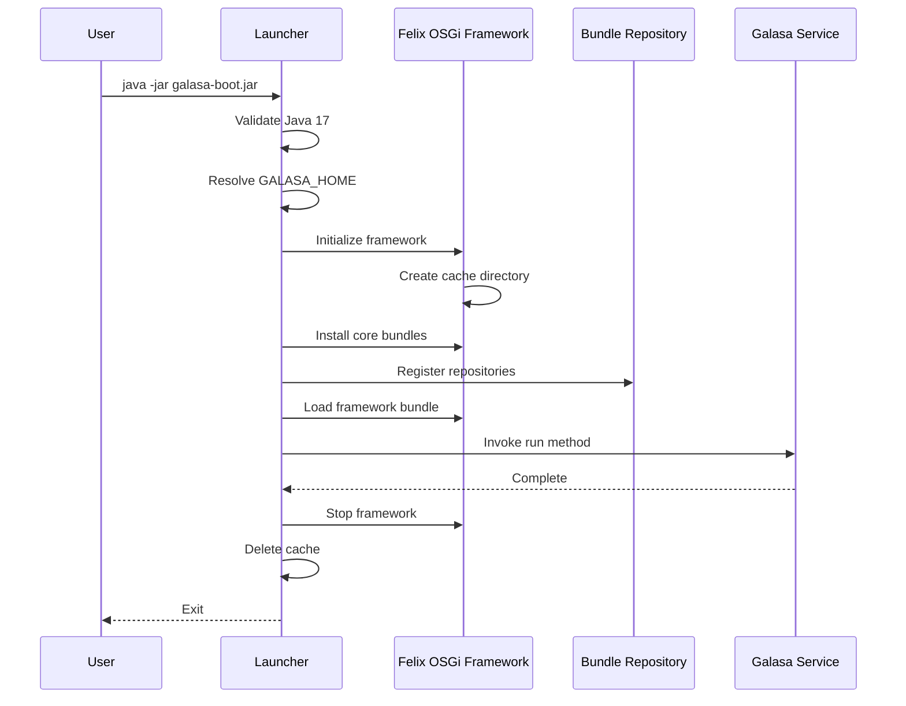

# Galasa Boot JAR

The `galasa-boot` JAR is the primary entry point for launching Galasa in various operational modes. It initializes the Apache Felix OSGi framework, loads necessary bundles from OSGi Bundle Repositories (OBRs), and starts the appropriate Galasa service based on command-line options.

## Overview

The boot JAR provides a unified launcher that can:

- **Execute tests** – Run individual test classes or entire test suites
- **Start services** – Launch the REST API server, metrics server, resource management, or Kubernetes controller
- **Manage ecosystems** – Set up or validate Galasa ecosystem configurations
- **Prepare dependencies** – Pre-download OBR dependencies to the local Maven cache

After building the framework module locally, the boot JAR is located at:
```
galasa/modules/framework/galasa-parent/galasa-boot/build/libs/galasa-boot-{version}.jar
```

## Basic Syntax

The boot JAR requires Java 17 or later:

```bash
java -jar /path/to/galasa-boot-{version}.jar [OPTIONS]
```

The launcher validates the Java version on startup and exits with an error if Java 17 is not available.

## Core Configuration Options

### Bundle Repository

**`--obr <obr-url>`**

Specifies an OSGi Bundle Repository (OBR) to load. Multiple `--obr` options can be provided to load multiple repositories. The format is typically:

```bash
--obr mvn:/{group-id}/{artifact-id}/{version}/obr
```

Example:
```bash
--obr mvn:dev.galasa/dev.galasa.uber.obr/0.36.0/obr
```

### Bootstrap and Configuration

**`--bootstrap <url>`**

URL to the bootstrap properties file. Must start with `http://` or `file://`. If omitted, an empty bootstrap configuration is used, and `GALASA_HOME` is set automatically.

Example:
```bash
--bootstrap file://${HOME}/.galasa/bootstrap.properties
```

**`--overrides <url>`**

URL to the overrides properties file. Must start with `http://` or `file://`. If omitted and `${GALASA_HOME}/overrides.properties` exists, it is loaded automatically.

Example:
```bash
--overrides file://${HOME}/.galasa/overrides.properties
```

### Maven Repository Configuration

**`--localmaven <url>`**

Specifies the local Maven repository location. Defaults to `~/.m2/repository`. Use `--localmaven disable` to disable the local Maven repository entirely.

Example:
```bash
--localmaven file://${HOME}/.m2/repository
```

**`--remotemaven <url>`**

Specifies remote Maven repository URLs. Can be provided multiple times for multiple repositories. Defaults to Maven Central (`https://repo.maven.apache.org/maven2`).

Example:
```bash
--remotemaven https://nexus.example.com/repository/maven-public/
```

**`--offline`**

Disables all remote Maven repository access. Cannot be used with `--remotemaven`.

## Operational Modes

The boot JAR must be invoked with exactly one of the following mode flags:

### Test Execution Mode

**`--test <bundle>/<class>`**

Runs a specific test class. The format is `{osgi-bundle-name}/{fully-qualified-class-name}`.

Example:
```bash
java -jar galasa-boot.jar \
  --obr mvn:dev.galasa/dev.galasa.uber.obr/0.36.0/obr \
  --test dev.galasa.example.tests/dev.galasa.example.banking.TestAccount
```

**`--run <run-name>`**

Executes a test run by name. The run name is converted to uppercase automatically.

**`--gherkin <url>`**

Runs a Gherkin test specification. Must start with `file://`.

Example:
```bash
--gherkin file:///path/to/test.feature
```

**`--methods <method-name>`**

Optional. Used with `--test` to specify which test methods to execute. Can be provided multiple times or as a comma-separated list. If omitted, all test methods in the test class are run.

Example:
```bash
--test dev.galasa.example.tests/dev.galasa.example.TestClass \
--methods testMethod1 \
--methods testMethod2,testMethod3
```

### Service Modes

**`--api`**

Starts the Galasa REST API server. Loads the Jetty web server and all API bundles.

Example:
```bash
java -jar galasa-boot.jar \
  --obr mvn:dev.galasa/dev.galasa.uber.obr/0.36.0/obr \
  --bootstrap file://${HOME}/.galasa/bootstrap.properties \
  --api
```

**`--resourcemanagement`**

Starts the resource management server, which monitors and manages resource allocation across test runs.

Example:
```bash
java -jar galasa-boot.jar \
  --obr mvn:dev.galasa/dev.galasa.uber.obr/0.36.0/obr \
  --bootstrap file://${HOME}/.galasa/bootstrap.properties \
  --resourcemanagement
```

**`--local-resource-management`**

Starts a local resource management process. Unlike `--resourcemanagement`, this mode runs resource monitors locally without requiring a full ecosystem deployment.

**`--k8scontroller`**

Starts the Kubernetes-based engine controller service, which manages test execution on Kubernetes clusters.

**`--metricserver`**

Starts the Galasa metrics collection and export service.

### Ecosystem Management Modes

**`--setupeco`**

Sets up a new Galasa ecosystem by initializing required stores and configurations.

**`--validateeco`**

Validates an existing Galasa ecosystem by submitting a CoreManagerIVT test run to verify proper configuration.

### Dependency Preparation

**`--prepare`**

Downloads all OBR bundle dependencies to the local Maven cache without running any tests or services. Useful for offline operation setup.

Example:
```bash
java -jar galasa-boot.jar \
  --obr mvn:dev.galasa/dev.galasa.uber.obr/0.36.0/obr \
  --localmaven file://${HOME}/.m2/repository \
  --prepare
```

## Additional Options

### Bundle Management

**`--bundle <bundle-name>`**

Loads extra bundles beyond those in the OBR. Can be provided multiple times.

Example:
```bash
--bundle dev.galasa.example.extension
```

### Monitoring and Health

**`--metrics <port>`**

Specifies the port for the metrics server. Use `0` to disable metrics.

**`--health <port>`**

Specifies the port for the health check server. Use `0` to disable health checks.

### Resource Monitor Filtering

**`--includes-monitor-pattern <glob-pattern>`**

Used with `--local-resource-management`. Specifies Java class glob patterns for resource monitors to load. Can be provided multiple times or as a comma-separated list. If omitted, all monitors in the Galasa uber OBR are loaded.

Example:
```bash
--includes-monitor-pattern "dev.galasa.*.resource.*Monitor"
```

**`--excludes-monitor-pattern <glob-pattern>`**

Used with `--local-resource-management`. Specifies Java class glob patterns for resource monitors to exclude. Can be provided multiple times or as a comma-separated list.

### Logging

**`--trace`**

Enables TRACE-level logging throughout the framework.

**`--log4j2-properties-file <path>`**

Path to a custom log4j2 properties file. Must be a `file://` URL or a filesystem path. Overrides the `--trace` option.

Example:
```bash
--log4j2-properties-file file:///etc/galasa/log4j2.properties
```

### Dry Run

**`--dryrun`**

Performs a dry-run of the specified actions without making actual changes. Can be combined with `--file`.

**`-f, --file <path>`**

Specifies a file for data input/output.

## Environment Variables

The boot JAR respects several environment variables that control runtime behavior:

### Home Directory

**`GALASA_HOME`**

Sets the Galasa home directory. Precedence order:
1. System property `-DGALASA_HOME`
2. Environment variable `GALASA_HOME`
3. Default: `${HOME}/.galasa`

Example:
```bash
export GALASA_HOME=/opt/galasa
```

### Store Configuration

These environment variables override bootstrap properties for store locations:

**`GALASA_CONFIG_STORE`** – Configuration Property Store (CPS) location  
**`GALASA_DYNAMICSTATUS_STORE`** – Dynamic Status Store (DSS) location  
**`GALASA_RESULTARCHIVE_STORE`** – Result Archive Store (RAS) location  
**`GALASA_CREDENTIALS_STORE`** – Credentials Store location  
**`GALASA_AUTH_STORE`** – Authentication Store location

Example:
```bash
export GALASA_CONFIG_STORE="etcd:http://localhost:2379"
export GALASA_RESULTARCHIVE_STORE="couchdb:http://localhost:5984"
```

### Maven Credentials

**`GALASA_MAVEN_USERNAME`** – Maven repository username  
**`GALASA_MAVEN_PASSWORD`** – Maven repository password

These are written to the bootstrap properties as `maven.repository.username` and `maven.repository.password`.

### Extra Bundles

**`GALASA_EXTRA_BUNDLES`** – Comma-separated list of extra bundles to load, written to `framework.extra.bundles` in bootstrap properties.

### Resource Management

**`GALASA_MONITOR_STREAM`** – Stream name for resource management  
**`GALASA_MONITOR_INCLUDES_GLOB_PATTERNS`** – Comma-separated include patterns for resource monitors  
**`GALASA_MONITOR_EXCLUDES_GLOB_PATTERNS`** – Comma-separated exclude patterns for resource monitors

## System Properties

System properties can be set using `-D` flags and are passed directly to the JVM:

```bash
java -jar galasa-boot.jar -DGALASA_HOME=/opt/galasa -DGALASA_JWT=token ...
```

The launcher automatically masks any property containing `DGALASA_JWT` in log output for security.

## OSGi Framework Initialization

The boot JAR performs the following initialization sequence:

1. **Validate Java version** – Ensures Java 17 is available
2. **Determine GALASA_HOME** – Resolves the home directory from properties or environment
3. **Create Felix framework** – Initializes Apache Felix OSGi framework with a unique cache directory
4. **Install core bundles** – Loads Felix SCR, log4j2 bridge, and Maven repository handlers
5. **Load OBRs** – Registers all specified bundle repositories
6. **Load framework bundle** – Installs `dev.galasa.framework` and extra bundles
7. **Invoke service** – Calls the appropriate service method based on the operational mode
8. **Cleanup** – Stops the Felix framework and deletes the cache directory



## Complete Examples

### Running a Test Locally

```bash
java -jar galasa-boot-0.36.0.jar \
  --obr mvn:dev.galasa/dev.galasa.uber.obr/0.36.0/obr \
  --obr mvn:dev.example/dev.example.tests.obr/1.0.0/obr \
  --bootstrap file://${HOME}/.galasa/bootstrap.properties \
  --overrides file://${HOME}/.galasa/overrides.properties \
  --test dev.example.tests/dev.example.tests.banking.TestAccount \
  --methods testAccountBalance
```

### Starting the API Server

```bash
java -jar galasa-boot-0.36.0.jar \
  --localmaven file://${HOME}/.m2/repository \
  --bootstrap file://${HOME}/.galasa/bootstrap.properties \
  --overrides file://${HOME}/.galasa/overrides.properties \
  --obr mvn:dev.galasa/dev.galasa.uber.obr/0.36.0/obr \
  --api \
  --metrics 9010 \
  --health 9011
```

### Running Resource Management

```bash
java -jar galasa-boot-0.36.0.jar \
  --obr mvn:dev.galasa/dev.galasa.uber.obr/0.36.0/obr \
  --bootstrap file://${HOME}/.galasa/bootstrap.properties \
  --resourcemanagement \
  --metrics 9010 \
  --health 9011
```

### Preparing Dependencies for Offline Use

```bash
java -jar galasa-boot-0.36.0.jar \
  --obr mvn:dev.galasa/dev.galasa.uber.obr/0.36.0/obr \
  --obr mvn:dev.example/dev.example.tests.obr/1.0.0/obr \
  --localmaven file://${HOME}/.m2/repository \
  --prepare
```

### Running Local Resource Management with Filtering

```bash
export GALASA_MONITOR_INCLUDES_GLOB_PATTERNS="dev.galasa.zos.*.resource.*Monitor"
export GALASA_MONITOR_EXCLUDES_GLOB_PATTERNS="*TestMonitor"

java -jar galasa-boot-0.36.0.jar \
  --obr mvn:dev.galasa/dev.galasa.uber.obr/0.36.0/obr \
  --bootstrap file://${HOME}/.galasa/bootstrap.properties \
  --local-resource-management
```

## Troubleshooting

### Java Version Error

**Error**: "Galasa requires Java 17, we found: {version}"

**Solution**: Ensure Java 17 is installed and available in `JAVA_HOME` or the system PATH.

### Bundle Not Found

**Error**: "Unable to locate bundle ... in OBR repository"

**Solution**: Verify the `--obr` URL is correct and accessible. Check that the bundle exists in the specified repository.

### Connection Timeout

**Error**: "Unable to load bootstrap properties"

**Solution**: Verify the `--bootstrap` URL is accessible. Check network connectivity if using HTTP URLs. Increase timeout if needed.

### Maven Repository Access

**Error**: Failed to resolve dependencies

**Solution**: Check `--localmaven` and `--remotemaven` settings. Verify Maven credentials if using authenticated repositories. Consider using `--offline` if working without network access.

## Related Components

- **[Framework Core Architecture](/openwiki/architecture/framework-core.md)** – The framework services initialized by the boot JAR
- **Felix OSGi Framework** – The underlying OSGi container managed by galasa-boot
- **OBR (OSGi Bundle Repository)** – Bundle repositories loaded by the launcher

## Implementation Notes

The boot JAR uses Apache Commons CLI for command-line parsing and Apache Felix as the OSGi framework implementation. It embeds core dependencies (Felix framework, Felix Bundle Repository, Commons CLI, Commons IO, and log4j2) directly in the JAR to minimize external dependencies during bootstrap.

The launcher creates a unique Felix cache directory under `${GALASA_HOME}/cache/felix-cache-{uuid}` for each invocation, ensuring isolation between concurrent launches. The cache is automatically deleted when the framework stops.

Service invocation uses OSGi service references and Java reflection to locate and call the appropriate service methods, maintaining loose coupling between the boot JAR and framework services.
