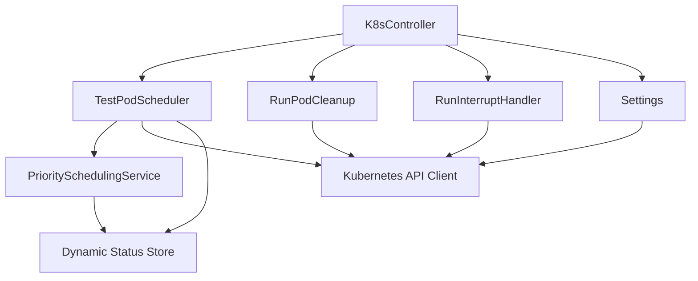
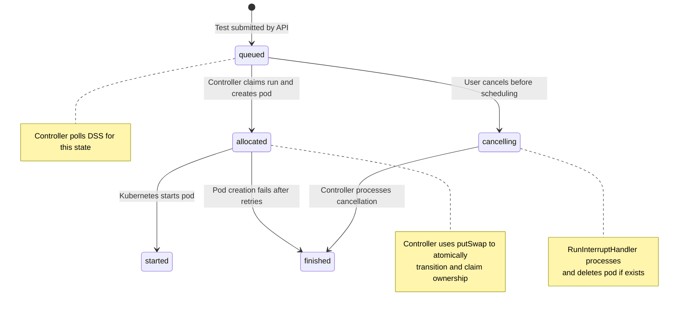

# Kubernetes Controller

The Kubernetes Controller is a continuously-running service that schedules and monitors Galasa test runs within a Kubernetes-based ecosystem. It monitors the Dynamic Status Store (DSS) for queued tests, launches pods to execute them, manages pod cleanup, and handles test run state transitions including interruptions and cancellations.

## Overview

The controller bridges the Galasa ecosystem and Kubernetes by:

- **Polling for queued tests** – Periodically queries DSS for tests in the `queued` state
- **Creating test pods** – Launches Kubernetes pods configured to run individual tests
- **Managing pod lifecycle** – Tracks pod creation, execution, termination, and cleanup
- **Handling interruptions** – Processes cancelled, hung, and requeued test runs
- **Distributing load** – Spreads pods across cluster nodes using configurable affinity and delay settings

The controller runs as a long-lived pod within the Kubernetes cluster and is started via the `--k8scontroller` flag on the galasa-boot JAR.

## Starting the Controller

The controller is launched through galasa-boot:

```bash
java -jar galasa-boot.jar \
  --obr mvn:dev.galasa/dev.galasa.uber.obr/0.36.0/obr \
  --bootstrap file:///bootstrap.properties \
  --k8scontroller
```

When invoked with `--k8scontroller`, galasa-boot:
1. Initializes the Felix OSGi framework
2. Loads the `dev.galasa.framework.k8s.controller` bundle
3. Retrieves the `K8sController` OSGi service
4. Invokes the `run(bootstrapProperties, overridesProperties)` method
5. Runs until shutdown signal is received

The controller remains active until the pod receives a termination signal, at which point it performs graceful shutdown including stopping scheduled tasks and closing metrics/health servers.

## Component Architecture

The controller consists of several cooperating components:



*The controller's main components and their dependencies*

### K8sController

The main orchestrator that:
- Initializes framework services (CPS, DSS, RAS)
- Creates and schedules worker threads using a `ScheduledExecutorService`
- Starts metrics and health servers
- Coordinates graceful shutdown

The controller spawns five worker threads for concurrent operations:
1. **Heartbeat thread** – Updates controller heartbeat in DSS every 20 seconds
2. **Settings refresh thread** – Reloads ConfigMap settings every 20 seconds
3. **Test pod scheduler thread** – Polls for queued tests and launches pods
4. **Pod cleanup thread** – Scans for terminated pods and removes completed ones
5. **Interrupt handler thread** – Processes cancelled, hung, and requeued runs every 5 seconds

### TestPodScheduler

Polls DSS for queued tests and creates Kubernetes pods to execute them. The scheduler:

1. **Checks capacity** – Verifies current active pods are below `max_engines` limit
2. **Fetches prioritized runs** – Retrieves queued tests ordered by priority
3. **Allocates runs** – Uses atomic DSS putSwap to claim test runs
4. **Creates pods** – Generates pod definitions with appropriate resource limits, volumes, and affinity rules
5. **Manages retries** – Handles pod creation failures with retry logic up to `max_test_pod_retry_limit`
6. **Staggers launches** – Waits `kube_launch_interval_milliseconds` between successive pod creations

### RunPodCleanup

Periodically scans Kubernetes for terminated test pods and deletes those associated with finished test runs. This prevents pod accumulation and reclaims cluster resources.

### RunInterruptHandler

Monitors DSS for interrupted test runs (cancelled, hung, or requeued) and processes them by:
- Transitioning run state appropriately (e.g., `queued` → `cancelling` → `finished`)
- Deleting associated pods if they exist
- Processing deferred RAS actions
- Requeuing tests marked for retry

### PrioritySchedulingService

Calculates priority scores for queued tests based on:
- **Time in queue** – Points accumulate based on minutes queued (configurable growth rate)
- **Requestor priority** – User-specific priority from RBAC service
- **Tag priority** – Priority values from test run tags

Tests with higher total scores are scheduled first, preventing starvation while respecting user and tag priorities.

### Settings

Loads and refreshes configuration from a Kubernetes ConfigMap every 20 seconds, allowing dynamic adjustment without restarting the controller. When settings change, the controller reschedules polling threads to pick up new intervals.

## Test Run State Transitions

The controller manages several state transitions in the DSS:



*State transitions managed by the Kubernetes Controller*

The controller is responsible for the `queued` → `allocated` transition. Other transitions are handled by the test runner executing inside the pod, except for interrupt-related transitions handled by the `RunInterruptHandler`.

## Pod Scheduling and Resource Distribution

The controller creates pods with resource specifications and scheduling constraints designed to distribute workload across cluster nodes.

### Launch Interval Throttling

To prevent all test pods from being scheduled onto the same node, the controller waits between successive pod launches:

```java
// From TestPodScheduler.run()
long launchIntervalMilliseconds = settings.getKubeLaunchIntervalMillisecs();
timeService.sleepMillis(launchIntervalMilliseconds);
```

This delay allows Kubernetes resource usage statistics to propagate across the cluster before the next pod is scheduled. Without this delay, the Kubernetes scheduler may observe all nodes as having identical available resources and place multiple pods on the same node, potentially exhausting node memory.

The delay is necessary because Kubernetes resource metrics are not updated in real-time but have a propagation lag. The controller assumes the configured delay exceeds this lag, allowing proper load distribution.

### Pod Resource Specifications

Each test pod is created with configurable resource requests and limits:

- **Memory request**: `engine_memory_request` (default: 150 Mi)
- **Memory limit**: `engine_memory_limit` (default: 200 Mi)
- **CPU request**: `engine_cpu_request` (default: 400m)
- **CPU limit**: `engine_cpu_limit` (default: 1000m)
- **Heap size**: `engine_memory_heap` (default: 150 Mi) – passed as JVM argument

These values guide Kubernetes scheduling decisions and prevent individual test runs from consuming excessive node resources.

### Node Affinity and Tolerations

The controller supports optional node affinity rules to influence pod placement:

- **Node architecture selector**: `node_arch` – Restricts pods to nodes with specific architecture (e.g., `amd64`)
- **Preferred affinity**: `galasa_node_preferred_affinity` – Soft preference for nodes matching label=value
- **Required affinity**: `galasa_node_required_affinity` – Hard requirement for nodes matching label=value
- **Tolerations**: `galasa_node_tolerations` – Allows pods to tolerate specific node taints

Example ConfigMap entry for tolerations:
```yaml
data:
  galasa_node_tolerations: "galasa-engines=Exists:NoSchedule"
```

This configuration allows test pods to be scheduled on nodes tainted with `galasa-engines`, preventing other workloads from consuming resources reserved for testing.

## Configuration via ConfigMap

The controller loads configuration from a Kubernetes ConfigMap specified by the `CONFIG` environment variable (default: `config`). Configuration is refreshed every 20 seconds.

### Key Configuration Properties

#### kube_launch_interval_milliseconds

**Type**: `long`  
**Default**: `1000`

The number of milliseconds to wait between successive pod launches. Increasing this value improves load distribution across nodes but slows test startup. Decreasing it speeds up test queue processing but may cause pods to cluster on the same node.

```yaml
data:
  kube_launch_interval_milliseconds: "2000"
```

#### max_engines

**Type**: `int`  
**Default**: `1`

The maximum number of active test pods the controller will allow. When this limit is reached, the controller stops scheduling new tests until pods complete. This prevents cluster resource exhaustion.

#### run_poll

**Type**: `int`  
**Default**: `60`

The number of seconds between polls for queued test runs. Shorter intervals provide faster test startup but increase DSS query load. Longer intervals reduce system load but increase test startup latency.

#### max_test_pod_retry_limit

**Type**: `int`  
**Default**: `5`

The maximum number of attempts to create a pod for a test run. If pod creation fails this many times (e.g., due to name conflicts or Kubernetes API errors), the test is marked as `EnvFail` and transitioned to `finished`.

#### interrupted_test_run_cleanup_grace_period_seconds

**Type**: `long`  
**Default**: `300`

The grace period before processing interrupted test runs. Tests marked as cancelled, hung, or requeued must remain in that state for at least this duration before the controller processes them. This allows in-flight test pods time to detect the interruption and clean up gracefully.

#### allocated_test_run_timeout_minutes

**Type**: `long`  
**Default**: `30`

The timeout for test runs in `allocated` state. If a pod remains allocated without transitioning to `started` for longer than this duration, the controller considers it stuck and may take corrective action.

#### engine_image

**Type**: `string`  
**Default**: `ghcr.io/galasa-dev/galasa-boot-embedded-amd64`

The container image used for test pods. The image must contain galasa-boot and be configured to run tests when started.

#### engine_label

**Type**: `string`  
**Default**: `k8s-standard-engine`

The label applied to test pods for identification and filtering. Used in pod queries and cleanup operations.

#### is_istio_enabled

**Type**: `boolean`  
**Default**: `false`

Whether to add Istio sidecar injection label to test pods. When `true`, test pods are labeled `sidecar.istio.io/inject: "true"`.

## Monitoring and Observability

The controller exposes metrics and health endpoints for operational monitoring.

### Metrics Server

Runs on port configured by `controller.metrics.port` CPS property (default: 9010). Exposes Prometheus-compatible metrics including:

- `galasa_k8s_controller_submitted_runs` – Counter of test runs submitted by the controller

### Health Server

Runs on port configured by `controller.health.port` CPS property (default: 9011). Provides a simple HTTP endpoint indicating controller health status.

### Heartbeat

The controller writes a heartbeat timestamp to the DSS every 20 seconds:
```
servers.controller.<pod-name>.heartbeat = <ISO-8601-timestamp>
```

External monitoring systems can track this property to detect controller failures or DSS connectivity issues.

## Pod Lifecycle Management

### Pod Creation

When creating a pod for a test run, the controller:

1. **Generates pod name**: `<engine-label>-<run-name-lowercase>[-<suffix>]`
2. **Atomically allocates run**: Uses DSS `putSwap` to transition `queued` → `allocated`
3. **Sets allocation metadata**: Records controller name, allocated timestamp, and timeout
4. **Constructs pod definition**: Includes resource limits, volumes, environment variables, affinity rules
5. **Submits to Kubernetes API**: Creates the pod in the cluster namespace
6. **Handles conflicts**: Appends suffix and retries if pod name already exists

### Pod Cleanup

The `RunPodCleanup` component scans for terminated pods every `run_poll` seconds and deletes pods when:

- The associated test run is in `finished` state
- The test run no longer exists in the DSS

This prevents pod accumulation while preserving pods for in-progress tests.

### Interrupt Handling

The `RunInterruptHandler` processes test runs with an interrupt reason (`cancelled`, `hung`, or `requeued`) by:

1. **Transitioning state**: For queued runs, atomically transition to `cancelling`
2. **Deleting pods**: For running tests, delete the associated pod
3. **Processing RAS actions**: Execute deferred RAS operations (e.g., updating test result)
4. **Finalizing state**: Transition to `finished` or re-queue as appropriate

Interrupt processing includes a grace period (`interrupted_test_run_cleanup_grace_period_seconds`) to allow running tests time to detect the interrupt and shut down gracefully before the controller forcibly deletes the pod.

## Failure Scenarios

### Pod Creation Failure

If pod creation fails, the controller retries up to `max_test_pod_retry_limit` times with a 2-second delay between attempts. If all retries fail, the test is marked `EnvFail` and transitioned to `finished`.

### DSS Connectivity Loss

If the controller cannot connect to the DSS, scheduled threads continue attempting operations but log errors. The heartbeat thread will fail to update the heartbeat timestamp, allowing external monitoring to detect the issue.

### Kubernetes API Failure

If the Kubernetes API is unavailable, the controller logs errors but continues running. It will resume normal operation when API connectivity is restored.

### Maximum Capacity Reached

When active pods reach `max_engines`, the controller stops scheduling new tests and logs informational messages. Tests remain in `queued` state until capacity becomes available.

## Security and Isolation

### Service Account Permissions

The controller pod requires a Kubernetes service account with permissions to:
- List, get, create, and delete pods in the namespace
- Read ConfigMaps in the namespace
- Access secrets referenced by test pods (e.g., encryption keys)

### Test Pod Isolation

Each test pod runs as a separate Kubernetes pod with isolated:
- Network namespace (unless Istio sidecar is injected)
- Process namespace
- File system (ephemeral storage)

Tests cannot directly access other test pods or the controller pod.

### Credentials and Secrets

The controller mounts secrets as volumes in test pods:
- **Encryption keys**: Mounted from secret specified by `encryption_keys_secret_name`
- **TLS certificates**: Optionally mounted from ConfigMap if `GALASA_CACERTS_FILE_PATH` is set

Test pods access credentials through the credentials store, never directly from the controller.

## Operational Considerations

### Scaling

Run only one controller instance per Galasa installation. Multiple controllers compete for the same queued runs using DSS atomic operations, but this creates unnecessary overhead. Scale test capacity by increasing `max_engines` rather than running multiple controllers.

### Cluster Autoscaling

The controller works with Kubernetes cluster autoscaling. When pods cannot be scheduled due to insufficient node resources, Kubernetes adds nodes (if autoscaling is configured). The controller continues polling and will schedule tests once new nodes become available.

### Upgrade Strategy

To upgrade the controller:
1. Set `max_engines` to 0 in the ConfigMap to stop new test scheduling
2. Wait for active test pods to complete
3. Delete the controller pod
4. Deploy the new controller version
5. Restore `max_engines` to the desired value

### Resource Recommendations

For the controller pod itself:
- **Memory**: 512 Mi request, 1 Gi limit
- **CPU**: 100m request, 500m limit

The controller is lightweight and spends most time sleeping between polling intervals. Resource requirements scale with polling frequency and test submission rate, not cluster size.
