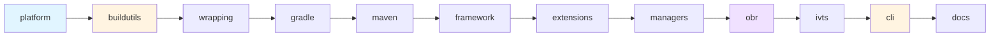

# Building the Repository Locally

This guide provides comprehensive instructions for building the Galasa repository on your local machine. The repository consists of eleven modules that can be built individually or as a complete chain, using a combination of Gradle, Maven, and Go build tools.

## Prerequisites

Before building Galasa locally, ensure your system has all required tools installed. There are two setup approaches: using a development container (recommended) or manual installation.

### Option 1: Development Container (Recommended)

The development container provides a pre-configured environment with all required tools. See the [Development Container Setup](/openwiki/operations/dev-container.md) guide for complete instructions.

**Prerequisites:**
- Visual Studio Code with the [Dev Containers extension](https://marketplace.visualstudio.com/items?itemName=ms-vscode-remote.remote-containers)
- A container runtime: Docker Desktop, Rancher Desktop, or Podman

The dev container automatically provides:
- Java 17 (Semeru distribution 17.0.14)
- Maven 3.9.0
- Gradle 9.0.0
- Python 3.11.0
- Go 1.23.5
- Docker-outside-of-Docker support

### Option 2: Manual Tool Installation

If you prefer to set up your environment manually, install the following tools:

#### Required Tools

**Java Development Kit**
- Version: OpenJDK 17 (tested with Semeru 17.0.12)
- Installation: Use [SDKman](https://sdkman.io/)

```bash
# Install SDKman
curl -s "https://get.sdkman.io" | bash
source "$HOME/.sdkman/bin/sdkman-init.sh"

# Install Java 17
sdk install java 17.0.12-sem
sdk default java 17.0.12-sem
```

**Gradle**
- Version: 8.9 (required)
- Installation: Use SDKman

```bash
sdk install gradle 8.9
sdk default gradle 8.9
```

Configure Gradle to use your Java installation by creating or updating `~/.gradle/gradle.properties`:

```properties
org.gradle.java.home=/path/to/java/17
systemProp.javax.net.ssl.trustStore=/path/to/java/17/lib/security/cacerts
systemProp.javax.net.ssl.trustStorePassword=changeit
```

**Maven**
- Version: 3.9.0 (recommended)
- Installation: Use SDKman

```bash
sdk install maven 3.9.0
```

Configure Maven by creating or updating `~/.m2/settings.xml`:

```xml
<settings xmlns="http://maven.apache.org/SETTINGS/1.0.0"
          xmlns:xsi="http://www.w3.org/2001/XMLSchema-instance"
          xsi:schemaLocation="http://maven.apache.org/SETTINGS/1.0.0 http://maven.apache.org/xsd/settings-1.0.0.xsd">
  <pluginGroups>
    <pluginGroup>dev.galasa</pluginGroup>
  </pluginGroups>
  <profiles>
    <profile>
      <id>galasa</id>
      <activation>
        <activeByDefault>true</activeByDefault>
      </activation>
      <repositories>
        <repository>
          <id>maven.central</id>
          <url>https://repo.maven.apache.org/maven2/</url>
        </repository>
        <repository>
          <id>galasa.repo</id>
          <url>https://development.galasa.dev/main/maven-repo/obr</url>
          <releases><enabled>true</enabled></releases>
          <snapshots><enabled>true</enabled></snapshots>
        </repository>
      </repositories>
      <pluginRepositories>
        <pluginRepository>
          <id>maven.central</id>
          <url>https://repo.maven.apache.org/maven2/</url>
        </pluginRepository>
        <pluginRepository>
          <id>galasa.repo</id>
          <url>https://development.galasa.dev/main/maven-repo/obr</url>
          <releases><enabled>true</enabled></releases>
          <snapshots><enabled>true</enabled></snapshots>
        </pluginRepository>
      </pluginRepositories>
    </profile>
  </profiles>
</settings>
```

**Go**
- Version: 1.23.5 or higher
- Installation: Download from [go.dev](https://go.dev/doc/install)

**Python**
- Version: 3.11.0 or higher
- Installation: Use [pyenv](https://github.com/pyenv/pyenv) for managing Python versions

```bash
# Install pyenv (macOS)
brew install pyenv

# Install Python
pyenv install 3.11.0
pyenv global 3.11.0
```

**Optional Tools**

For building Docker images:
- Docker, Podman, or compatible container runtime

For secret detection:
- [detect-secrets](https://github.com/Yelp/detect-secrets)

```bash
pip install detect-secrets
```

## Understanding the Build System

### Module Structure and Dependencies

The Galasa repository is divided into eleven modules with specific build order dependencies:



**Build Order:**
1. **platform** - Gradle platform BOM defining dependency versions
2. **buildutils** - Go build utilities (galasabld, openapi2beans)
3. **wrapping** - Maven wrappers for non-OSGi JARs
4. **gradle** - Gradle plugins for Galasa
5. **maven** - Maven plugin for Galasa
6. **framework** - Core framework components
7. **extensions** - Framework extensions (CPS, RAS, auth)
8. **managers** - Test managers for various technologies
9. **obr** - OSGi Bundle Repository assembly
10. **ivts** - Installation Verification Tests
11. **cli** - galasactl command-line tool
12. **docs** - Documentation site

Each module depends on artifacts produced by previous modules in the chain. Breaking the build order will result in dependency resolution failures.

### Build Technologies

Modules use different build systems:

- **Gradle modules**: platform, gradle, framework, extensions, managers, ivts
- **Maven modules**: wrapping, maven, obr
- **Go modules**: buildutils, cli (also uses Gradle)
- **Mixed**: docs (uses Gradle for dependency management)

## Using the build-locally.sh Script

The root `tools/build-locally.sh` script orchestrates the entire build process, handling module dependencies and build ordering automatically.

### Basic Usage

**Build everything from the beginning:**

```bash
./tools/build-locally.sh
```

This builds all modules in dependency order, starting with the `platform` module. The full build typically takes 15-20 minutes on first run.

**Build from a specific module:**

```bash
./tools/build-locally.sh --module framework
```

This starts building from the `framework` module and continues through all subsequent modules in the chain (extensions, managers, obr, ivts, cli, docs).

**Build a single module without chaining:**

```bash
./tools/build-locally.sh --module obr --chain false
```

This builds only the `obr` module without building subsequent modules. Useful when you've already built later modules and only need to rebuild one.

### Build Options

**`--module <name>`**
- Specifies which module to start building from
- Valid values: `platform`, `buildutils`, `wrapping`, `gradle`, `maven`, `framework`, `extensions`, `managers`, `obr`, `ivts`, `cli`, `docs`
- Default: `platform` (builds everything)

**`--chain <true|false|yes|no|y|n>`**
- Controls whether to build subsequent modules after the starting module
- `true` (default): Builds the specified module and all modules that depend on it
- `false`: Builds only the specified module
- Useful for rebuilding a single module without affecting the rest of the build

**`--docker`**
- Enables Docker image building for modules that produce container images
- Applies to `obr` (boot embedded image) and `docs` modules
- Requires a container runtime (Docker, Podman, etc.)

**`--minikube`**
- Sets up a local Docker registry for minikube
- Automatically enables `--docker`
- Pushes built images to the minikube registry
- Used for local Kubernetes development

### Examples

**Full clean build:**

```bash
# Clean Maven cache first
rm -fr ~/.m2/repository/dev/galasa/galasa*
rm -fr ~/.m2/repository/dev/galasa/dev-galasa*

# Build everything
./tools/build-locally.sh
```

**Rebuild framework and everything after:**

```bash
./tools/build-locally.sh --module framework
```

**Build only the CLI:**

```bash
./tools/build-locally.sh --module cli --chain false
```

**Build OBR with Docker images:**

```bash
./tools/build-locally.sh --module obr --docker
```

**Build for local Kubernetes testing:**

```bash
./tools/build-locally.sh --docker --minikube
```

## Building Individual Modules

Each module has its own `build-locally.sh` script in its directory. You can build modules directly, but you must ensure dependencies are already built and available.

### Module-Specific Build Scripts

**Platform module:**

```bash
cd modules/platform
./build-locally.sh --detectsecrets false
```

**Framework module (requires platform, wrapping, gradle, maven):**

```bash
cd modules/framework
./build-locally.sh --clean --detectsecrets false
```

Options:
- `--clean`: Full clean build (required for first build or after major changes)
- `--delta`: Incremental build (faster for small changes)

**CLI module (requires Go and framework artifacts):**

```bash
cd modules/cli
./build-locally.sh --clean --detectsecrets false
```

**OBR module (with Docker images):**

```bash
cd modules/obr
./build-locally.sh --docker --detectsecrets false
```

### Common Build Script Options

Most module build scripts support:

- `--detectsecrets true|false`: Run secret detection scan (default: `true`)
- `-h | --help`: Display help for the module's build script

Some modules (framework, extensions, managers, cli) also support:
- `--clean`: Perform a clean build
- `--delta`: Perform an incremental build

## Environment Variables

Several environment variables affect the build behavior:

### SOURCE_MAVEN

Specifies where Gradle/Maven should look for pre-built Galasa artifacts.

**Default:** `file://${HOME}/.m2/repository`

**Usage:**
```bash
export SOURCE_MAVEN=https://development.galasa.dev/main/maven-repo/obr/
./tools/build-locally.sh
```

This is useful when:
- Building from a specific module without building all prerequisites
- Using development builds from the Galasa CI/CD system
- Testing with specific artifact versions

### LOGS_DIR

Controls where build logs are stored.

**Default:** Temporary directory created per build

**Usage:**
```bash
export LOGS_DIR=/path/to/logs
./tools/build-locally.sh
```

### DEBUG

Enables verbose debug output during builds.

**Default:** `0` (off)

**Usage:**
```bash
export DEBUG=1
./tools/build-locally.sh
```

### GPG_PASSPHRASE

Passphrase for GPG key used to sign artifacts (required for full builds).

**Usage:**
```bash
export GPG_PASSPHRASE="your-passphrase"
./tools/build-locally.sh
```

**Note:** GPG signing is required for publishing artifacts but not for local development builds.

## Build Artifacts and Output

### Maven Local Repository

Gradle and Maven modules publish artifacts to your local Maven repository at `~/.m2/repository/dev/galasa/`.

**Artifact structure:**
```
~/.m2/repository/dev/galasa/
├── galasa-parent/
├── galasa-framework/
├── galasa-extensions-parent/
├── galasa-managers-parent/
└── [other modules]/
```

These artifacts are consumed by subsequent modules during the build process.

### Go Binaries

Go modules produce binary executables:

- **buildutils**: `modules/buildutils/bin/galasabld`
- **cli**: `modules/cli/bin/galasactl-darwin-x86_64` (or platform-specific binary)

### Docker Images

When building with `--docker`, the following images are created:

**OBR module:**
- `galasa-boot-embedded:latest` - Standalone Galasa boot JAR with embedded OBR

**Docs module:**
- `galasa-docs:latest` - Documentation site container

View built images:
```bash
docker images | grep galasa
```

## Common Build Scenarios

### First-Time Build

```bash
# Clone the repository
git clone https://github.com/galasa-dev/galasa.git
cd galasa

# Clean any existing artifacts
rm -fr ~/.m2/repository/dev/galasa

# Build everything
./tools/build-locally.sh
```

Expected time: 15-20 minutes (downloads dependencies on first run)

### Incremental Development Build

After making changes to a specific module:

```bash
# Build just the changed module and everything that depends on it
./tools/build-locally.sh --module framework
```

Expected time: 5-10 minutes (depending on module)

### Testing Docker Images Locally

```bash
# Build with Docker images enabled
./tools/build-locally.sh --module obr --docker

# Run the boot embedded image
docker run -it --rm galasa-boot-embedded:latest
```

### Building for Minikube

```bash
# Build and push to minikube registry
./tools/build-locally.sh --minikube

# Verify images are available in minikube
minikube ssh docker images | grep galasa
```

### Rebuilding After Version Change

After using `set-version.sh` to change the Galasa version:

```bash
# Set new version
./tools/set-version.sh --version 1.2.0

# Clean old artifacts
rm -fr ~/.m2/repository/dev/galasa

# Rebuild everything
./tools/build-locally.sh
```

## Troubleshooting

### Build Failures

**Dependency resolution failures:**
```
Could not resolve dev.galasa:galasa-framework:1.1.1
```

**Cause:** Required artifacts from previous modules not available.

**Solution:** Build from an earlier module in the chain:
```bash
./tools/build-locally.sh --module platform
```

**Out of memory errors:**
```
java.lang.OutOfMemoryError: Java heap space
```

**Cause:** Insufficient JVM heap size for Gradle.

**Solution:** Increase Gradle memory in `~/.gradle/gradle.properties`:
```properties
org.gradle.jvmargs=-Xmx2048m -Xms512m
```

**GPG signing failures:**
```
Unable to sign artifacts: gpg: signing failed: No secret key
```

**Cause:** Missing or misconfigured GPG key.

**Solution:** For local development, this can usually be ignored. Signing is required for CI/CD but not for local builds. Some modules may need the `GPG_PASSPHRASE` environment variable set, but you can skip signing for development.

**Docker build failures:**
```
Cannot connect to the Docker daemon
```

**Cause:** Docker daemon not running or not accessible.

**Solution:** 
- Start Docker Desktop, Rancher Desktop, or Podman
- Ensure your user has permission to access the Docker socket
- On Linux: `sudo usermod -aG docker $USER` (then log out and back in)

### Secret Detection Issues

If the build fails with secret detection warnings:

```bash
# Update the secrets baseline
detect-secrets scan --update .secrets.baseline

# Audit the findings
detect-secrets audit .secrets.baseline
```

Or disable secret detection for development:
```bash
./tools/build-locally.sh --module framework --detectsecrets false
```

### Clean Build Required

If you encounter unexplained build failures, try a clean build:

```bash
# Clean local Maven repository
rm -fr ~/.m2/repository/dev/galasa

# Clean Gradle caches
rm -fr ~/.gradle/caches/modules-2/files-2.1/dev.galasa

# Rebuild from scratch
./tools/build-locally.sh
```

## Build System Internals

### How the Build Script Works

The `tools/build-locally.sh` script:

1. **Cleans local Maven repository** - Removes old Galasa artifacts from `~/.m2/repository/dev/galasa/`
2. **Determines module order** - Uses `get_next_module()` function to determine build sequence
3. **Invokes module build scripts** - Calls each module's `build-locally.sh` with appropriate arguments
4. **Handles build failures** - Exits immediately if any module build fails
5. **Runs secret detection** - Executes `detect-secrets.sh` after all modules build successfully

### Module Build Script Pattern

Each module's `build-locally.sh` script follows a common pattern:

1. **Parse command-line arguments** - Process flags like `--clean`, `--docker`, `--detectsecrets`
2. **Set up environment** - Configure `SOURCE_MAVEN`, `LOGS_DIR`, etc.
3. **Download dependencies** - For modules that need pre-built artifacts
4. **Execute build tool** - Run Gradle, Maven, or Go build commands
5. **Publish artifacts** - Install artifacts to local Maven repository
6. **Run tests** - Execute unit tests (if applicable)
7. **Check for secrets** - Scan for accidentally committed secrets

### Gradle Configuration

Gradle modules use these key properties:

**`sourceMaven`** - Source repository for dependencies
```gradle
repositories {
    maven { url sourceMaven }
}
```

**`targetMaven`** - Target repository for publishing
```gradle
publishing {
    repositories {
        maven { url targetMaven }
    }
}
```

**`galasaVersion`** - Version of Galasa being built (from `build.properties`)

These are typically set via command-line:
```bash
gradle -PsourceMaven=$SOURCE_MAVEN -PtargetMaven=$HOME/.m2/repository build
```

## Best Practices

### Development Workflow

1. **Use the dev container** - Eliminates environment inconsistencies
2. **Build incrementally** - Use `--module` to rebuild only what you've changed
3. **Keep Maven cache clean** - Periodically remove old Galasa artifacts
4. **Run tests locally** - Ensure your changes don't break existing functionality
5. **Use version control** - Commit frequently and create branches for features

### Performance Optimization

**Enable Gradle daemon:**
Add to `~/.gradle/gradle.properties`:
```properties
org.gradle.daemon=true
org.gradle.parallel=true
org.gradle.caching=true
```

**Increase build parallelism:**
```properties
org.gradle.workers.max=4
```

**Use local Maven cache effectively:**
- Don't clean unless necessary
- Let `SOURCE_MAVEN` default to local cache when possible

### Avoiding Common Pitfalls

1. **Don't skip modules in the dependency chain** - Always build from the earliest changed module forward
2. **Don't mix versions** - If you change the version, rebuild everything
3. **Don't ignore test failures** - They often indicate real problems
4. **Don't commit without secret scanning** - Use `detect-secrets` before committing
5. **Don't build as root** - Use your normal user account

## Integration with CI/CD

The local build process mirrors the GitHub Actions workflows:

- **Main Build Orchestrator** - Builds all modules in sequence (like `build-locally.sh`)
- **Pull Request Build Orchestrator** - Builds changed modules and dependencies
- **Module-specific workflows** - Build individual modules with artifacts from previous runs

Local builds use the same scripts and build logic as CI/CD, ensuring consistency between local development and automated builds.

## Related Documentation

- [Repository Module Structure](/openwiki/concepts/modules.md) - Detailed module architecture
- [Development Container Setup](/openwiki/operations/dev-container.md) - Setting up the dev container
- [Local Development Environment](/openwiki/operations/local-development.md) - Configuring GALASA_HOME
- [Contributing Guidelines](repo://CONTRIBUTING.md) - How to contribute code

## Quick Reference

**Build everything:**
```bash
./tools/build-locally.sh
```

**Build from specific module:**
```bash
./tools/build-locally.sh --module framework
```

**Build single module:**
```bash
./tools/build-locally.sh --module obr --chain false
```

**Build with Docker:**
```bash
./tools/build-locally.sh --docker
```

**Clean and rebuild:**
```bash
rm -fr ~/.m2/repository/dev/galasa
./tools/build-locally.sh
```

**Set environment for development builds:**
```bash
export SOURCE_MAVEN=https://development.galasa.dev/main/maven-repo/obr/
./tools/build-locally.sh --module framework
```
