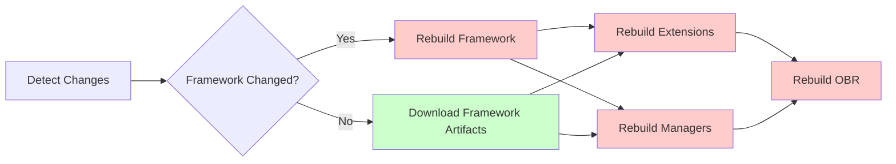

# Contributing Code to Galasa

This guide provides comprehensive instructions for contributing code to the Galasa project. It covers everything from forking the repository and setting up your development environment to signing commits and submitting pull requests.

## Prerequisites

Before contributing code, familiarize yourself with:
- The [Code of Conduct](/CODE_OF_CONDUCT.md) - Community behavior expectations
- The [Developer Certificate of Origin](/CONTRIBUTIONS.md) (DCO) - Legal framework for contributions
- [Building Locally](/openwiki/workflows/building-locally.md) - How to build and test your changes

## Ways to Contribute

### Finding Work

Check the [Galasa Kanban board](https://github.com/orgs/galasa-dev/projects/3) for open issues:
- **good first issue** - Great starting points for new contributors
- **webui** - Web UI related changes
- **cli** - Command-line interface changes
- **REST API** - API related changes
- **Untagged issues** - Typically core repository changes

### Reporting Bugs

1. Search existing issues to avoid duplicates
2. Include clear reproduction steps
3. Provide environment details (Galasa version, OS, etc.)
4. Raise bugs at [galasa-dev/projectmanagement](https://github.com/galasa-dev/projectmanagement/issues)

### Suggesting Features

1. Open an issue with a user story and task list
2. Clearly describe the feature and its benefits
3. Explain alignment with project goals
4. Submit feature requests at [galasa-dev/projectmanagement](https://github.com/galasa-dev/projectmanagement/issues)

## Developer Certificate of Origin (DCO)

All contributions must comply with the Developer Certificate of Origin. By signing your commits, you certify that:

- You created the contribution or have the right to submit it under the open source license
- You understand the contribution is public and will be maintained indefinitely
- You have the right to submit the work under the project's license

The DCO is version 1.1, adopted from the Linux Foundation's standard DCO. Every commit in your pull request must be signed to pass the automated checks.

## Commit Signing Requirements

Galasa requires two types of commit signing:

### DCO Sign-off

Sign your commits with the `-s` flag to add a DCO sign-off line:

```bash
git commit -s -m "feat(auth): add JWT token refresh endpoint"
```

This adds the following line to your commit message:
```
Signed-off-by: Your Name <your.email@example.com>
```

### GPG Signature

Sign your commits with the `-S` flag to add a cryptographic GPG signature:

```bash
git commit -S -m "feat(auth): add JWT token refresh endpoint"
```

### Combined Signing

Always use both flags together:

```bash
git commit -s -S -m "feat(auth): add JWT token refresh endpoint"
```

The DCO sign-off proves your legal agreement to contribute, while the GPG signature cryptographically proves who made the change.

### Setting Up GPG for Commit Signing

If you need to create a GPG key for signing commits:

1. **Generate a new GPG key**:
```bash
gpg --full-generate-key
```

2. **Select key options**:
   - Type: RSA and RSA (default)
   - Length: 4096 bits
   - Expiration: Choose appropriate duration (e.g., 1 year)

3. **Enter your identity**:
   - Name: Your full name
   - Email: Email address associated with your GitHub account
   - Comment: Leave blank

4. **Create a strong passphrase** and store it securely

5. **Configure Git to use your GPG key**:
```bash
# List your keys to get the key ID
gpg --list-secret-keys --keyid-format=short

# Set Git to use your GPG key (replace KEYID with your actual key ID)
git config --global user.signingkey KEYID

# Enable automatic commit signing (optional)
git config --global commit.gpgsign true
```

6. **Add your GPG key to GitHub**:
   - Export your public key: `gpg --armor --export KEYID`
   - Go to GitHub Settings → SSH and GPG keys → New GPG key
   - Paste your public key

For more details, see [Git's commit signing documentation](https://git-scm.com/book/ms/v2/Git-Tools-Signing-Your-Work).

### Fixing Missing Signatures

If you forgot to sign commits, you can fix them:

**For a single commit**:
```bash
git commit --amend -s -S --no-edit
```

**For multiple commits**:
```bash
# Squash your commits, then sign
git rebase -i HEAD~<number-of-commits>
git commit -s -S

# Force push to your branch
git push origin <branch-name> --force
```

## Fork and Branch Workflow

### 1. Fork the Repository

1. Navigate to the [galasa repository](https://github.com/galasa-dev/galasa)
2. Click **Fork** in the top-right corner
3. Select your GitHub account as the owner
4. Optionally customize the repository name and description
5. Choose "Copy the `main` branch only" (recommended)
6. Click **Create fork**

### 2. Clone Your Fork

```bash
git clone https://github.com/YOUR-USERNAME/galasa.git
cd galasa
```

### 3. Configure Upstream Remote

Add the original repository as `upstream` and prevent accidental pushes:

```bash
# Add upstream remote
git remote add upstream https://github.com/galasa-dev/galasa.git

# Prevent pushing to upstream
git remote set-url --push upstream no_push

# Verify configuration
git remote -v
```

You should see:
```
origin    https://github.com/YOUR-USERNAME/galasa.git (fetch)
origin    https://github.com/YOUR-USERNAME/galasa.git (push)
upstream  https://github.com/galasa-dev/galasa.git (fetch)
upstream  no_push (push)
```

### 4. Create a Feature Branch

Use descriptive branch names that reference the issue number:

```bash
# Update your main branch
git checkout main
git pull upstream main

# Create a new feature branch
git checkout -b issue-123/add-authentication-feature
```

## Configuring GitHub Actions for Your Fork

Before you can build your changes in GitHub Actions, you need to enable workflows and configure secrets.

### Enable GitHub Actions

1. Go to the **Actions** tab in your forked repository
2. Click "I understand my workflows, go ahead and enable them"

### Understanding Required Secrets and Variables

The Galasa build requires secrets for:
- **GPG signing** - Signing Maven/Gradle artifacts to prove authenticity
- **GitHub Packages authentication** - Pulling and pushing Docker images

Different modules require different secrets:

| Module | Build Tool | Required Secrets/Variables |
|--------|------------|---------------------------|
| platform | Gradle | GPG_KEY, GPG_KEYID, GPG_PASSPHRASE |
| buildutils | Go/Docker | WRITE_GITHUB_PACKAGES_USERNAME, WRITE_GITHUB_PACKAGES_TOKEN |
| wrapping | Maven | GPG_KEY, GPG_KEYID, GPG_PASSPHRASE |
| gradle | Gradle | GPG_KEY, GPG_KEYID, GPG_PASSPHRASE |
| maven | Maven | GPG_KEY, GPG_KEYID, GPG_PASSPHRASE |
| framework | Gradle | GPG_KEY, GPG_KEYID, GPG_PASSPHRASE, WRITE_GITHUB_PACKAGES_USERNAME, WRITE_GITHUB_PACKAGES_TOKEN |
| extensions | Gradle | GPG_KEY, GPG_KEYID, GPG_PASSPHRASE |
| managers | Gradle | GPG_KEY, GPG_KEYID, GPG_PASSPHRASE |
| obr | Maven | GPG_KEY, GPG_KEYID, GPG_PASSPHRASE, WRITE_GITHUB_PACKAGES_USERNAME, WRITE_GITHUB_PACKAGES_TOKEN |
| ivts | Gradle | GPG_KEY, GPG_KEYID, GPG_PASSPHRASE, WRITE_GITHUB_PACKAGES_USERNAME, WRITE_GITHUB_PACKAGES_TOKEN |
| cli | Go/Docker | WRITE_GITHUB_PACKAGES_USERNAME, WRITE_GITHUB_PACKAGES_TOKEN |

### Setting Repository Variables

1. Navigate to your fork's **Settings**
2. Select **Secrets and variables** → **Actions**
3. Click the **Variables** tab
4. Click **New repository variable**
5. Create:
   - **Name**: `WRITE_GITHUB_PACKAGES_USERNAME`
   - **Value**: Your GitHub username

### Setting Repository Secrets

1. Navigate to **Settings** → **Secrets and variables** → **Actions**
2. Click the **Secrets** tab
3. Click **New repository secret**
4. Add each secret (note: values cannot be viewed after creation)

#### GPG_KEYID Secret

1. List your GPG keys:
```bash
gpg --list-secret-keys --keyid-format=short
```

2. Find your key ID in the output:
```
sec   rsa4096/XXXXXXXX 2023-05-22 [SC] [expires: 2025-05-21]
```

3. Create secret:
   - **Name**: `GPG_KEYID`
   - **Value**: `XXXXXXXX` (your key ID in plain text)

#### GPG_KEY Secret

1. Export your key in Base64 format (use your key ID from above):
```bash
gpg --export-secret-keys XXXXXXXX | base64
```

2. Ensure the output is on a single line
3. Create secret:
   - **Name**: `GPG_KEY`
   - **Value**: The Base64-encoded output

#### GPG_PASSPHRASE Secret

1. Create secret:
   - **Name**: `GPG_PASSPHRASE`
   - **Value**: Your GPG key passphrase in plain text

**Note**: If you forgot your GPG passphrase, you must create a new GPG key.

#### WRITE_GITHUB_PACKAGES_TOKEN Secret

You need a GitHub Personal Access Token with `write:packages` scope.

**To create a Personal Access Token (classic)**:

1. Go to **GitHub Settings** → **Developer settings** → **Personal access tokens** → **Tokens (classic)**
2. Click **Generate new token (classic)**
3. Configure:
   - **Note**: "Token to build personal forks of Galasa"
   - **Expiration**: Custom (e.g., 1 year)
   - **Scopes**: Select `write:packages`
4. Click **Generate token**
5. Copy the token immediately (it won't be shown again)
6. Create repository secret:
   - **Name**: `WRITE_GITHUB_PACKAGES_TOKEN`
   - **Value**: Your token

### Initial Workflow Run

Before opening pull requests, you must run the **Main Build Orchestrator** once to:
- Prime build caches with dependencies
- Validate your secrets configuration
- Create baseline artifacts for PR builds

**To trigger the workflow**:

1. Go to the **Actions** tab in your fork
2. Select **Main Build Orchestrator** from the left sidebar
3. Click **Run workflow** on the right
4. Click the green **Run workflow** button

The workflow takes approximately 15-20 minutes to complete. It builds all eleven modules sequentially.

**If the workflow fails**:

Check the failure logs to identify the issue:
- **Secret/variable failures**: Verify all secrets are correctly configured and re-run failed jobs
- **Build failures**: Check the module logs for dependency or compilation errors

To re-run failed jobs:
1. Click on the failed workflow run
2. Click **Re-run jobs** dropdown
3. Select **Re-run failed jobs**

## Making Changes and Committing

### 1. Make Your Changes

Edit files in your feature branch and test locally:

```bash
# Build and test your changes
./tools/build-locally.sh

# Run unit tests for specific modules
cd modules/framework
gradle test
```

See [Building Locally](/openwiki/workflows/building-locally.md) for detailed build instructions.

### 2. Commit with Conventional Commits

Follow [Conventional Commits](https://www.conventionalcommits.org/en/v1.0.0/) format:

```
type(scope): description

[optional body]

[optional footer]
```

**Types**:
- `feat` - New feature
- `fix` - Bug fix
- `docs` - Documentation changes
- `style` - Formatting (no code change)
- `refactor` - Code refactoring
- `test` - Adding/fixing tests
- `build` - Build system changes
- `ci` - CI configuration changes

**Examples**:

```bash
git commit -s -S -m "feat(auth): add JWT token refresh endpoint"
git commit -s -S -m "fix(cli): resolve credential store timeout issue"
git commit -s -S -m "docs(readme): update contribution guidelines"
```

**Breaking changes** (add `!` after type/scope):

```bash
git commit -s -S -m "feat(api)!: remove deprecated authentication endpoint

BREAKING CHANGE: The /auth/legacy endpoint has been removed. Use /auth/v2 instead."
```

### 3. Push to Your Fork

```bash
git push origin issue-123/add-authentication-feature
```

## Opening a Pull Request

### 1. Create the Pull Request

1. Navigate to your fork on GitHub
2. Click **Compare & pull request** (appears after pushing)
3. Or go to **Pull requests** → **New pull request**
4. Ensure:
   - **Base repository**: `galasa-dev/galasa`
   - **Base branch**: `main`
   - **Head repository**: `YOUR-USERNAME/galasa`
   - **Compare branch**: Your feature branch

### 2. Write a Clear PR Description

Include:

**Summary**: Brief overview of the change

**Motivation**: Why is this change needed?

**Changes**: What was modified?

**Testing**: How was this tested?

**Related Issues**: Link to relevant issues using `Fixes #123` or `Relates to #456`

**Example PR description**:

```markdown
## Summary
Adds JWT token refresh functionality to extend user sessions without re-authentication.

## Motivation
Users currently must re-authenticate after token expiration, interrupting workflows.
Issue #123 requested automatic token refresh for better user experience.

## Changes
- Added `/auth/refresh` endpoint in AuthenticationService
- Implemented token validation and renewal logic
- Added unit tests for refresh scenarios
- Updated API documentation

## Testing
- Unit tests pass locally
- Manually tested token refresh flow in development environment
- Verified expired tokens are properly rejected

## Related Issues
Fixes #123
```

### 3. Submit the Pull Request

Click **Create pull request**. The automated checks will begin:

- **Pull Request Build Orchestrator** - Builds changed modules
- **CodeQL scanning** - Security analysis for Java and Go code
- **Secret detection** - Ensures no secrets were committed
- **DCO check** - Verifies all commits are signed (if configured)

## Understanding the PR Build Process

When you open a pull request, the [Pull Request Build Orchestrator](/openwiki/operations/github-workflows.md#pull-request-build-orchestrator-pull-requestsyaml) executes:

### 1. Change Detection

The workflow identifies which modules changed using the PR's file diff. If you modify files in `modules/framework/`, the framework module is marked for rebuild.

### 2. Artifact Resolution

For unchanged modules, the workflow downloads artifacts from the last successful Main Build Orchestrator run on the base branch (typically `main`). This significantly speeds up PR builds.

### 3. Selective Rebuilds

Only changed modules and their dependents are rebuilt:



### 4. Validation Checks

All PRs undergo:
- **Build verification** - All changed modules build successfully
- **Test execution** - Unit tests pass for changed modules
- **CodeQL scanning** - Static security analysis
- **Secret detection** - No credentials or tokens committed

### 5. Branch Protection Rules

Two jobs must succeed before merging:
- **Pull Request build was successful** (`end-pull-request-build`)
- **CodeQL scanning was successful** (`end-codeql-scanning`)

These jobs are required by GitHub branch protection on the `main` branch.

## Code Review Process

### What Happens After Submission

1. **Automated checks run** - Wait for all checks to pass (green checkmarks)
2. **Maintainer review** - A project maintainer reviews your code
3. **Feedback and discussion** - Address any review comments
4. **Approval** - Maintainer approves the changes
5. **Merge** - Your contribution is merged into `main`

### Responding to Review Comments

1. **Make requested changes** in your feature branch
2. **Commit with sign-off and signature**:
```bash
git commit -s -S -m "fix: address review comments on error handling"
```
3. **Push to your branch**:
```bash
git push origin issue-123/add-authentication-feature
```

The PR automatically updates with your new commits, and checks re-run.

### Review Timeline

- Contributors should expect initial review within a few days
- Complex PRs may require multiple review rounds
- Keep PRs focused and reasonably sized for faster review

### Keeping Your PR Updated

If the base branch (`main`) changes while your PR is under review:

```bash
# Update your local main
git checkout main
git pull upstream main

# Rebase your feature branch
git checkout issue-123/add-authentication-feature
git rebase main

# Force push (required after rebase)
git push origin issue-123/add-authentication-feature --force
```

## Common Contribution Scenarios

### Contributing to Multiple Modules

If your change spans multiple modules (e.g., framework and extensions):

1. Make changes to all affected modules in a single branch
2. Commit changes with appropriate scopes:
```bash
git commit -s -S -m "feat(framework): add new configuration API"
git commit -s -S -m "feat(extensions): implement configuration store extension"
```
3. The PR build will automatically rebuild all changed modules

### Documentation-Only Changes

For documentation changes in the `docs/` directory:

1. Create a branch as usual
2. Make documentation edits
3. Commit and push:
```bash
git commit -s -S -m "docs(getting-started): clarify installation steps"
```
4. The PR build skips most modules but validates documentation rendering

### Fixing Failing Builds

If your PR build fails:

1. **Check the logs** - Click on the failed job to see error details
2. **Fix locally** - Reproduce and fix the issue on your machine
3. **Test the fix**:
```bash
./tools/build-locally.sh --module <failing-module>
```
4. **Commit and push** - The PR automatically re-runs checks

### Emergency Hotfixes

For urgent production fixes:

1. Create a branch from the release branch (not `main`)
2. Make minimal, focused changes
3. Follow the same signing and PR process
4. Note urgency in the PR description
5. Request expedited review from maintainers

## Troubleshooting

### GPG Signing Issues

**Problem**: Git says "gpg: signing failed"

**Solutions**:
- Ensure GPG is installed: `gpg --version`
- Check your key exists: `gpg --list-secret-keys`
- Verify Git configuration: `git config --get user.signingkey`
- Try signing with explicit key ID: `git commit -s -S -u KEYID -m "message"`

### DCO Sign-off Missing

**Problem**: PR checks fail with "DCO check failed"

**Solution**: Amend or rebase to add sign-off to all commits:
```bash
# For last commit
git commit --amend -s -S --no-edit

# For multiple commits
git rebase HEAD~<n> --signoff --exec 'git commit --amend --no-edit -S'
```

### Workflow Build Failures

**Problem**: Main Build Orchestrator fails on first run

**Common causes**:
- Missing or incorrect secrets - Re-check secret values
- GPG key expired - Generate and configure a new key
- Token permissions insufficient - Regenerate token with correct scopes
- Network timeout - Re-run the workflow

### Merge Conflicts

**Problem**: Your PR has merge conflicts with `main`

**Solution**: Rebase on latest main:
```bash
git checkout main
git pull upstream main
git checkout issue-123/add-authentication-feature
git rebase main
# Resolve conflicts in your editor
git add <resolved-files>
git rebase --continue
git push origin issue-123/add-authentication-feature --force
```

## Additional Resources

### Documentation
- [Code of Conduct](/CODE_OF_CONDUCT.md) - Community guidelines
- [Developer Certificate of Origin](/CONTRIBUTIONS.md) - Contribution legal terms
- [Building Locally](/openwiki/workflows/building-locally.md) - Local development guide
- [GitHub Actions Workflows](/openwiki/operations/github-workflows.md) - CI/CD system details

### External Resources
- [Conventional Commits](https://www.conventionalcommits.org/) - Commit message format
- [Git Commit Signing](https://git-scm.com/book/ms/v2/Git-Tools-Signing-Your-Work) - GPG signing guide
- [GitHub Forking Workflow](https://docs.github.com/en/get-started/quickstart/fork-a-repo) - Fork and PR basics

### Getting Help
- [Galasa Slack](https://openmainframeproject.slack.com/archives/C05ST4K4K54) - `#galasa-users` channel
- [Project Management Board](https://github.com/orgs/galasa-dev/projects/3) - Track issues and progress
- [Galasa Dev Team](https://github.com/orgs/galasa-dev/teams/org-owners) - Contact maintainers

## Best Practices

### Before Submitting
- ✅ Run local builds and tests
- ✅ Follow code style of surrounding code
- ✅ Add or update tests for new functionality
- ✅ Update relevant documentation
- ✅ Sign all commits with DCO and GPG
- ✅ Use descriptive commit messages

### During Review
- ✅ Respond promptly to review comments
- ✅ Be open to feedback and suggestions
- ✅ Keep PRs focused and reasonably sized
- ✅ Update PR description if scope changes
- ✅ Test requested changes before pushing

### After Merge
- ✅ Delete your feature branch
- ✅ Update your fork's main branch
- ✅ Close related issues if not auto-closed
- ✅ Monitor for any issues from your changes

## Thank You

Thank you for contributing to Galasa! Your contributions help make testing on z/OS and other mainframe systems more accessible and efficient. We appreciate your effort in following these guidelines and look forward to reviewing your pull requests.
